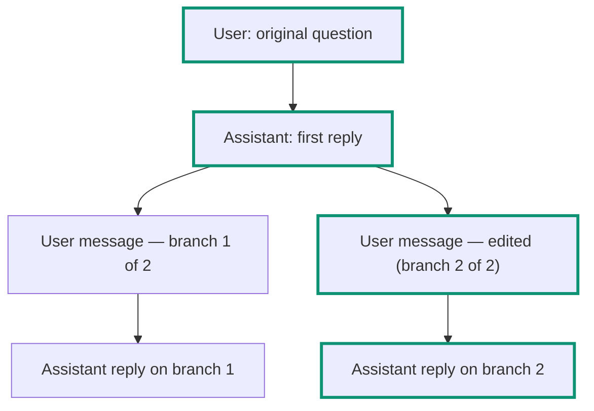

You can edit any of your own messages, regenerate any reply, and step back through every version those produce; rename, pin, link to and delete threads from the sidebar; and search thread titles and the body of every finished message in them — yours and Beetle's replies alike, including versions you are no longer looking at — with `Cmd/Ctrl+K`. This page explains each of those, and the one rule that makes them predictable.

A Receipt thread isn't a flat list of messages — it's an immutable tree. Every message points at its parent, and whenever more than one message shares the same parent, the thread has more than one branch. Receipt always resolves a single, deterministic path through that tree, root to leaf. It is never "whichever branch was touched most recently."

## The message tree and the canonical path

Editing a user message, or regenerating a response, doesn't change the message that already exists — it creates a new sibling message under the same parent. The tree keeps every version; only one path through it is "active" at a time, and that active path is what you see rendered as the conversation.

In this example, editing the second user message created a second branch under the first assistant reply. Both versions of that message still exist in the tree, but the canonical path (outlined above) follows the edited version and its reply — the version you'd see by default when you open the thread.

## Editing and regenerating

- Only **user** messages that sit on the current canonical path can be edited. A message on a branch you're not currently viewing can't be edited directly.
- **Regenerate** always anchors to a user message, even if you trigger it from an assistant reply — Receipt walks up to that reply's parent user message and branches from there.
- There is **no per-message delete** and **no explicit "fork" action**. Branching is simply what editing and regenerating do implicitly, every time. Deleting a message on its own isn't possible; deletion exists only at the thread level, from the sidebar.
- When more than one version exists, a pager appears — always on a **user** message, never on an assistant reply. Chevrons labelled **Previous branch version** and **Next branch version** sit either side of an `n/m` counter, and step either between edited versions of that message or between the replies regenerated from it.

## When two tabs disagree

Every edit or regenerate carries the branch version it expects to be working from. If that version is out of date but still lower than the thread's current version, Receipt rebases it onto the current tail and retries automatically — so an older tab, or one that's been open a while, keeps working without you noticing. If the conflict can't be resolved that way, you'll see:

`This chat changed in another tab or session. Refresh and try again.`

If you try to edit a message that's no longer on the canonical path, or that's stale for some other reason, you'll instead see:

`This message can no longer be edited. Refresh and try again.`

Editing or regenerating while a response is still streaming is refused by the server — finish or stop the current response first.

## The sidebar

Above your threads, the chat area of the sidebar holds a single entry: **Search chats**. The threads below it are grouped by date: **Pinned**, **Today**, **Yesterday**, **Last 7 Days**, **Last 30 Days**, and **Older**. There is no new-chat button in the sidebar — open the **Chat** area itself, or use the palette's **New chat** action.

Each thread has a menu with **Rename**, **Copy link**, **Pin** / **Unpin**, and **Delete**. These produce toasts as you'd expect — `Thread renamed`, `Thread title cannot be empty`, `Failed to delete thread`, `Failed to rename thread`, `Failed to update pinned state` — with one naming quirk worth knowing: the toast that confirms a successful thread deletion reads `Objective deleted`, not "Thread deleted."

The quirk has a reason: a thread that starts background work is backed by an objective, and both the dialog and the toast name that objective rather than the thread. So **Delete** first asks you to confirm, in a dialog titled `Delete <thread title>?`:

> Deleting this objective is permanent and cannot be undone. It will also stop and remove any running tasks it started. Are you sure you want to continue?

The confirming button reads **Delete objective**. Closing the dialog without confirming deletes nothing. What an objective and its tasks are is covered in [Objectives and tasks](/co-worker/objectives-and-tasks).

While a thread is in flight, its row in the sidebar carries a small status icon rather than a text pill: a spinner while the thread is queued or a response is being produced, and a warning icon if something went wrong. The icon does not open a hover bubble. Instead, the state is the icon's accessible name, which a screen reader announces as one of:

- `Pending: This chat is queued; a response will be generated shortly.`
- `Generating: Beetle has started generating the response.`
- `Error: Something went wrong and the response could not be generated.`

[Beetle](/introduction) is the interface's name for the assistant; you will see it in a few status lines like this one.

## Searching your chats

`Cmd/Ctrl+K` opens the search palette from any page of the signed-in app — chat, Tasks, settings — except while your cursor is in a text field, where the shortcut is left alone so it never interrupts typing. The sidebar's **Search chats** entry opens the same palette, but in search-only mode, without the actions described below.

<Frame caption="The Cmd/Ctrl+K palette open over the chat home page. Before you type, the box reads Search threads and messages... and the Actions group underneath it offers New chat, Account, Skills and Switch to dark mode; the footer reminds you that the arrow keys navigate and Enter selects. Everything behind the palette is blurred by the dialog, so the page under it is only context.">
  
</Frame>

The palette is titled **Search chats** and describes itself as "Search your threads and jump directly to matching messages." Its input reads `Search threads and messages...`. In the sidebar's search-only mode, before you type it says `Type a thread title or message text.`; when nothing matches it says `No matching chats found.`; if the request fails it shows the failure, which is `Search failed. Try again.` when the server returns nothing more specific. Results appear under a **Threads** heading, and a hit inside a message body shows a snippet of the matching text beneath the thread title.

Search runs after a 120 ms debounce, returns 20 results by default (30 at most), and a query longer than 200 characters is rejected as too long. Searching message bodies (as opposed to just thread titles) requires at least 2 characters.

<Tip>
Content search scans every message in the thread's history, including messages on branches that aren't part of the current canonical path — so a message you'd otherwise have to page through several `n/m` versions to find is still searchable directly. Selecting a hidden-branch result activates that message's whole root-to-leaf branch path in one step, scrolls it into view, and highlights the match.
</Tip>

### Actions in the palette

When you open the palette with the shortcut, an **Actions** group sits under the search box. Each entry is also matched by the words you type, so `theme` or `create skill` finds the relevant action without scrolling.

| Action | What it does |
|---|---|
| **New chat** | Closes the palette and starts a fresh thread. |
| **Account** | Opens [your account settings](/core/your-account). |
| **Skills** | Opens the organization's Skills page, where skills are created and managed. See [Skills](/catalog/skills). |
| **Switch to dark mode** / **Switch to light mode** | Toggles the theme; the label always names the mode you would switch *to*. |

<Note>
The **Skills** action is a shortcut into organization settings, which are owner and admin only. A member who picks it is bounced straight back out of settings — on the hosted app that lands you in chat again — and there is no access-denied screen. Using a skill inside a message does not need this page; see [Skills in chat](/co-worker/skills-in-chat).
</Note>

Next step: [attach files to a message](/co-worker/files-and-attachments).
