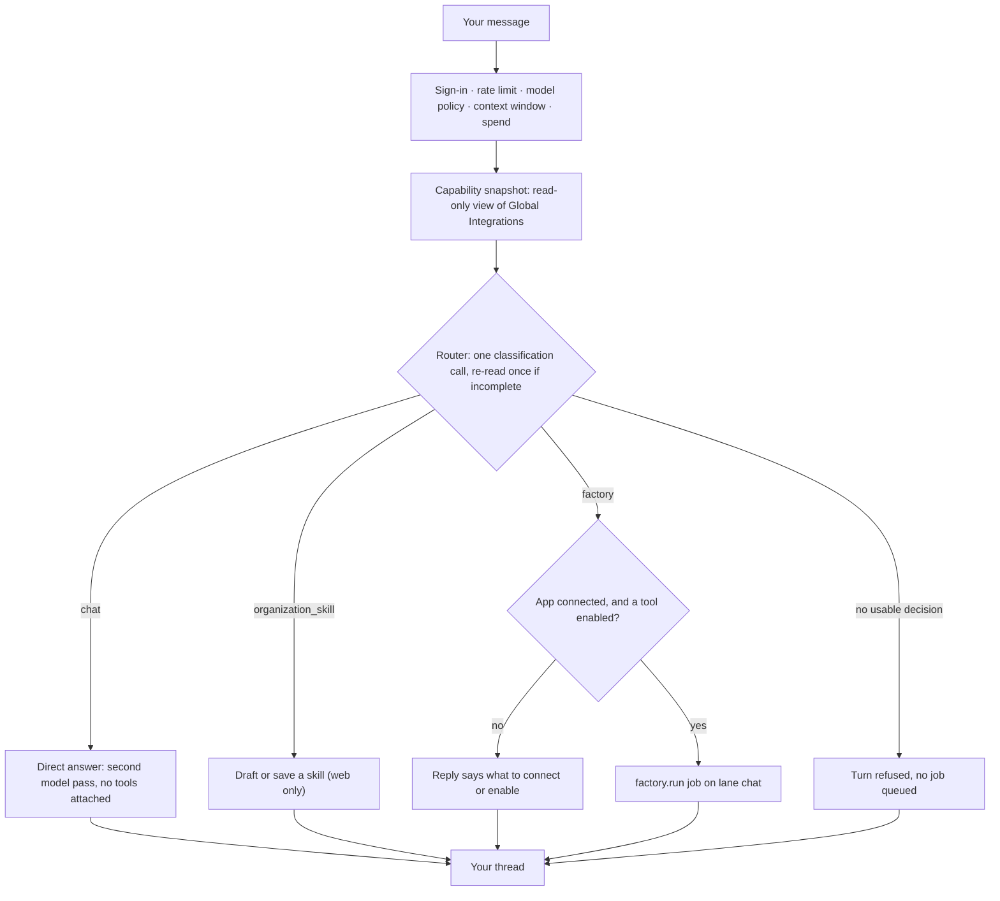
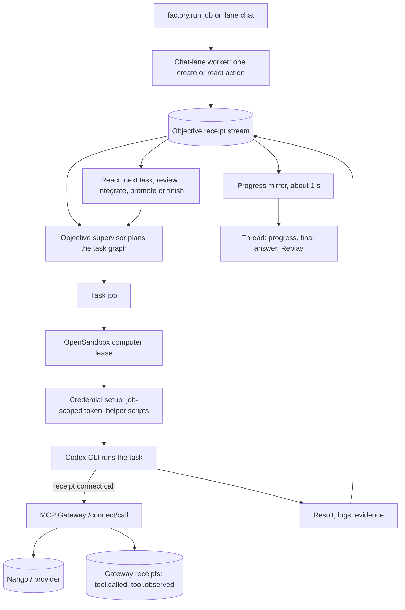

Every message you send does one of three things: it gets an answer written for it, it drafts a skill, or it starts a background run. Knowing which path a turn took — and what that path could and could not touch — is what lets you read a reply, a refusal or a [replay](/co-worker/replay) with confidence.

## Before the router

A web turn arrives as one `POST /api/chat` request and passes a fixed series of gates before any model is called. If a gate refuses, the turn ends there with one of the messages in [errors and limits](/co-worker/errors-and-limits).

1. **Sign-in and access.** An active organization, membership of the [workspace](/core/organizations-and-workspaces) that organization resolves to, and a thread you can see.
2. **Rate limit.** 30 requests per minute per user, counted in Postgres and switched off entirely by `VITE_DISABLE_REDIS=true`.
3. **Model policy.** The [LLM Gateway](/llm-gateway/model-policy) resolves the thread's model and whether provider and compliance policy allows it. Every denial happens here, before a provider is contacted.
4. **Context window.** The conversation must fit the active model's window.
5. **Spend reservation.** Quota is reserved before the model call and settled from what it used. See [usage and spend](/llm-gateway/usage-and-spend).

Receipt then takes a **capability snapshot**: a read-only look at the organization's Global Integrations, fetched with a `connect:read` token and a 2.5-second timeout. It is the router's only authority on what is connected. When it cannot be fetched, a turn that needs a connected app is not started and the reply reads `I cannot confirm {Provider} is connected right now because Receipt Connect status could not be checked.`

## The routing decision

The router is a single model call whose only job is to classify. Its system prompt is one sentence: "You are the Beetle chat router. Return one routing decision only; do not perform tool work and do not write any user-facing answer, greeting, acknowledgement, or status update." ([Beetle](/introduction) is the interface's name for the assistant.) It returns one JSON decision and nothing else, so no words it produces reach your thread.

The rules it is given explain most surprises:

- It decides on "semantic intent from the complete latest turn and bounded conversation", never on "keywords, phrase matching, connector-name matching, or sentiment lookup tables".
- `chat` when the turn "can be answered from the visible conversation and authoritative capability facts without external work" — including a question "answerable from general or public knowledge" that happens to name a connector.
- `factory` when the answer "requires current private, local, repository, terminal, connected-account, or other external evidence not already supplied", tagged `investigation` for read-only evidence or `delivery` for "creates, updates, deletes, external artifacts, code/configuration edits, deployments, and pull requests". A generated downloadable file counts as delivery.
- `organization_skill` only to author a brand-new skill; changing an existing one is delivery work.
- It picks the apps a run depends on "from the meaning of the latest request, not the number of integrations available", and must "never select every integration as a fallback". Each is intersected with the snapshot; anything inactive is dropped.

An unusable decision is read a second time, as is any background decision that names no app or lands in a thread with prior context: the router is asked to "Review this candidate routing decision for dependency scope". If the second reading fails too, the turn is refused with `Receipt couldn't determine the access needed for this request. Please retry; no task was started.` The refusal happens before the enqueue, so no objective and no job are created, though the turn itself is already recorded as a receipt. On the web that sits inside the `Beetle stopped before completing this response.` block; [Slack](/co-worker/slack) posts it as is; [Teams](/co-worker/teams) still falls back to a background run.

## The three branches

**Direct answer.** A second model pass writes the reply. It is told that its response "is posted verbatim", that it may use "only the visible conversation and authoritative Receipt Connect facts", and that where those are insufficient it should "say that plainly rather than filling the gap with plausible details". The call attaches no tools at all; the Tools entries in the composer's `+` menu are stored on the thread but read by nothing at run time. A direct answer never calls a provider tool, searches the web or touches a connected app, which is why a question about your live account state becomes a background run instead.

**Draft or save a skill.** Receipt drafts a SKILL.md and shows it in the thread; it is saved only when you explicitly asked for that, and only an owner or admin can save. Web only: Slack and Teams turn the same request into a background run. See [using skills in chat](/co-worker/skills-in-chat).

**Background run.** The apps the run needs are checked against the snapshot first. One that is not connected, or whose tools are all disabled, ends the turn with a reply saying what to connect or enable ([background runs](/co-worker/background-runs) has the wording). Otherwise a job is enqueued and the thread shows `Beetle queued job <jobId>.`

## Inside a background run

The job is a `factory.run` on the `chat` lane, allowed two attempts. Its worker does exactly one thing: a single dispatch action. From there a durable **objective supervisor** owns every decision. A follow-up is normally a react on the objective bound to the thread; unrelated work creates a new objective, and a create deliberately drops the previous objective's messages and context so a run cannot inherit evidence it did not gather. When the router asks for a lifecycle action instead — cancel, archive, promote or cleanup — that too is the one action the job performs.

1. **Plan.** The supervisor — a model decision taken at explicit receipt boundaries — turns the objective into a task graph that is then applied deterministically. A permanent model authentication failure is not retried: the run reports `Your OpenAI API key is invalid or expired. Update it in BYOK settings and retry.` with the provider's own error appended.
2. **Lease a computer.** Each ready task becomes a job and waits for a disposable OpenSandbox computer. One active computer per organization is the shipped default (`OPEN_SANDBOX_ORG_MAX_ACTIVE`, which a deployment can raise), so on that default a second run sits at the phase **Waiting for computer** until the first releases its lease. Idle sandbox hosts are not stopped automatically; stopping one is an operator action.
3. **Prepare the workspace.** The run records `Preparing the computer workspace.` while task files, selected skills, credentials and execution metadata are synced in. An investigation gets a receipt-only workspace, not the application repository; a delivery gets the repository worktree.
4. **Run the agent.** The Codex CLI runs the task inside the computer with approvals turned off (`-a never`), so it never pauses to ask; its own kernel sandbox is bypassed because the container is the isolation boundary. Native web search is switched on only for tasks the plan classifies as `broad`.
5. **Collect the result.** Codex writes a structured result, logs, a last message and an evidence bundle. Its outcome — approved, changes requested, blocked or partial — decides what happens next, and every finished task job reacts the objective again.
6. **Integrate, promote, audit.** For delivery work the agent's own outcome is recorded as the candidate's review; the change is then merged into an integration worktree, validated by running the objective's checks inside the computer, and taken through a promotion gate. Publishing a pull request is a further agent run. Investigations skip all of that and produce a synthesized report. A terminal objective is then audited; audits produce recommendations and memory summaries for later runs, and applying them is an operator action.

Throughout, the runtime mirrors progress into the chat session about once a second and the app polls the objective's live status every three seconds, then posts the terminal answer. The same state syncs to your browser as a projection, which is why you can close the tab and come back to a finished answer. Every stage appends receipts to the objective's stream, and that stream is what Replay rebuilds.

<Frame caption="Agent replay on the Transcript tab, badged Completed, 4 meaningful actions and 59 receipts. Under the request, 4 additional activities outside this conversation expands to what the agent did inside the computer: the bash command it ran, then a tool entry reading Codex completed the turn, badged Succeeded.">
  
</Frame>

## What a run knows

A run does not see everything in Receipt. Its context comes from four bounded sources.

- **The conversation.** At most 8 prior messages, each cut to 2,000 characters, 8,000 characters in total. A background run's problem statement carries that transcript and, on a react, the bound objective's latest summary and output.
- **Attachments.** Images and PDFs reach the model natively when the active model supports that input; every other type, spreadsheets and documents included, arrives only as converted text. Organization knowledge is added only once an owner or admin has activated at least one indexed document; there is no separate toggle. See [files and attachments](/co-worker/files-and-attachments) and [Org Brain](/catalog/org-brain).
- **The capability snapshot.** A run is scoped to the apps the router selected for that turn. The wider inventory of connected apps is discovery, not a request: the runtime ignores it as a dependency source, so a run is never handed every connection as a fallback.
- **Enabled skills**, snapshotted when the task packet is written.

Memory is receipt-backed: each scope is its own stream, and commits, reads and forgets are recorded as events. A run started from chat carries the scope `factory-chat:auto`, resolved at run time to the objective's own scope, or to the profile's when nothing is bound yet. A task also gets read-only scopes for its worker type and the shared repository, plus objective, task, candidate and integration scopes; audits commit to their own, which is how a later run draws on an earlier one. Web chat does **not** inject preference memory — nothing in the chat path reads durable user preferences into the prompt; that surface belongs to the runtime and its CLI.

Enabled skills are mounted as a read-only tree with a compact catalog beside it: files at mode `0444`, directories at `0555`, replaced only by the controller between packets, so a run already under way does not see a later enable or disable. Receipt does not rank skills for the agent. A catalog skill mounted beside them says to "Select the smallest relevant set using the task, plan, and catalog metadata" and to read each chosen skill completely first, but nothing in the task prompt points the agent at that catalog skill. A patch touching that tree is rejected as a Receipt operational path, and no receipt records which skill was read. See [Skills](/catalog/skills).

## Tools inside the computer

The computer is where connected apps are actually used, and the credential design is the part worth understanding.

Before the agent starts, the controller mints a **job-scoped Receipt Connect token**: `connect:read` for discovery, plus `connect:credential` and write scope when the objective requires a capability. Because the execution contract grants `connect:write` whenever an objective has any required capability, a run holds write authority from the start and the per-connection enabled-tool list is the only remaining gate. A write action needs both, or it fails with `integration action '<tool>' requires connect:write` or `integration action not found or disabled`. See [tools and permissions](/mcp-gateway/tools-and-permissions).

The token is written into the task workspace with owner-only permissions, and provider access is materialized per provider:

| Provider kind | What the worker gets |
|---|---|
| AWS, Google Cloud, kubectl, Jira | A configured native CLI whose credential helper is a generated script. Each command fetches fresh material from the gateway at call time under the job token; the stored provider secret never enters the environment or a static file. |
| Every other connected app | Nothing is installed. The worker calls `receipt connect call`, which the gateway executes server-side, so the provider credential never enters the computer at all. Each call writes `tool.called` and `tool.observed` receipts. |

The packet says it plainly — "Receipt applies provider credentials server-side; never request or print them." — and the prompt discipline adds "Never print or persist raw secret, token, password, API key, or credential values in stdout, stderr, artifacts, or the final JSON."

Three things do enter the computer: an OpenAI key as the agent's auth file — your organization's own key when one is set, otherwise a platform-credit key — so a background run always executes on OpenAI, and an Anthropic key configured for chat does not fund it (see [bring your own key](/llm-gateway/bring-your-own-key)); a GitHub token when the controller has one, which publishing a pull request needs; and the run's identifiers and gateway address. What a leaked token would be worth is in the [security model](/mcp-gateway/security-model).

## Where the gateways and Guard sit

| Control | Where it applies | Status |
|---|---|---|
| Model and compliance policy ([LLM Gateway](/llm-gateway/model-policy)) | The router and direct-answer calls | Enforced |
| Rate limit and spend ([usage and spend](/llm-gateway/usage-and-spend)) | Before routing, and before the model call | Enforced |
| Token scopes, workspace membership and the connection tool allowlist ([MCP Gateway](/mcp-gateway/tools-and-permissions)) | Scope and membership on every credential fetch; the per-connection allowlist on every `receipt connect call` action | Enforced |
| Sandbox | Every task; there is no host execution path | Enforced |
| Receipts ([receipts and audit](/guard/receipts-and-audit)) | Chat turns, gateway actions, every run stage | Enforced |
| Guardrail groups ([Guardrails](/guard/guardrails)) | Nowhere on this pipeline | Not applied |
| Tool approval, rate-limit and budget rules ([Policies](/guard/policies)) | Nowhere on this pipeline | Stored, not read |

<Warning>
**Guardrail groups and the Policies modules are not applied anywhere on this pipeline in this release.** No step of a turn or a run calls the guardrail enforcement service, and no runtime code reads tool-approval, rate-limiting or budget rules. Nor is there a per-action approval prompt ([tools and permissions](/mcp-gateway/tools-and-permissions)).
</Warning>

Slack and Teams do not pass through the web gates; their mentions go to the runtime's channel-neutral routing and response routes, which need an organization OpenAI key before anything runs. For the machinery underneath, see [architecture](/core/architecture) for the runtime's process roles, [jobs and durable execution](/core/jobs-and-durable-execution) for how a job survives a crash, and [Factory engine](/core/factory-engine) for the engine itself.

Next step: [learn the vocabulary of objectives and tasks](/co-worker/objectives-and-tasks).
