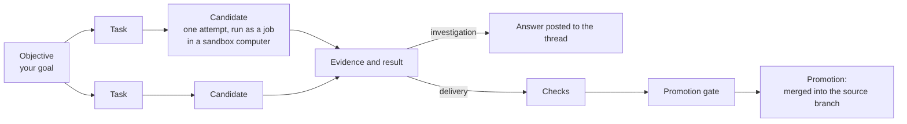

Every background run Receipt starts for you — from a chat turn, a Slack mention, or the Tasks page — is an **objective**: a goal Receipt plans into tasks, carries out in disposable computers, and records step by step as receipts. You do not need the vocabulary to use Receipt. You need it the moment a run stops on **Blocked** and tells you to "react or cancel the objective".

This page defines the words, says where each surfaces, and covers the Tasks page, where you can start an objective yourself. That page is titled **Beetle Tasks** ([Beetle](/introduction) is the interface's name for the assistant).

## The vocabulary

### Objective

The top unit of work: a durable, receipt-backed goal. Everything Receipt does for it lands on one receipt stream, which is what [Replay](/co-worker/replay) reads back. Ids look like `objective_moc07bs6_ovbmts`, and every run has a durable address, `/chat?objective=<id>`, that reopens its thread.

An objective carries a **mode** — `investigation` or `delivery`, below — and a **severity** from 1 to 5, which sets how much reasoning effort the worker spends. The Tasks page maps **Priority** onto severity: **P1** is 5, **P2** is 4, **P3** is 3, **P4** is 2.

### Task

A focused piece of the objective, and a node in a graph: it can depend on other tasks and becomes ready only when they are done. Receipt's planner, the objective supervisor, produces the graph and extends it as evidence comes in. A task moves through `pending`, `ready`, `running`, `reviewing`, `approved`, `integrated`, `blocked` and `superseded`.

### Candidate

One attempt at a task. If an attempt is reviewed and sent back, the next is a new candidate; a task gets at most 4 by default. Candidate statuses are `planned`, `running`, `awaiting_review`, `changes_requested`, `approved`, `integrated`, `rejected` and `conflicted`.

### Job

The queued unit of work behind a task, a planning decision, a monitor pass or a cancel. Jobs are what the interface quotes when it hands work off: chat shows `Beetle queued job <jobId>.` A job is `queued`, `leased`, `running`, `completed`, `failed` or `canceled`. See [jobs and durable execution](/core/jobs-and-durable-execution).

### Check

A shell command run against the integrated work before it can be promoted — a build or a test suite. Checks run inside the same disposable computer as the work, not on the Receipt server. Investigations run none, because they change nothing. A Tasks-page task runs `bun run check:full`.

### Evidence

What a task has learned so far. Each task carries an evidence status that only ever rises — `empty`, `partial`, `sufficient`, `final` — and the worker writes an evidence bundle the controller collects. An investigation's findings each carry a confidence of `confirmed`, `inferred` or `uncertain`, and the result is `answered`, `partial` or `blocked`. A delivery result records an outcome — `approved`, `changes_requested`, `blocked` or `partial` — plus what changed, the proof, and any remaining work: exactly what the promotion gate reads.

### Promotion

The last step of a delivery objective: the approved, checked work is merged into the source branch. First the promotion gate runs, refusing with one of six fixed messages when something is missing — a missing planning receipt, a task still blocked, no integrated task that satisfied the objective, a task without its completion contract or its proof, or a task that still reports remaining work. Delivery objectives promote on their own once the gate passes; investigations skip it, because there is nothing to merge. [Factory engine](/core/factory-engine) has the exact wording.

## Investigation or delivery

Every objective is one of two kinds, and the kind decides how much machinery it goes through.

| | Investigation | Delivery |
|---|---|---|
| **What it is for** | Read-only evidence: look something up, compare, answer | Creates, updates, deletes, generated files, code or configuration changes, deployments, pull requests |
| **Repository execution slot** | Not taken | Taken; queues when none is free |
| **Checks** | None | Run inside the computer before promotion |
| **Promotion gate** | Skipped | Runs; six fixed refusals if it fails |
| **Ends with** | An answer in the thread, with findings and their confidence | Promoted work, plus a pull request when your organization has a GitHub connection |

In chat, the router picks the mode from what you asked: read-only evidence becomes an investigation, while "creates, updates, deletes, external artifacts, code/configuration edits, deployments, and pull requests" become delivery. A generated file is an artifact even when the data behind it is read-only, so "count the open tickets and give me a PDF" is delivery. A decision that arrives without a usable mode falls back to delivery, so unknown work takes the stricter path. Tasks created from the Tasks page are always delivery.

<Note>
"The repo execution slot" is the developer CLI board's vocabulary, and it is singular there, but the runtime admits several delivery objectives at once — 20 per repository by default, a deployment setting. Only delivery objectives take a slot.
</Note>

## Statuses you will see

An objective's status is one of twelve values. Three are final — `completed`, `failed` and `canceled`; `blocked` stops without being final.

| Status | Meaning |
|---|---|
| `planning` | Your goal is being turned into tasks. |
| `waiting_for_slot` | Waiting for a repository execution slot. |
| `collecting_evidence` | An investigation is gathering evidence. |
| `evidence_ready` | Evidence gathered; synthesis is next. |
| `synthesizing` | Evidence is becoming the final answer. |
| `executing` | Tasks are running. |
| `integrating` | Approved changes are being applied and checked. |
| `promoting` | The approved work is being promoted. |
| `completed` | Finished. |
| `blocked` | Stopped on something outside the run. Not final. |
| `failed` | Ended in failure. Final. |
| `canceled` | Stopped by you. Final. |

Alongside the status the runtime reports a coarser **display state** — `Draft`, `Queued`, `Running`, `Awaiting Review`, `Stalled`, `Blocked`, `Completed`, `Archived`, `Failed`, `Canceled` — and a finer phase, each with a fixed one-line summary. Those summaries are the lines the chat progress panel and the developer CLI print. Five of the ones you are most likely to read:

| Phase | What it says |
|---|---|
| **Queued** | `Waiting for the repo execution slot.` |
| **Waiting for computer** | `Waiting for computer capacity before the agent starts.` |
| **Collecting evidence** | `Gathering evidence for the active task.` |
| **Blocked** | `Waiting for operator guidance before continuing.` |
| **Stalled** | `Execution stopped making visible progress.` |

## The Tasks page

<Frame caption="The Tasks page with nothing to show yet. The counters read the stages of the rows that appear under Live runs, which is showing Syncing while the projection loads, and New Task opens the composer. Notice that the sidebar has no Tasks entry; you reach this page by typing its URL.">

</Frame>

`/tasks` is where you start an objective yourself and watch the ones started there. It lists only objectives created on this page, plus Receipt's own automated fix-up work; a run started from chat or Slack does not appear here — open that one from its thread. [Monitoring your runs](/co-worker/monitoring) tours the page; below is what the labels mean.

The counters read the same stages the rows do: **Unresolved** is everything not yet done, failed or archived; **Running** covers running and reviewing objectives. A row's stage comes from the objective's live state, first matching rule winning: archived, completed, failed or canceled, blocked, a review integration status, any active task or the `executing` status, a queued slot, otherwise **New**. A recorded blocker counts even when the status has not caught up, so an objective with tasks still running can read **Blocked**.

### The New task panel

**New Task** opens a composer for starting an objective yourself. [Monitoring your runs](/co-worker/monitoring) walks it field by field and quotes the messages it returns; what matters here is what it produces.

You pick one of two lanes — **Improvement check** ("Investigate a Receipt signal, reproduce it, and return a scoped fix with proof.") or **Add/improve integration** ("Build the checked-in connector catalog path, Nango mapping, tests, and PR-ready change.") — then describe the work, its priority and scope, and what must be true when it is done. Both lanes are written for work on Receipt itself and its connector catalog; the **Scope** placeholder is `ReceiptFactory`, and **Priority** becomes the objective's severity.

Whatever lane you choose, the panel produces a delivery objective: it takes a repository execution slot, runs `bun run check:full` in the computer, and passes the promotion gate before anything merges.

<Note>
**Save draft** stores the draft in your browser, not in Receipt: one draft per browser, not shared with your organization, and no objective is created.
</Note>

## When an objective needs attention

A run can stop without finishing or failing. Its status becomes `blocked`: the plan cannot go further until something outside the run changes, so Receipt waits instead of retrying. Blocked is deliberately not final — the receipts are intact and the objective can be unblocked or redirected — so every surface gives it its own place.

- **In chat**, the progress headline turns red, screen readers hear it prefixed **Needs attention:**, and the message ends with a line such as `Next: Review the blocking receipt and react or cancel the objective.` [Background runs](/co-worker/background-runs) walks through that message.
- **On the Tasks page**, the row reads **Blocked**, its summary is `Beetle needs intervention before it can continue.`, and the blocker is printed in red under the title. The **Blocked** counter tells you if anything is waiting on you.
- **On the developer CLI's board**, it sits in the **Needs Attention** section — "Blocked or conflicted objectives that need review." — alongside **Active**, **Queued**, **Completed** and **Archived**. See [the in-repo Factory CLI](/cli/from-source/factory-overview).

You have two ways to respond.

**React.** Fix the cause — enable the missing tool, renew a credential, grant the repository permission — then reply in the objective's own thread. A follow-up in a bound thread continues that objective rather than starting a new one; a terse "retry" or "continue" after a blocked result is exactly the case the router is told to treat that way. From the Tasks page, **Thread** opens the right conversation.

**Cancel.** On the Tasks page, **Cancel** confirms first, then stops the agent as soon as it is safe to do so; work already committed stays in the objective's receipts. Receipt aborts the objective's jobs before recording the cancellation, so the row reports the cancellation as in progress until the projection catches up. In chat, **Stop generation** does the same for the run attached to your turn. The trash icon is a different action: it archives the objective permanently, and the receipts survive.

## Limits that shape an objective

- By default an objective runs at most 5 tasks at once, dispatches at most 50 task runs, allows 4 attempts per task, and has a 24-hour wall-clock budget.
- Computers are shared: one is active per organization by default, so a second objective waits at **Waiting for computer** until the first releases it.
- Delivery objectives per repository are capped by the slot count, 20 by default.
- Write operations on a connected app must be enabled per connection first. An objective that needs one it lacks stops rather than asking you mid-run; see [tools and permissions](/mcp-gateway/tools-and-permissions).

Next step: [look up an error or a limit](/co-worker/errors-and-limits).
