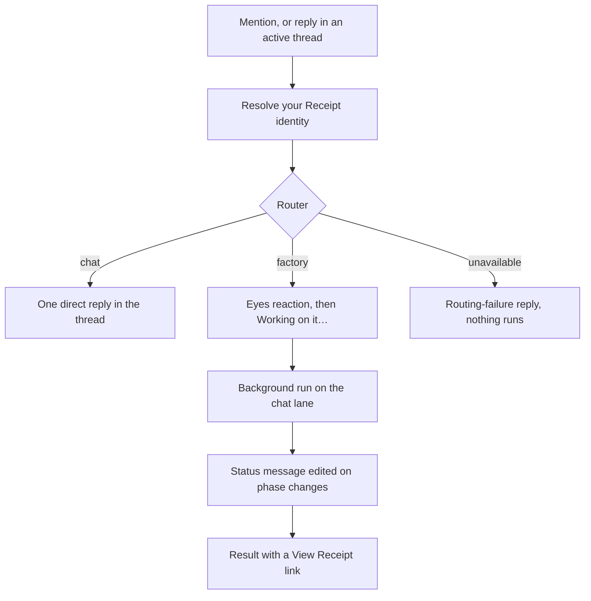

Mention `@receipt` in a channel and Receipt answers in that thread. A question it can answer outright gets a single reply. Anything that needs work against your connected systems becomes a background run: Receipt acknowledges it, edits one status message as the run moves through its phases, and replaces that message with the result and a **View Receipt** link when the run ends. Everything stays in the thread, and you can keep the conversation going there.

Receipt's Slack app is a direct Slack OAuth integration, not one of the Receipt Connect connectors in the [catalog](/catalog/connectors). Installing it authorizes a bot user in your Slack workspace; it doesn't hand Receipt a data connection to manage separately.

<Warning>
**Slack needs an organization OpenAI key.** Every mention is classified by the runtime's router, and in Slack that router runs only on the organization's own OpenAI key — web chat's router accepts OpenAI-routed models without one; the Slack app's does not. Until an owner or admin saves a key under [Bring your own key](/llm-gateway/bring-your-own-key), every mention ends with the reply in [When routing fails](#when-routing-fails): no direct answer is written and no run starts.
</Warning>

## Before you start

Three things have to be true before a mention does anything:

- **An organization owner or admin installs the app.** The install link turns everyone else away.
- **The organization has an OpenAI provider key.**
- **The apps you want Receipt to use are connected at the organization level.** Slack reads the same Global integrations as web chat, not the connections inside an MCP Gateway workspace. See [Connection scopes](/mcp-gateway/connection-scopes) and [Connect an app](/mcp-gateway/connect-an-app).

## Installing Slack

The sidebar's **Slack** item opens the install route in a new tab. You need to be signed in to Receipt with an active organization, and you need to be an owner or admin of it:

- Not signed in, or no active organization: `Sign in and select a workspace before installing Slack.`
- Signed in, but neither owner nor admin: `Only workspace admins can install Slack.`

From there Receipt redirects you into Slack's own OAuth authorization screen. The signed state Receipt puts in that link is valid for **ten minutes**, and it is checked again when Slack redirects back; if you sit on the link too long, or reuse an old one, you land on a page that reads:

> `Slack installation state is invalid or expired. Start again from Receipt.`

There's no way to extend that window — start over from the sidebar link.

Once the authorization completes, Receipt shows:

> `@receipt added to <team name>!`
> `Go to any channel, type /invite @receipt, then mention @receipt to get started.`

<Note>
A Slack workspace belongs to exactly one Receipt organization at a time — the installation is stored under the Slack team id. You can't split one Slack team across two organizations, and if an admin of a different organization installs the app over the top, the team moves to that organization.
</Note>

## What the app can and can't do in Slack

Receipt's Slack app requests exactly six scopes: `app_mentions:read`, `channels:history`, `chat:write`, `reactions:write`, `users:read`, and `users:read.email`. The authorization link asks for bot scopes only — it sends no `user_scope`, so Receipt never holds a token that acts as you. There is no `commands` scope and no direct-message scope.

Consistent with that scope list, none of the following are implemented: slash commands, interactive buttons or modals, direct messages, an App Home tab, file uploads, or message shortcuts. There is no approval prompt in the thread either — nothing in Slack asks you to confirm an action before a run takes it. The entire surface is: get mentioned in a channel, and reply in that channel's thread.

## Getting a response

When you `@mention` Receipt in a channel — or reply without tagging it inside a thread it's already active in — Receipt first works out who you are (see [Who Receipt runs as](#who-receipt-runs-as)), then asks the router what your message needs. It is the same router web chat uses (see [How it works](/co-worker/how-it-works)), and in Slack its decision has two outcomes: a direct answer, or a background run. If it cannot decide, nothing runs — see [When routing fails](#when-routing-fails).

### A direct answer

If your message can be answered without touching connected data, Receipt posts one reply in the thread: your `@mention` followed by the answer. There is no reaction, no status message, and nothing runs in the background. If the answer cannot be produced, you get:

> `I couldn't generate a reply just now. Nothing was run—please try again.`

Asking Receipt to create a skill from Slack does not draft one. Drafting and saving skills is web only; Slack turns that request into a background run instead. See [Skills in chat](/co-worker/skills-in-chat).

### A background run

Receipt adds an :eyes: reaction to your message, then posts:

> `:hourglass_flowing_sand: <@user> *Working on it…*`
> `_I’ll post the result in this thread._`

Everything that happens next edits that same message rather than posting new ones, so the thread doesn't fill up with status noise.

While the work runs, Receipt updates the message only when the run moves to a new phase, and those updates are throttled to roughly one every 20 seconds with a cap of 12 per run. Only three labels ever appear — `Checking the connected data…`, `Reviewing the results…`, and `Preparing the answer…` — and the phases in between, where the agent is actually running, deliberately produce no message at all, so you won't see a play-by-play of every internal step.

<Info>
On a deployment you run yourself, `SLACK_PROGRESS_UPDATE_INTERVAL_MS` and `SLACK_MAX_PROGRESS_MESSAGES_PER_RUN` set that cadence and cap.
</Info>

The final message carries a status label — `Completed in <duration>`, `Failed after <duration>`, `Canceled after <duration>` or `Blocked after <duration>`, where the duration reads like `6s` or `1m 05s` — then the answer with its markdown converted to Slack formatting (tables become bulleted records, and text longer than about 2,800 characters is cut off and ends with `...(truncated)`), then a **View Receipt** link back into the app. When the run produced a link of its own — a pull request it opened, a record it created — that link is appended under a `Links:` line, so you don't depend on the answer text repeating it. Nothing Receipt adds around the answer spells out an internal run, job or objective id; follow the link if you need one.

The link opens the run in the web app, where [Replay](/co-worker/replay) shows every step; it also appears on the Tasks page with the rest of your [background runs](/co-worker/background-runs).

### After ten minutes

If a run is still going after Receipt's own ten-minute polling deadline, the status message becomes `This is taking longer than expected.` or `The objective is still working and is taking longer than expected.`, followed by the **View Receipt** link once there is a run to link to — it deliberately never claims the run finished when it hasn't.

Receipt keeps watching in the background for a little over two hours from the start of the delivery and still replaces that status message with the result when the run ends; only the phase labels stop. If the Slack service restarts in the meantime, it picks the pending delivery up again from the thread's receipts.

## Following up in a thread

Once Receipt has replied in a thread, that thread stays active. Mention it again, or simply reply without tagging it, and Receipt treats the message as a follow-up: it rebuilds the recent conversation from the thread's receipts (the last 12 events, up to 3,000 characters), remembers which connected apps earlier turns used, and hands all of that to the router together with the run the thread is bound to. A follow-up about a run already in the thread is applied to that run rather than starting a fresh one, unless the router decides it is a new request.

You don't have to wait for a run to finish before following up; each message is handled on its own. Untagged replies in a thread Receipt has never joined are ignored — mention it to bring it in — as are messages posted by other apps and edits to existing messages.

## When routing fails

If Receipt can't get a usable routing decision — the runtime is unreachable, the organization has no OpenAI key, or the router returned something Slack can't act on — it stops before anything is funded or queued and replies:

> `Receipt couldn't determine the access needed for this request. Please retry; no task was started.`

No run was started, and retrying the mention is safe. The refusal is recorded as a `slack.thread.routing_failed` receipt on the thread's stream, with the reason `capability_selection_unavailable`, so it is visible when you inspect the thread's history. Earlier releases silently fell back to a background run when routing failed; this release does not.

## Other messages you may see

Warnings are posted as a :warning: followed by your `@mention` and one of these:

| Message | When |
|---|---|
| `Receipt could not start a run: <reason>` | Queueing the run failed. Nothing is running. |
| `Receipt lost contact with the runtime: <reason>` | Receipt could not read the run's status. If the run had started, it keeps trying to deliver the result in the background. |
| `Receipt could not verify the workspace OpenAI key right now. Please try again.` | The organization's OpenAI key could not be checked as the run was about to start. |
| `This workspace does not have platform credit or an OpenAI provider key.` | The key failed its check and no platform credit was available to fall back to. |
| `This workspace has exhausted its platform credit.` | The key failed its check and the platform credit is used up. |
| `Receipt could not verify this workspace's model funding. Please try again.` | Any other error while authorizing funding for the run. |

The funding check runs after routing and before the run is queued, and its messages replace **Working on it…** in place. It calls the provider once with the organization's OpenAI key: if the key answers, the run's model calls are billed to it; if the key is present but rejected, Receipt reserves platform credit for that run instead. A provider outage fails the check rather than quietly spending credit.

## Who Receipt runs as

Receipt resolves your Slack identity against your Receipt account before it runs anything for you:

- If your Slack account is already linked, the run happens as that Receipt user.
- If not, Receipt looks up your Slack email and matches it against your organization's members. A match links the two accounts automatically.
- If Slack will not share your email, Receipt replies: ``Receipt needs access to your Slack email before it can add you to this workspace. Ask a Receipt admin to reinstall Slack with `users:read.email`, then mention Receipt again.``
- If there's no match, Receipt creates a pending invitation and replies with a signup link instead of running anything — `Sign up for Receipt as <email> to join this workspace. After signup, mention me again with your question:` followed by the link. Sign up with that email and mention Receipt again.
- If the organization has no seats left for a new member, Receipt refuses to create the invitation and the mention gets no reply at all. The refusal is logged by the Slack service as `This workspace only has <n> seats available. Remove pending invites or upgrade seats before inviting more members.` So if a new colleague's mention goes unanswered, check seats and pending invitations first under [Members and roles](/core/members-and-roles).

## How a thread is recorded

Every Slack thread Receipt joins gets its own hash-chained receipt stream. The thread's events are appended there as they happen: `slack.thread.activated` when the first mention arrives, `slack.thread.follow_up_received` for later messages, `slack.thread.providers_selected` when the router picks the connected apps to use, `slack.thread.direct_turn_resolved` for a direct answer, the `slack.thread.objective_delivery_*` events around a run's result, the `slack.thread.funding_*` events for billing, and `slack.thread.routing_failed` when routing was refused.

That stream is what makes the follow-up behaviour and the restart recovery above possible: context is replayed from receipts rather than kept in memory, and only a successful delivery clears a pending one. The run itself is an ordinary background run on the chat lane, which is why it appears in Replay and on the Tasks page exactly like a run started from web chat. See [Receipts and streams](/core/receipts-and-streams) for the model behind it.

Next step: [see how Receipt behaves in Microsoft Teams](/co-worker/teams).
