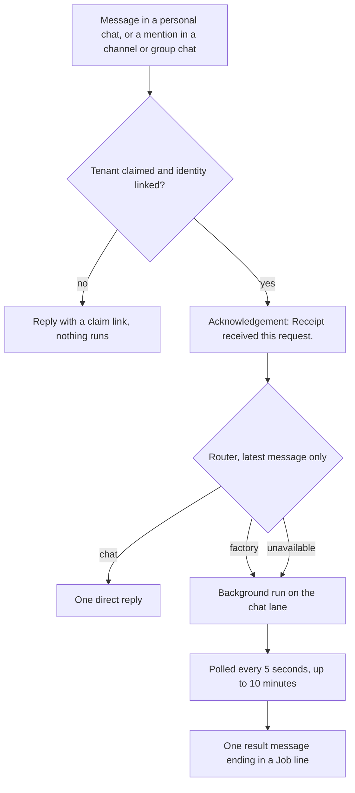

Mention Receipt in a Teams channel, group chat or personal chat and it replies in the same conversation. A question it can answer outright gets one reply. Anything that needs work against your connected systems becomes a background run: Receipt acknowledges the request straight away, runs it, and posts a single result message when the run ends, closing with a `Job:` line that identifies the run. There are no progress updates in between.

The Teams app is a first-party bot, not one of the Receipt Connect connectors in the [catalog](/catalog/connectors). It ships as a custom app package a Teams administrator uploads rather than through the Teams Store, and its manifest asks only for the Teams `identity` permission — Receipt requests no Microsoft Graph access.

## Before you start

Four things have to be true before a mention does anything:

- **The bot service is configured and the package is uploaded** — the [installation](#installing-receipt-in-teams) below, done by whoever operates your Receipt deployment.
- **An owner or admin has claimed the tenant, and you have linked your own Teams identity**, through the [claim links](#connecting-your-tenant-and-linking-your-identity) Receipt posts in Teams.
- **The organization has an OpenAI provider key**, added under [Bring your own key](/llm-gateway/bring-your-own-key).
- **The apps you want Receipt to use are connected** in your organization's **Default** workspace — not the Global integrations that web chat and Slack use. See [Connection scopes](/mcp-gateway/connection-scopes).

<Warning>
**Teams needs an organization OpenAI key, and without one it still starts a run.** Every mention is classified by the runtime's router, which in Teams runs only on the organization's own OpenAI key. When the router cannot answer, Teams does not refuse the turn the way web chat and Slack do: it falls back to a background run, which then fails because it has no key to run on, and you get the `⚠️` result described in [When routing fails](#when-routing-fails). Add the key before rolling the app out.
</Warning>

## Installing Receipt in Teams

Two people are involved: whoever operates your Receipt deployment registers the bot and builds the package; a Teams administrator uploads it and allows it for users.

<Steps>
<Step title="Register the bot in Azure">
Create a Microsoft Entra application and an Azure Bot for Receipt using the supported **Single Tenant** bot type, create a client secret, enable the **Microsoft Teams** channel, and set the messaging endpoint to `https://<your-receipt-host>/teams/api/messages`. Keep the application (client) ID, the directory (tenant) ID and the secret value.
</Step>

<Step title="Configure the Teams service">
Set `CLIENT_ID`, `CLIENT_SECRET` and `TENANT_ID` on the Teams service and restart it. The service reads exactly these names; `TEAMS_`-prefixed variants are not read. Then check its health endpoint:

```bash
curl https://<your-receipt-host>/teams/health
```

```json
{"ok":true,"configured":true}
```

`configured:false` means one of the three values is missing. The service keeps listening and logs `CLIENT_ID, CLIENT_SECRET, and TENANT_ID are required before the Teams messaging endpoint is enabled.`, but handles no Teams message until all three are set.
</Step>

<Step title="Build the app package">
From the repository root:

```bash
TEAMS_BOT_ID=<application-client-guid> \
TEAMS_APP_ID=<stable-teams-package-guid> \
TEAMS_APP_VERSION=1.0.0 \
RECEIPT_WEB_URL=https://<your-receipt-host> \
bun run teams:package
```

`teams:package` runs `scripts/package-teams-app.mjs`, which writes `dist/receipt-teams-app.zip`: the manifest plus two icons. `TEAMS_BOT_ID` is the Azure application's client ID and is required; `TEAMS_APP_ID` is the package's own stable ID, defaults to the bot ID, and should be generated once and reused for every later version. Both must be GUIDs, or the script stops with `Set TEAMS_BOT_ID and optionally TEAMS_APP_ID to valid GUIDs before packaging.` `TEAMS_APP_VERSION` defaults to `1.0.0`, must be numeric `x.y.z`, and has to go up whenever the manifest or icons change; backend changes alone need no new package. `RECEIPT_WEB_URL` defaults to the hosted app at `app.kentron.ai`, must be HTTPS, and becomes the manifest's website, privacy and terms links and its valid domain.
</Step>

<Step title="Upload it">
A Teams or Global administrator uploads the ZIP in **Teams admin center → Teams apps → Manage apps → Upload new app**, then allows it for the intended users through the tenant's app policies. Custom-app upload needs no Microsoft Store review, and a newly uploaded app can take a few hours to appear.
</Step>
</Steps>

The package presents the app as **Receipt** (full name **Receipt durable background agent**) in personal, team and group-chat scopes, with one listed command, `help`.

<Note>
Uploading the package into a tenant other than the one that registered the bot is a pilot path each tenant has to validate for itself. Microsoft's route for broad installation by other organizations is the Teams Store, which does require Microsoft review.
</Note>

## Connecting your tenant and linking your identity

Receipt binds a Microsoft tenant to exactly one Receipt organization, and each Teams user to one member of it, through claim links it posts in Teams. A link expires after **10 minutes** and opens a page titled **Connect Microsoft Teams to Receipt**; if you are not signed in, you are sent to sign-in and brought back.

<Steps>
<Step title="An owner or admin claims the tenant">
On install, Receipt posts `Receipt is ready. Connect this Teams tenant to a Receipt workspace to finish setup.` with a link; a message sent before the tenant is claimed gets `Receipt needs a Teams administrator to connect this tenant to a Receipt workspace.` and a fresh one.

The page reads `Choose the Receipt workspace that should own <tenant name>.` and lists your Receipt organizations in a picker whose empty option reads **Select a Receipt workspace** (the page says workspace; the list holds organizations), then **Connect Teams tenant**. You must be an owner or admin of the organization you pick, or you get `You do not have permission to connect this Teams identity.` Claiming the tenant links your own identity in the same step.
</Step>

<Step title="Every other user links their identity once">
The first time anyone else messages Receipt, it replies `Link your Teams identity to your Receipt account before I run this request.` with their own link. Their page reads `Link <name> to the Receipt workspace already connected to this tenant.` and the button is **Link my Teams identity**. They must already be a member of that organization — Teams creates no members or invitations, and a non-member gets `You do not have permission to connect this Teams identity.` Invite them first under [Members and roles](/core/members-and-roles).
</Step>

<Step title="Go back to Teams">
On success the page reads **Microsoft Teams connected**, with `Return to Teams and send your request again.`, and your active organization switches to the one you connected. Send the request again — the message that triggered the link was not run.
</Step>
</Steps>

An expired or malformed link shows `This Teams link is invalid or expired.`; message Receipt again for a new one. A tenant stays with the organization that claimed it. Every later link opens against that same organization and only adds a user link; a claim that would move the tenant is refused with `This Teams tenant is already connected elsewhere or the link is invalid.`

Removing the app deactivates the binding, unlinks every user and marks every recorded conversation removed. After a reinstall the tenant has to be claimed again.

## Getting a response

Teams delivers every message in a personal chat to Receipt; in a channel or group chat it delivers only messages that mention the bot, so mention it there. Receipt strips the mention, and what remains is your request. Sending `help` returns, whether or not you are linked yet:

> `Mention Receipt with the work you want done. I will acknowledge it here, run it through Receipt, and post the durable result back to this conversation.`

For anything else Receipt checks that the tenant is claimed and you are linked, then acknowledges before anything else happens:

> `Receipt received this request. I’ll post the result here.`

Only then does it ask the router what your message needs. It is the same router web chat uses, described in [How it works](/co-worker/how-it-works), but Teams hands it your latest message alone: no earlier messages, and no run to attach to.



### A direct answer

If your message can be answered without touching connected data, Receipt posts the answer as one message; nothing runs and no job is created. If the runtime cannot produce the reply, you get:

> `⚠️ Receipt could not complete the request: Profile-aware direct response unavailable.`

Asking Receipt to create a skill does not draft one either: drafting and saving skills is web only, and Teams turns the request into a background run instead. See [Skills in chat](/co-worker/skills-in-chat).

### A background run

Receipt queues a run on the same chat lane web chat uses, with a job id of the form `teams_activity_<id>` derived from your message. The job is attempted once, and the run is a single Factory ingress action rather than an iterative loop: it dispatches the work, and the objective it creates is what carries on. Receipt polls every 5 seconds for up to 10 minutes and, when the run ends, posts one message made of a status marker, the answer and a closing `Job: teams_activity_<id>` line:

| Marker | Meaning |
|---|---|
| `✅` | The run completed. |
| `⏳` | The 10-minute wait ran out while the run was still going. |
| `⚠️` | The run failed, was blocked or cancelled, or could not be started. |

A completed result carries no link back into Receipt, and a Teams run does not appear on the [Tasks page](/co-worker/objectives-and-tasks), which lists only objectives started on that page. The one link Teams posts is on the `⏳` message described under [After ten minutes](#after-ten-minutes); it opens the run in the web app, where [Replay](/co-worker/replay) shows every step. When the run produced no readable answer, the text is `Receipt objective <status>.` or `Receipt run <status>.`

The answer is posted as Markdown. A Markdown link to a PNG, JPEG or GIF image, a PDF, or a Word, Excel or PowerPoint file is also sent as an attachment on the same message; links to any other format stay plain Markdown links. Files attached to your own message are not read — Receipt sees only the text.

### After ten minutes

If the run is still going when the wait runs out, the result carries `⏳`: either `This objective is still working and is taking longer than expected.` with a link into the web app, or `This run is still working. Open Receipt to follow its live progress.` The run continues, but nothing watches it after the deadline, so Teams is never told when it finishes. Check the web app for the outcome.

## Following up in a conversation

Every message is handled on its own. Receipt does record the conversation as a thread — in a channel, the reply chain under the root post; elsewhere, the whole conversation — and appends each later message to it. But earlier messages never reach the router or the run, and no run is bound to the conversation, so a follow-up about an earlier run starts a fresh one rather than reacting to it. Write follow-ups as complete requests. Teams itself offers no way to react to or cancel a run once it is going; see [Background runs](/co-worker/background-runs).

Teams can deliver the same message more than once. Receipt records each message id as it starts work and ignores a redelivery, unless the earlier attempt failed or has sat untouched for more than two minutes.

## When routing fails

Web chat and Slack refuse a turn when the router cannot reach a usable decision, surfacing `Receipt couldn't determine the access needed for this request. Please retry; no task was started.` Teams is the exception: if the runtime is unreachable, the organization has no OpenAI key, or the router returns something Teams cannot act on, it falls back to a background run with no selected apps and posts that run's result.

Without a key the run cannot be funded and ends as a failure, so the message carries `⚠️`. A failure Teams catches itself — a run it could not queue, or a poll that could not complete — is posted instead as `⚠️ Receipt could not complete the request: <reason>`. Retrying does not help until the cause is fixed: runs are billed to the organization's OpenAI key, and there is no platform-credit fallback for Teams.

## What Teams does not do

- **No progress updates.** Acknowledgement, then result — no message edits, reactions or streamed text.
- **No approval prompts.** Nothing asks you to confirm an action before a run takes it; which operations a run may call is decided per connection under [Tools and permissions](/mcp-gateway/tools-and-permissions).
- **No file input, and no link in a completed result.**

## Configuration reference

Set these on the Teams service; never commit the values.

| Variable | What it does |
|---|---|
| `CLIENT_ID`, `CLIENT_SECRET`, `TENANT_ID` | The Azure bot's application ID, client secret and home tenant. All three are required before the messaging endpoint is enabled. |
| `PORT` | The port the service listens on, default `3978`. The `start:all` supervisor sets it and fronts the service at `/teams/`. |
| `RECEIPT_WEB_URL` | The web app origin used in claim and objective links. Falls back to `BETTER_AUTH_URL`, then to a development localhost default. |
| `ZERO_UPSTREAM_DB` | The Postgres connection holding installations, user links and conversations. |
| `TEAMS_CLAIM_SECRET` | Signs claim links. Falls back to `BETTER_AUTH_SECRET`; one of the two must be set. |
| `TEAMS_DEFAULT_PROFILE_ID` | The agent profile background runs use, default `receipt`. |

`TEAMS_BOT_ID`, `TEAMS_APP_ID` and `TEAMS_APP_VERSION` are read by `bun run teams:package`, not by the service.

## How a conversation is recorded

Every Teams conversation gets its own hash-chained receipt stream, recording activation and each follow-up, the connected apps the router picked, the queueing and outcome of every run, and each reply sent. Tenant claims, user links and app removal are recorded the same way. The run itself is an ordinary background run on the chat lane, which is why Replay rebuilds it exactly like one started from web chat — see [Receipts and streams](/core/receipts-and-streams).

Next step: [see how a turn is processed](/co-worker/how-it-works).
