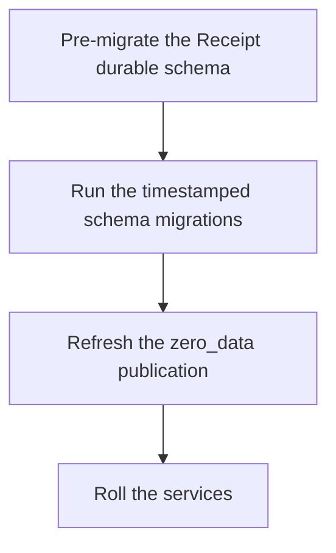

One forward-only command migrates a Receipt database: `./bunw run --cwd apps/start zero:migrate`. It is safe against a live stack: idempotent, and advisory-locked so two concurrent deploys cannot race each other through it. This page covers what your Postgres has to be before that command works, what the runner does, and the single membership rule that decides whether your UI shows any data at all.

Receipt stores everything in Postgres. The client sync layer — Zero — does not read your tables over HTTP; it **replicates them out of Postgres over logical replication** and serves the replica to browsers. That one fact drives every requirement below.

## What Postgres has to be

<Warning>
**Logical replication must be on.** Postgres must run with `wal_level=logical`. The default, `wal_level=replica`, does not work — the sync layer cannot replicate from it.

The bundled compose file starts Postgres with `command: postgres -c wal_level=logical`. A Postgres you bring yourself almost certainly does not have it set.
</Warning>

### Pick a major version deliberately

The repository does not agree with itself, so you have to choose:

| Where | Version |
|---|---|
| The bundled Postgres compose file, used by local development | `postgres:16-alpine` |
| The CI workflow's service container | `postgres:17` |
| The managed database in the reference deploy configuration | Postgres 17 |

Nothing in the code enforces a floor. The one place the repository states one is a database-migration note written for a specific managed-Postgres move, which says Postgres 15 or newer. Pin one version across your environments rather than letting each one pick its own.

### Other upstream requirements

The next three come from that same note. Treat them as its requirements rather than as a general contract:

- Enough `max_replication_slots` and `max_wal_senders` headroom for the sync layer's slot alongside any migration tooling.
- On that managed service, logical replication is a parameter-group setting that takes effect only on reboot, so the first deploy or a parameter change needs a database restart before replication works. Check your own provider's equivalent.
- `ZERO_UPSTREAM_DB` must be a **direct writer** connection: no connection pooler, no read replica, no reader endpoint. The sync layer's CVR and change databases may be pooled.

Two more are properties of Postgres itself:

- Inactive logical slots retain WAL. Watch replication-slot lag and slot disk usage, or a forgotten slot will fill the volume.
- A Postgres you run natively rather than from the bundled compose file needs `wal_level=logical`, and `pg_trgm` must be installable — `schema.sql` opens with `CREATE EXTENSION IF NOT EXISTS pg_trgm;`.

<Note>
`ZERO_UPSTREAM_DB` is the connection variable the application, the Receipt runtime and the sync layer read. Only the migration runner and the self-hosted setup health check fall back to other names; the application pool and the runtime do not. See [Configuration, secrets, and keys](/core/configuration) for why it accepts no other aliases.
</Note>

## Migrations

A migration is a single timestamped, forward-only, idempotent SQL file in `apps/start/zero/migrations/`, named `YYYYMMDD_snake_case_description.sql`. Files are matched by `^\d+_.+\.sql$` and applied in lexical order. `schema.sql` sits alongside them and bootstraps a fresh database.

The conventions visible in the checked-in migrations: `CREATE TABLE IF NOT EXISTS` and `CREATE INDEX IF NOT EXISTS` throughout, `metadata_json JSONB NOT NULL DEFAULT '{}'::jsonb` for open-ended data, `created_at BIGINT` epoch millis, and indexes that match the exact read paths. About half the files also open with a comment block explaining why the table exists; copy that habit rather than the files that skip it.

### One runner, nine steps

`apps/start/scripts/zero-migrate.ts` is the single production migration runner. It:

<Steps>
<Step title="Resolves the connection string">
From `ZERO_UPSTREAM_DB`, falling back in order to `DATABASE_URL`, `DATABASE_PUBLIC_URL`, `POSTGRES_URL` and `PGURL`. With none of them set it fails with `No Postgres connection string found. Set ZERO_UPSTREAM_DB, DATABASE_URL, or DATABASE_PUBLIC_URL in deployment variables.` — the message names only the first three, so set one of those.
</Step>
<Step title="Takes an advisory lock">
It connects with `search_path=public` and takes a Postgres advisory lock, so two concurrent deploys cannot race each other through the migration set. The lock is released in a `finally` block.
</Step>
<Step title="Normalises legacy per-user-schema tables back into public">
Tables left over from an earlier per-user-schema architecture are moved back into `public`, so every later step operates against one consistent schema.
</Step>
<Step title="Runs the Better Auth migrations">
So the auth-owned tables — `user`, `session`, `account`, `verification`, `organization`, `member`, `invitation`, `twoFactor` — exist before anything references them.
</Step>
<Step title="Creates the ledger">
`zero_schema_migrations (filename PK, checksum, applied_at)`.
</Step>
<Step title="Bootstraps schema.sql on a fresh database">
Detected by the absence of any of four baseline tables, because older timestamped migrations depend on `schema.sql`.
</Step>
<Step title="Applies every timestamped migration in lexical order">
Every file matching `^\d+_.+\.sql$` in `apps/start/zero/migrations/` — currently 50 timestamped migrations, plus `schema.sql`.
</Step>
<Step title="Refreshes the zero_data publication">
Covered below. This is the step that decides what reaches a browser.
</Step>
<Step title="Records filename and SHA-256 checksum">
And fails when an already-applied file has changed.
</Step>
</Steps>

### Never edit an applied migration

<Warning>
Editing a migration that has already run fails the next deploy:

```
Migration <file> was already applied with a different checksum. Create a new migration file instead of editing old ones.
```

Add a new timestamped file instead. A small allow-list inside the runner pairs specific historical filenames with the exact prior checksums they are allowed to have; those files are re-applied idempotently and the ledger is advanced, without weakening the check for anything else.
</Warning>

### The newest migration is a runtime table

The most recent timestamped migration, `20260905_durable_projection_work.sql`, creates the two tables that make projection delivery crash-safe: `receipt_projection_work`, fed by an `AFTER INSERT` trigger on the raw receipt log, and `receipt_reducer_checkpoints`, which lets a projector resume from a checkpoint instead of re-folding a whole stream. Neither is published: both are `internal` in the runtime table contract, and the schema calls them "Internal, rebuildable state; never published to Zero clients."

<Info>
Note where that file lives: these are Receipt **runtime** tables, but the migration ships in the Zero migration set, so the web app's migrator applies it too. The file is generated from the same SQL the runtime's own schema migration runs, and its first line says to keep the two aligned — the runtime installs the tables and the trigger in its resolved schema, this migration installs them in `public`. Edit one and you must regenerate the other. See [Receipts and streams](/core/receipts-and-streams) for what the two tables do.
</Info>

### Which commands are safe against a live stack

| Command | Safe on a live stack? | What it does |
|---|---|---|
| `./bunw run --cwd apps/start zero:migrate` | **Yes** — forward-only, advisory-locked | The nine steps above |
| `./bunw run --cwd apps/start db:reset` | **No — destructive** | Drops the `zero_data` publication and every base table in `public` with `CASCADE`, re-runs the Better Auth migrations, then runs the sync reset |
| `./bunw run --cwd apps/start zero:reset` | **No — destructive** | Drops the sync layer's event triggers and internal schemas, drops its tables, re-applies `schema.sql` and every timestamped migration, recreates the publication, and deletes the local replica files `zero.db`, `zero.db-wal`, `zero.db-wal2`, `zero.db-shm` |
| `./bunw run --cwd apps/start postgres:drop-all-tables` | **No — destructive** | Drops every base table in `public` with `CASCADE`, including tables a reset would miss |

`zero:reset` finishes by printing what you still have to do yourself:

```
Done. Next steps:
  - Restart zero-cache: bun run zero-cache
  - Restart the app dev server.
  - For a clean browser client, clear site data for localhost (DevTools → Application → Clear site data).
```

## The publication trap

This is the one thing to take away from this page.

The sync layer replicates a **curated** publication called `zero_data`, not `FOR ALL TABLES`. A table reaches a browser client only when it is a member of that publication. A table that exists, has rows and is queried correctly still reaches nobody if it is not published — and if it is also declared in the Zero client schema, the mismatch takes the rest of sync down with it.

<Warning>
A table missing from the `zero_data` publication does not break only that table. It **silently breaks all client sync** — UI flicker and no data after login. The repository records this as its first root-cause finding, its own contributor instructions lead with it, and a unit test guards it by asserting that every table in the Zero client schema is published.
</Warning>

### Membership is computed, not declared once

`apps/start/scripts/zero-publication.ts` builds the member list from:

- A fixed list of 14 app tables: `user`, `organization`, `member`, `invitation`, `org_ai_policy`, `org_connection_secret`, `receipt_workspace`, `receipt_workspace_member`, `attachments`, `org_billing_account`, `org_subscription`, `org_entitlement_snapshot`, `org_member_access`, `org_user_usage_summary`.
- The 15 Receipt projection tables the runtime table contract marks `zeroPublication: "default"`.
- `ZERO_PUBLICATION_EXTRA_TABLES`, a comma-separated list appended to the rest and de-duplicated against it. This is the supported opt-in for a new UI surface without editing the fixed list.

Those 29 tables are, today, exactly the 29 tables in the Zero client schema. The guard test asserts the direction that breaks sync: every table in the client schema must appear in the publication. A published table with no client-schema entry is harmless and is not caught.

Each table is schema-qualified: Receipt runtime projections get `RECEIPT_POSTGRES_SCHEMA` (default `public`), everything else gets `public`. Four `receipt_`-prefixed tables are explicit exceptions, qualified with `public` because they are app-owned settings created by an ordinary migration: `receipt_workspace`, `receipt_workspace_member`, `receipt_org_guardrail_group_projection` and `receipt_org_policy_rule_projection`. The exception decides only which schema qualifies the name — `receipt_org_policy_rule_projection` is `internal` in the contract, so it is not in the publication at all.

Raw receipt logs, stream and branch indexes, the change log, projection offsets, memory embeddings, durable scheduler tables, the eval-run and computer-use session projections, and the new projection-work and checkpoint tables all stay server-side on purpose.

The refresh is `ALTER PUBLICATION zero_data SET TABLE …` when the publication already exists, otherwise `CREATE PUBLICATION zero_data FOR TABLE …`, with per-table column lists where declared. It logs one of:

```
Refreshing zero_data publication with <n> tables...
Creating zero_data publication with <n> tables...
```

### Adding a table is two changes, not one

<Info>
Change the schema **and** the publication membership in the same migration. A schema change without a membership change ships a table nobody can read; a membership change without the table breaks the refresh.
</Info>

If the new table is a Receipt runtime projection, its entry in the runtime table contract must declare `zeroPublication: "default"`, and the table must also be declared in the Zero client schema at `apps/start/src/integrations/zero/schema.ts`. Add the client-schema entry without the contract declaration and the guard test fails before the change reaches a browser — which is exactly the failure the test was written for.

On a self-hosted deployment, the browser replica also lives under a versioned storage namespace, currently `receipt-self-hosted-zero-data-v8`. Bump it when a change means every client has to rebuild its local cache rather than resume against a schema that no longer matches.

### Ordering on deploy

The publication references Receipt projection tables, so those tables must exist before the refresh runs.



The supervised local stack does exactly this: it pre-migrates the Receipt durable schema, then runs `zero:migrate`, then explicitly re-runs the publication refresh afterwards. If you drive migrations by hand, keep the same order.

### Logical replication does not backfill

Adding a table to the publication does not populate the existing replica with the rows already in it. Forcing a full initial sync means starting from a fresh replica file, which is what deleting `zero.db*` — and what `zero:reset` — does.

The browser also keeps its own store, and a hard refresh does not rebuild it. If one client looks stuck while others are fine, clear site data for the origin.

<Note>
The reference deployment carries a replica-generation marker in its configuration, used for both the replica file name and its backup location. The comment beside it says to bump the marker when a publication or schema mistake leaves the durable replica unable to apply the current change log: Postgres stays authoritative, and a new generation forces a fresh initial sync instead of restoring a poisoned backup. That comment is the only place the procedure is written down; there is no separate runbook for it.

Changing the upstream database has the same consequence — delete the replica file and its siblings before starting against a new upstream.
</Note>

## Symptoms and their causes

| What you see | Cause | Fix |
|---|---|---|
| The UI loads but nothing ever syncs | A table missing from the `zero_data` publication breaks all client sync | Run `zero:migrate` against the live stack (or `zero:reset` locally), and confirm Postgres runs with `wal_level=logical` |
| A newly published table shows no rows | Logical replication does not backfill | Force a full initial sync from a fresh replica file; clear browser site data too |
| `zero-cache` exits shortly after start, following a schema reset | A retained replica file still holds table DDL and replication watermarks from the earlier schema lifecycle; the replayed `CREATE TABLE` hits a table the replica already has | Delete `zero.db*`, or let `zero:reset` do it. The stack validator isolates its replica file per run for exactly this reason |
| `relation "<schema>.receipt_job_projection" does not exist` during `zero:migrate` | The migration refreshed the publication before Receipt's durable projection tables existed in the configured schema | Pre-migrate the Receipt schema first, as above |
| `Could not locate the bindings file.` from `zero-cache` | The sync layer's native SQLite binding was not built | Rebuild the `@rocicorp/zero-sqlite3` native binding; `start:all` and `local:up` rebuild it automatically, `dev` does not |

## What the publication does not carry

Postgres replicates every column of a published table unless the publication declares a column list. Three tables declare one:

| Table | Published columns |
|---|---|
| `org_connection_secret` | `id`, `organization_id`, `workspace_id`, `provider`, `name`, `kind`, `status`, `expires_at`, `last_validated_at`, `created_at`, `updated_at` |
| `receipt_workspace` | `id`, `organization_id`, `name`, `slug`, `is_default`, `stream`, `receipt_refs_json`, `created_at`, `updated_at` |
| `receipt_workspace_member` | `workspace_id`, `organization_id`, `user_id`, `role`, `stream`, `receipt_refs_json`, `created_at`, `updated_at` |

`org_connection_secret` is where this earns its keep. Its `ciphertext`, `iv`, `auth_tag`, `key_version` and `created_by_user_id` columns are **not** in the list, so they are never replicated to a browser — even though `status`, which the UI needs, shares the same row. `receipt_workspace` withholds one column, `created_by_user_id`. `receipt_workspace_member` withholds nothing today; its list pins the shape so a future column is not published by accident. Copy this pattern if you add a table that mixes client-visible state with secret material.

## Tenancy: a directory name becomes a schema name

The Receipt runtime's Postgres store is keyed by data directory, not by a schema you name:

- `RECEIPT_DATA_DIR` (or `DATA_DIR`) is resolved to an absolute path, hashed with SHA-256, and the first 24 hex characters become the schema name `receipt_data_<24 hex>`.
- Setting `RECEIPT_POSTGRES_SCHEMA` explicitly skips the derivation entirely and uses that schema.
- Connections are pinned to the resolved schema with `-c search_path="<schema>"`, so a role's default `search_path` cannot silently redirect unqualified queries somewhere else. The direct pools set it even for `public`; the shared tenant pool leaves it unset for `public` on purpose, so a query can still resolve against the shared tables while another connection is creating a tenant schema.
- The default pool size is **2**, overridable with `RECEIPT_POSTGRES_POOL_MAX`. Projection catch-up reserves a separate single-connection pool so a long catch-up batch cannot starve receipt acceptance.

Two deployments pointed at the same database with different data directories therefore land in different schemas and cannot see each other's runtime data. Two deployments with the same resolved data directory share one.

Next step: [Run the integration provider](/core/integrations-provider), the service Receipt Connect cannot work without, and the key that only exists after you have already deployed once.
