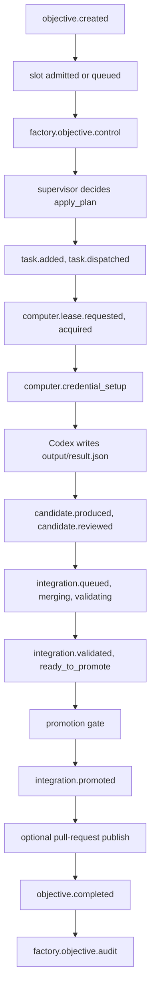

When you give Receipt a goal it cannot answer inside the chat turn, Factory is what runs it. Factory takes the written goal, plans it into a graph of tasks, executes each task inside a disposable computer, integrates the result, and records every step as receipts you can replay afterwards. You reach it from chat, from the Tasks page in the application, and from the in-repo `receipt factory` commands.

This page is the engine's internals. For what a run looks like from the outside — what you see while it works and how to read the result — start with [background runs](/co-worker/background-runs) and [objectives and tasks](/co-worker/objectives-and-tasks).

<Note>
The application's Tasks page is titled **Beetle Tasks**. Beetle is the assistant's name in the interface; the engine described here is the same one behind chat, that page and the CLI.
</Note>

## From a goal to a finished run

A delivery objective moves through this sequence. Every state change is a receipt on the stream `factory/objectives/<objectiveId>`, so the whole run is reconstructable afterwards; the boxes below name those receipts and the jobs that write them.



An investigation objective takes a shorter path: it never consumes a repository execution slot, moves from `collecting_evidence` to `evidence_ready`, dispatches a synthesis task, and ends when that task writes its `investigation.reported` receipt — no checks, no promotion gate. Investigation is the default mode in a stock checkout, so it is the path you meet first.

The objective, task, candidate, job, check and promotion vocabulary — the twelve objective statuses, the display states, the profile and the promotion gate's exact refusal messages — is defined once in [Factory concepts and configuration](/cli/from-source/factory-overview).

## Planning is a supervisor decision at a receipt boundary

Factory does not plan continuously. At explicit points the runtime runs an **objective supervisor**: one model call whose structured answer is validated and then applied deterministically. The decision carries an assessment (`on_track`, `needs_more_evidence`, `needs_replan`, `sufficient` or `blocked`), a confidence, a rationale, and exactly one action — `continue`, `apply_plan`, `synthesize` or `block`.

`apply_plan` is what creates the task graph: it appends `task.added` receipts, each task carrying its `dependsOn` node ids. A reconcile pass then activates every ready task and dispatches worker jobs up to the objective's policy limits. Mutations are compare-and-append, so a mutation that loses the race is retried against the new head rather than overwriting it.

The supervisor model comes from `RECEIPT_FACTORY_OBJECTIVE_SUPERVISOR_MODEL` (falling back to `RECEIPT_FACTORY_SUPERVISOR_MODEL`); the task worker model comes from `RECEIPT_FACTORY_TASK_MODEL`.

## Dispatch, reaction and recovery

Factory has no scheduler of its own. It enqueues jobs on the receipt-backed queue and lets [durable execution](/core/jobs-and-durable-execution) carry them through Resonate: a driver begins the worker RPC, the worker leases the job, heartbeats under a fence, and settles it with a terminal receipt. Which [process](/core/architecture) picks a Factory job up is decided by its agent id first and its kind second.

| Factory work | Agent id | Runs on |
| --- | --- | --- |
| `factory.run`, `factory.dispatch` — turning a chat turn or a filed task into an objective action | `factory` | `worker-chat` |
| `factory.objective.control`, `factory.objective.audit`, `factory.objective.watchdog` | `factory-control` | `worker-control` |
| `factory.task.monitor` | `factory-monitor` | `worker-chat` |
| `factory.task.run` | `codex` | `worker-codex` |
| `factory.integration.validate`, `factory.integration.publish` | `codex` | `worker-codex` |

Anything whose kind starts with `factory.integration.` lands on `worker-codex` whatever agent id it carries. The queue's kind contract records a `workerGroup` as well, and for `factory.dispatch` and `factory.task.monitor` it names `control` — but the dispatcher routes on the agent id, so both of those run on `worker-chat`.

Factory jobs also carry longer leases than the 300-second default: objective control and the computer-path task monitor both default to 900 000 ms, and a codex job takes the larger of `CODEX_JOB_LEASE_MS` and its own payload timeout plus five minutes, capped at one hour.

Three behaviours are specific to Factory:

- **Every codex-lane job reacts the objective when it finishes.** `factory.task.run`, `factory.integration.validate` and `factory.integration.publish` each end by calling the objective's reconcile pass, unless the result was `skipped_terminal_state`. That is how one finished task activates the next.
- **A watchdog reconciles objectives nobody is driving.** It runs on a cron, scans objective summaries and enqueues an objective-control job with the reason `reconcile` for one of three decisions: `no_active_objective_work`, `phase_supersession_has_active_stale_job` or `active_objective_work_stalled`.
- **Repeated identical failures stop the objective without another model call.** When two consecutive sandbox-backed tasks are blocked by the same failure family, a deterministic circuit blocks the objective instead of replanning around it.

<Warning>
**A permanent model authentication failure is not retried.** An HTTP 401 or `invalid_api_key` from the model provider stops the supervisor immediately with the reason `Your OpenAI API key is invalid or expired. Update it in BYOK settings and retry.` followed by the raw provider message in parentheses. Fix the key in [BYOK settings](/llm-gateway/bring-your-own-key) and start the objective again — retrying the same objective will not clear it.
</Warning>

A **task monitor** job supervises each running task on a 10-second poll. Its checkpoints are mechanical: at an interval that depends on the objective — four minutes for delivery, two for investigation, one when severity is 4 or 5 — it re-reads the objective, the task and the Codex job, and it finishes as soon as any of them is no longer active. The monitor writes no receipt of its own; the job heartbeat is the liveness signal, and no checkpoint can promote a task's evidence to sufficient. Semantic judgements belong to the objective supervisor alone.

## The computer lane

There is exactly one execution path, `computer`, and exactly one computer target, `opensandbox`. There is no local or host-managed execution lane, and neither value is a per-objective choice.

| Setting | Default | Environment override |
| --- | --- | --- |
| Domain | `localhost:8080` | `OPEN_SANDBOX_DOMAIN` |
| Protocol | `http` | `OPEN_SANDBOX_PROTOCOL` |
| Worker image | `receiptfactory/opensandbox-worker:local` | `OPEN_SANDBOX_IMAGE` |
| Template version | `receipt-factory-opensandbox-v1` | `OPEN_SANDBOX_TEMPLATE_VERSION` |
| Remote workspace root | `/workspace/receipt-workspaces` | `OPEN_SANDBOX_REMOTE_WORKSPACE_ROOT` |
| Ready timeout | 120 s | `OPEN_SANDBOX_READY_TIMEOUT_SECONDS` |
| Request timeout | 120 s | `OPEN_SANDBOX_REQUEST_TIMEOUT_SECONDS` |
| Sandbox timeout | 3600 s | `OPEN_SANDBOX_TIMEOUT_SECONDS` |
| CPU / memory | `2` / `4Gi` | `OPEN_SANDBOX_CPU`, `OPEN_SANDBOX_MEMORY` |
| Host ready timeout | 180000 ms | `OPEN_SANDBOX_HOST_READY_TIMEOUT_MS` |
| Workspace sync timeout | 180000 ms, clamped to 1000–900000 | `RECEIPT_OPENSANDBOX_WORKSPACE_SYNC_TIMEOUT_MS` |

<Warning>
The default worker image is local-only, and two guards refuse to use it remotely:

`OPEN_SANDBOX_IMAGE is required for cloud OpenSandbox execution; refusing to use the local-only default image.`

`OPEN_SANDBOX_IMAGE must reference a published image when Receipt workers use a public gateway. Refusing local-only image receiptfactory/opensandbox-worker:local. Set OPEN_SANDBOX_IMAGE to the published ECR/OpenSandbox worker image before running remote computer objectives.`

Set `OPEN_SANDBOX_IMAGE` to a published image before running anything remotely.
</Warning>

### Capacity is a queue, not a pool

Computer capacity is a receipt-backed ledger with two limits, both defaulting to **1**: a global one (`OPEN_SANDBOX_GLOBAL_MAX_ACTIVE`) and a per-organization one (`OPEN_SANDBOX_ORG_MAX_ACTIVE`, or `OPEN_SANDBOX_ORG_<ORG>_MAX_ACTIVE` for a named organization). Capacity leases last 240 seconds and are renewed every 160 seconds while the task runs; a waiter polls every second, is told it is waiting after 15 seconds, and a claim abandoned by a dead worker expires after 3 minutes.

While a task waits and runs, the progress summaries it writes are the ones you see in chat and in [replay](/co-worker/replay): `Requesting a computer.`, `Computer acquired; resolving the workspace.`, `Computer acquired.`, `Preparing the computer workspace.` (detail: `Syncing task files, selected skills, credentials, and execution metadata.`), `Computer workspace is ready; starting the agent.`, `Starting the agent in the computer.` and `Released the computer.`

<Info>
Idle sandbox hosts are not stopped automatically. Host shutdown is an explicit operator action, so a host left running after a burst of work stays up until someone stops it.
</Info>

## The task packet

Everything a worker reads and writes for one task lives under `receipt/current/` in its workspace:

```
receipt/current/objective.json
receipt/current/task.json
receipt/current/manifest.json
receipt/current/context.md
receipt/current/context-pack.json
receipt/current/prompt.md
receipt/current/output/result.json
receipt/current/output/stdout.log
receipt/current/output/stderr.log
receipt/current/output/last-message.md
receipt/current/evidence/evidence.json
receipt/current/skills/skill-bundle.json
receipt/current/memory.cjs
receipt/current/memory-scopes.json
receipt/current/receipt-cli.md
```

Integration packets add `output/<candidateId>.integration.json` and the matching `.integration.stdout.log` and `.integration.stderr.log`.

What sits around the packet depends on the objective's mode. **An investigation task that carries a connected-system contract gets a receipt-only workspace** — `AGENTS.md`, the `receipt` tree (the packet plus the organization skill registry) and the selected skill roots, and nothing of the application source. Every investigation task also skips the dependency bootstrap. **Delivery workers get the repository worktree**, because they may implement, check or publish.

`receipt/current/receipt-cli.md` is generated per task and tells the worker which commands it may run. It is where the credential rule is stated to the agent directly: `Receipt applies provider credentials server-side; never request or print them.` The task prompt adds the matching discipline: `Never print or persist raw secret, token, password, API key, or credential values in stdout, stderr, artifacts, or the final JSON.`

## What runs inside

The agent in the sandbox is the Codex CLI, invoked once per task in `exec` mode against the workspace path, reading `prompt.md` on stdin and writing its last message and a structured result back into the packet. Web search (`--search`) is switched on only for tasks whose execution class is `broad`.

Codex's own kernel sandbox is bypassed deliberately — the container does not allow the nested namespace operations it needs — so **the OpenSandbox computer is the isolation boundary**, not Codex's sandbox flag.

Three timers supervise the run: a 60-second startup timeout (`RECEIPT_CODEX_STARTUP_TIMEOUT_MS`), a 300-second stall timeout (`RECEIPT_CODEX_STALL_TIMEOUT_MS`) and a 500 ms abort poll; both timeouts are additionally capped by the job's own execution window. A steer or abort command posted to the job is picked up within about half a second — the command stream is aborted, the computer lease is released, and the run is recorded as a controlled abort rather than an infrastructure failure.

## Credentials inside the sandbox

Connected-system credentials are not copied into the computer. For AWS, GCP, kubectl and Jira, Factory installs a **credential helper**: a small shell script that reads a token file, calls `POST <gateway>/connect/credential/<provider>` on the [Receipt Connect](/mcp-gateway/receipt-connect) gateway, and hands fresh material to the CLI at the moment it is used. Generic HTTP integrations get no helper at all — the worker calls `receipt connect call …` and the credential never leaves the server. Generated AWS profiles pin `region = us-east-1`, so name a region explicitly when your resources live elsewhere.

The token in that file is a job-scoped Receipt Connect JWT, minted with `connect:read` plus, when the task's contract needs credentials, `connect:credential` and the contract's write scopes. It is written with mode `0600` inside the workspace, and the gateway endpoint re-checks the scope and current workspace membership on every call.

Credential setup writes its own receipts: `computer.credential_setup.started` (`Installing and validating remote credentials before command startup.`), then either `computer.credential_setup.succeeded` — `Remote credential setup completed with <n> helper file(s).`, or `Remote credential setup completed; no Receipt Connect helpers were required.` — or `computer.credential_setup.failed` carrying the error.

<Warning>
**Two credentials are placed inside the computer, and one more can be.** The organization's OpenAI key is written to `~/.codex/auth.json` in the sandbox so Codex can run at all; Factory refuses to start without organization-scoped model funding, which is a BYOK key or platform credit where that is authorized. If the controller host has the `gh` CLI logged in, its GitHub token is projected into the sandbox as `GH_TOKEN` and `GITHUB_TOKEN` with a matching `gh` configuration — that is what makes pull-request publishing work, and it is the one credential that is not job-scoped. Where no Receipt Connect JWT secret is configured, an ambient `RECEIPT_CONNECT_TOKEN` from the controller's environment is reused instead of a fresh job-scoped token; that is the local development case.
</Warning>

When the contract cannot be satisfied, the task reports a readiness failure with one of these codes: `workspace_missing`, `codex_missing`, `codex_auth_missing`, `receipt_cli_missing`, `receipt_connect_unavailable`, `credential_helper_missing`, `provider_cli_missing`.

## Results, checks and promotion

After Codex exits, the runtime collects artifacts and patches — up to three attempts, refreshing the computer lease between them, when the sandbox command transport is interrupted, rather than rerunning the model — then writes `stdout.log` and `stderr.log` and reads token usage out of the Codex event stream. The structured result is `output/result.json` when it exists, otherwise the last message parsed as JSON. If neither parses, the job fails with `missing structured factory task result from codex`.

That result is a contract, not free text. A delivery result carries an `outcome` of `approved`, `changes_requested`, `blocked` or `partial`; a `completion` object listing what `changed`, the `proof` for it and any `remaining` work; and an `alignment` verdict of `aligned`, `uncertain` or `drifted`. An investigation result carries a `status` of `answered`, `partial` or `blocked` and findings each marked `confirmed`, `inferred` or `uncertain`.

The outcome decides what happens to the task. `approved` approves the candidate and the task, which is what lets the work move toward integration. `changes_requested` and `partial` both write a `changes_requested` review and return the task to `ready` for another pass — unless the rework cap or the alignment gate fires, which blocks it instead; a `partial` whose checks all passed and whose only remaining notes the controller can resolve itself is upgraded to `approved`. `blocked` writes a `task.blocked` receipt carrying the worker's handoff as the reason, and no candidate is produced. Those `completion` fields are what the promotion gate checks later, which is why a task that records no proof, or still reports remaining work, cannot be promoted.

Delivery work is merged in a dedicated integration worktree, and its checks run **inside the computer**, not on the controller: each check command goes through the sandbox lease with a 60-minute timeout, with one repair-and-retry when a check fails because a tracked file is missing. A passing run emits validated events with the summary `Integration checks passed for <candidateId>.` and the handoff `Integration checks passed for <candidateId>. Controller may continue toward promotion.`, commits an integration memory entry, and reacts the objective. Promotion happens behind the promotion gate: when the source checkout is clean it is a fast-forward merge of the integrated commit into the source branch, and when the source checkout has uncommitted changes Factory commits only the promoted paths — or refuses with a conflict when those changes overlap the promoted files.

## Publishing a pull request

A delivery objective can end with one more Codex run, `factory.integration.publish`, driven by a checked-in publisher skill. That run reads the objective's history through the receipt CLI, pushes the branch, checks for an existing pull request with `gh pr view`, creates one with `gh pr create` if there is none, retries transient GitHub failures at most twice more, and returns a strict JSON object: `summary`, `prUrl`, `prNumber`, `headRefName` and `baseRefName`, with `null` allowed for the last three when GitHub does not return them. The runtime also accepts an optional `handoff` and falls back to the summary when it is absent. The publisher is explicitly forbidden from running builds or tests and from changing code.

If the result carries no valid `http` or `https` `prUrl`, the job fails — with the worker's own blocker summary when it reported one, otherwise `factory publish result missing valid prUrl`.

## Memory

Memory is receipt-backed like everything else: a scope maps to its own stream, and reads and writes append `memory.accessed` and `memory.committed` events. Each packet mounts six scopes, reached through `memory.cjs`.

| Scope | What it holds |
| --- | --- |
| `factory/agents/<workerType>` | Agent memory for that worker type — read-only |
| `repos/<repoKey>/shared` | Repository-shared memory — read-only |
| `factory/objectives/<objectiveId>` | Objective memory |
| `factory/objectives/<objectiveId>/tasks/<taskId>` | Task memory |
| `factory/objectives/<objectiveId>/candidates/<candidateId>` | Candidate memory |
| `factory/objectives/<objectiveId>/integration` | Integration memory |

Publishing has a scope of its own, `factory/objectives/<objectiveId>/publish`. Search across a scope is semantic when an embedding function is configured, and keyword-based otherwise.

## Audits after a run

A terminal objective enqueues a `factory.objective.audit` job. The audit reconstructs the run from its receipts, writes `objective.audit.json` and `objective.audit.md` into the objective's artifacts, and commits summaries to the scopes `factory/audits/objectives/<objectiveId>` and `factory/audits/repo`. A repository-wide system-improvement report is produced only when `FACTORY_OBJECTIVE_AUDIT_SYSTEM_IMPROVEMENT` is set to `true`.

If newer receipts moved the objective's head while the audit was running, the audit completes as `superseded` rather than failing — findings are never published against a stale snapshot.

<Warning>
**Audits do not change the system on their own.** They produce recommendations and memory summaries for later runs; applying one is an operator action, and the routes that apply it live on the runtime's private shell rather than in the application UI. Nothing in Factory rewrites its own configuration, prompts or code as a result of an audit.
</Warning>

## Concurrency and limits

| Limit | Default | Where it comes from |
| --- | --- | --- |
| Delivery objectives admitted per repository | 20 | `repoSlotConcurrency`, or `RECEIPT_FACTORY_REPO_SLOT_CONCURRENCY` |
| Active computers, globally | 1 | `OPEN_SANDBOX_GLOBAL_MAX_ACTIVE` |
| Active computers, per organization | 1 | `OPEN_SANDBOX_ORG_MAX_ACTIVE` |
| Codex jobs per `worker-codex` process | 1 | `CODEX_JOB_CONCURRENCY` |
| Tasks running concurrently for one objective | 5 | `concurrency.maxActiveTasks` in the Factory policy, lowered further by the profile's `maxParallelChildren` and by severity (4 at severity 4, 2 at severity 5) |
| Objective wall-clock budget | 24 hours | `budgets.maxObjectiveMinutes`, maximum 7 days |

<Note>
The board calls the first row "the repo execution slot", which reads like one objective at a time. The runtime admits queued delivery objectives up to `repoSlotConcurrency` minus the number already holding a slot, so the shipped default is twenty concurrent delivery objectives per repository, not one. Investigation objectives take no slot at all.
</Note>

Two more constraints bite in practice. Factory needs organization-scoped model funding before anything can start. And the infrastructure helper catalog — 40 helpers at this release, 20 AWS and 18 GCP plus two audits — runs through Python 3, which must be present wherever helpers run. For the commands that drive all of this from a checkout, see [the receipt factory command reference](/cli/from-source/factory-reference).

Next step: [call the runtime over HTTP](/core/runtime-api).
