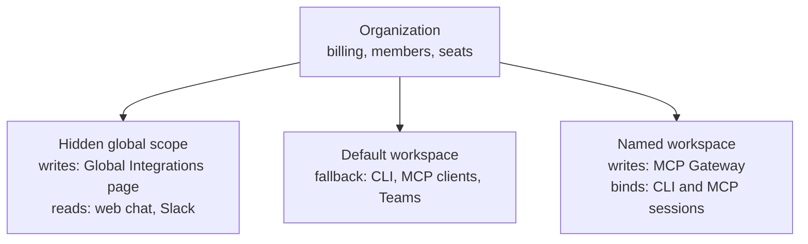

Receipt has two tenancy layers, and in-product copy calls both of them a "workspace". They are not the same thing, and a good deal of the rest of this site depends on telling them apart.

- An **organization** is the billing and membership tenant. It is what the sidebar switcher switches between, what holds your members and invitations, and what a plan and its seats attach to.
- A **Receipt workspace** is the credential and authorization boundary. It holds connected accounts, per-connection action permissions, provider keys, CLI sessions and MCP tools, and it is what the MCP Gateway, Receipt Connect and the CLI bind to.

The overlap is baked into the copy: the organization Receipt creates for you at signup is literally named `<Your Name>'s Workspace`, and the billing page describes itself as managing a workspace subscription while operating on an organization. A practical rule when you meet the word in the app — if the sentence is about billing, seats or members, it means the organization; if it is about connections, credentials or tokens, it means a Receipt workspace.

## How the two nest

One organization contains a `Default` workspace, any named workspaces you create, and a hidden global scope you never see in a list. Different surfaces read different scopes:

Connecting an app for chat therefore does not connect it for an MCP client on `Default`, and connecting one inside a named workspace does not make it available to chat. [Where a connection lives](/mcp-gateway/connection-scopes) has the full table of which surface reads which scope.

## Your organization

### You get one at signup

Creating an account creates an organization for you and makes it the active one. Its name is your display name followed by `'s Workspace`; when your name is empty or the literal `human`, Receipt derives it from the local part of your email address instead, turning `.`, `_` and `-` into spaces and title-casing the result, so `ari.say@example.com` becomes `Ari Say's Workspace`.

Your active organization lives on your session, and the sidebar switcher is what changes it. A fresh sign-in starts you on your oldest organization membership rather than the one you used last, so if you belong to more than one, expect to switch after signing in on a new device.

### Creating and switching

The organization avatar at the top of the sidebar rail — its accessible name is `Organization settings` — opens the switcher.

<Frame caption="The organization switcher, opened from the avatar at the top of the sidebar rail. The header names the organization, then who you are inside it, then the plan and active member count, and last the Receipt workspace you currently have selected. Below that, Organizations lists the organizations you belong to with a check on the active one.">
  
</Frame>

The header carries four facts about where you are: the organization name, `<your name> in <organization>`, a plan and member summary in the form `Free · 1 member` (`Self-hosted` on a self-hosted instance), and the name of the Receipt workspace you have selected. While the list loads it reads `Loading organizations...`, a switch in progress reads `Switching...`, and an empty list reads `No organizations found`.

**Create** opens a **Create organization** dialog described as `Enter a name.`, with the field **Organization name**, the placeholder `Acme` and a 50-character limit, and a **Create** button that stays disabled until the field holds a name. Creating an organization also switches you into it.

You can hold ten organizations. The cap is enforced when the create request reaches the server, which refuses with:

> `You have reached the maximum number of organizations`

The menu mirrors the same number: the **Create** entry is disabled once you reach it.

The links under the list — **Account**, then **Organization**, **Workspaces**, **Members** and **Models** — are the settings destinations that are not in the primary rail. The organization ones appear only if your role can manage organization settings.

### Naming and logo

Organization settings → **General** holds the two identity fields, and describes itself as `Manage your organization's profile, name, and logo.`

<Frame caption="Organization settings → General. The Workspace strip above the cards names the Receipt workspace this page is reading, and the two cards below it are the only editable identity fields an organization has.">
  
</Frame>

**Logo** reads `This is your organization's logo. Click to upload a custom image.` with the help line `A logo is optional but helps identify your organization.` It accepts JPG, PNG, WEBP and SVG up to 10 MB. A wrong file type gives `Please upload a JPG, PNG, WEBP, or SVG image.` and an oversized one `File exceeds limit of 10MB.` Success reads `Logo saved.`

**Organization name** reads `The display name of your organization.`, takes up to 64 characters with the help text `Use 64 characters or fewer.` and the placeholder `e.g. Acme Inc.`, and saves with **Save**. An empty value gives `Organization name cannot be empty.`, and success reads `Organization name saved.`

This page is owner and admin only, like the rest of organization settings — see [Members and roles](/core/members-and-roles).

## Receipt workspaces

### The Default workspace

Every organization has a workspace named `Default`, with the slug `default`. Its id is derived from the organization id, so the same organization always resolves to the same Default workspace, and its membership mirrors the organization's member list rather than being managed separately. It is not created at signup: the row appears the first time any workspace-scoped code path runs for that organization.

You cannot delete it. The server answers with HTTP 409 and:

> `the Default workspace cannot be deleted`

Any workspace, Default or not, must be emptied of connections before it can be deleted:

> `workspace connections must be removed before deleting the workspace`

### The hidden global scope

Alongside `Default`, each organization has a global scope. It is stored as a workspace row with a reserved slug (`receipt-system-global-<hash>`) and is created on demand, the first time someone opens organization-wide integrations. It is excluded from every workspace list, so no control in the app can pick it, rename it or delete it.

It exists because Receipt chat runs with no workspace selected. Global connections used to resolve to the organization's `Default` workspace, which meant connecting an app for chat also connected it for whoever used `Default` with an MCP client, and the reverse. Those are different audiences, so the global scope became its own row.

In practice, Organization settings → **Integrations** is the page that writes into it. It is titled **Global Integrations** and states the split itself:

> Connected once for the whole organization and available to Receipt chat. Workspace-scoped connections for CLI and MCP clients live under MCP Gateway.

### Named workspaces

Everything else is a workspace you create, and each is an isolated authorization boundary with its own connections, provider keys, members and activity. Creating one is an owner or admin action, and every organization owner and admin is added to a new workspace with their organization role, so administrators never have to be invited to it. Creating, renaming, sharing and deleting them is [Managing workspaces](/mcp-gateway/workspaces).

### Which workspace you are in

Several organization settings pages, **General** among them, carry a **Workspace** strip above their content naming the workspace the page is reading; pages that already carry a workspace in their own URL, and pages that are deliberately organization-wide, leave it out. When the organization has more than one workspace the strip doubles as the picker — its accessible name is `Active workspace`, and the Default row is marked `Default`. With nothing selected it reads `No workspace selected.` beside a **Manage workspaces** link.

That selection is a browser preference, not part of your account: it is remembered per organization in the local storage of the browser you made it in, and a `workspace` parameter in the URL takes precedence over it. Receipt reads that parameter but never writes it — the gateway's workspace pages carry their workspace in the path instead. Neither is an authorization source: every server action re-checks your membership of the workspace it names and mints a token bound to it. If neither resolves, Receipt falls back to `Default`.

Your CLI and MCP clients are unaffected by any of this. A CLI session binds to the workspace named in its own token, which is `Default` after you sign in until you change it with `receipt workspace use`; see [Switching workspaces](/cli/workspaces).

## Who can do what

Access to workspaces does not follow the same rule as the rest of organization settings.

- **Any organization member can open the Workspaces page**, because its path counts as an MCP Gateway path and the gateway is open to every member. A plain member reaches it from the **MCP Gateway** rail; the **Workspaces** link in the organization menu is one of the organization entries, so it appears only for owners and admins. The list itself returns only workspaces you are a member of.
- **Creating, renaming and deleting a workspace from the web app requires an organization owner or admin.** Anyone else gets `Only organization owners and admins can manage workspaces.`
- **An organization owner or admin is treated as an owner or admin in every workspace**, whatever that workspace's own member row says. The role the interface shows you is your organization role when that is owner or admin, and your workspace role otherwise.

[Access control](/guard/access-control) collects these rules alongside the rest of what Receipt enforces.

Next step: [see exactly what each role can do and how people join](/core/members-and-roles).
