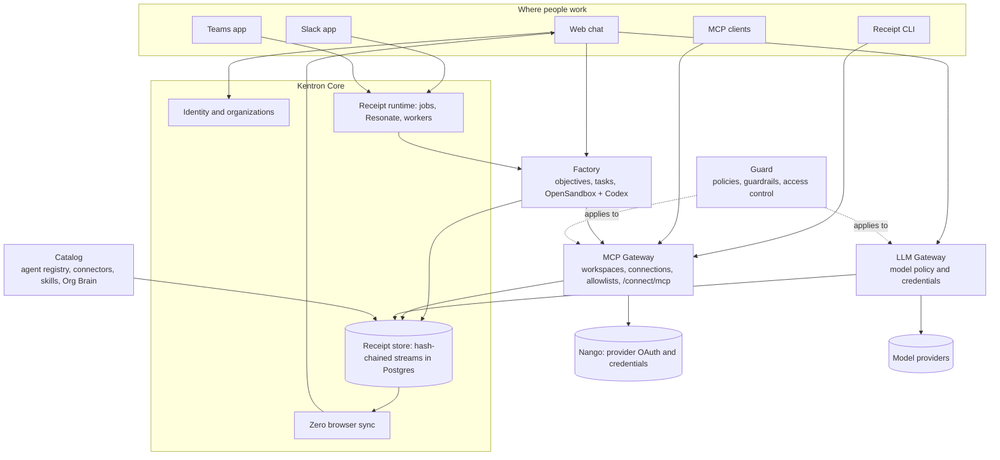

Core is the platform the other six sections run on. Your account, the organization that owns your data, the workspaces that scope connections, the database that holds every receipt, the runtime that carries out background work, and the sync layer that keeps the browser current all live here. Come to this tab to set up an account or an organization, to understand how a run is actually executed, or to configure, deploy and operate Receipt yourself.

<Warning>
**Three Core surfaces look functional but are not wired up in this release.** Plan entitlements gate nothing — every feature check resolves to allowed, on every plan; what genuinely differs is the seat count, the metered usage budget and the one-time signup credit. The organization **Security** page — **Domains**, **Single Sign-On**, **Directory Provisioning** — is a placeholder with disabled buttons and no implementation behind it. Two-factor authentication is verified at sign-in for an account that already has it enrolled, but no screen enrols one, and passkeys exist only as unused interface strings.
</Warning>

## How to read this tab

The groups follow the order you meet them: get an account and an organization, then the architecture behind a run, then the interfaces you can build against, then everything you need to configure, host and operate a deployment.

<CardGroup cols={2}>
  <Card title="Accounts and organizations" icon="user" href="/core/your-account">
    Signing up and signing in, organizations and workspaces, members and roles, seats and billing.
  </Card>
  <Card title="Architecture" icon="layer-group" href="/core/architecture">
    The five runtime roles and the service gateway, receipts and streams, jobs, and the Factory engine.
  </Card>
  <Card title="APIs and SDK" icon="code" href="/core/runtime-api">
    The runtime's HTTP, SSE and WebSocket surface, the TypeScript SDK, and authoring an agent.
  </Card>
  <Card title="Configure" icon="sliders" href="/core/configuration">
    Every environment variable the platform reads, what it defaults to, and what breaks without it.
  </Card>
  <Card title="Run it yourself" icon="server" href="/core/local-development">
    Local development, self-hosting, migrations, the integration provider, deploying, health checks.
  </Card>
  <Card title="Getting help" icon="life-ring" href="/core/getting-help">
    What works today, what is not available yet, and where to report a problem.
  </Card>
</CardGroup>

## The shared services

Each row is one service Core provides and the parts of the product that depend on it. When something in another tab behaves in a way you did not expect, this table usually points at the Core page that explains it.

| Service | What it is | Who depends on it |
|---|---|---|
| Accounts and sessions | Email and password accounts, up to 10 concurrent sessions you can revoke individually, and organization membership with owner, admin and member roles | Chat, files, settings, usage and billing screens; the Slack and Teams install claim pages; the CLI's browser sign-in |
| Organizations and workspaces | An organization owns members, plan and policy, and each person can create up to 10 of them. A workspace is the authorization boundary for connections; every organization gets a **Default** workspace that cannot be deleted | The MCP Gateway and Workspaces pages, the runtime's Connect routes, the Slack app, `receipt workspace` |
| Receipt store | Hash-chained receipt streams in one Postgres database, addressed by `ZERO_UPSTREAM_DB`. The streams are the source of truth; every table the rest of the product reads is a projection derived from them | Chat turns, gateway `/connect/call` actions, Factory runs, policy and skill changes, the agent registry |
| Runtime and job queue | One runtime image started in five roles. Work moves from the API role to a driver and then to a worker over durable promises, under leases and heartbeats, with recovery loops that redrive anything that stalls | Background runs started from chat, Slack and Teams; Factory; the CLI's Factory commands |
| Browser sync | Postgres logical replication feeds a sync service that pushes 29 projection and application tables to the browser over a websocket. A table missing from the publication breaks sync for every client, not just one view | Every live view in the application |
| Encryption keys | Two 32-byte base64 keys: `BYOK_ENCRYPTION_KEY_B64` for provider keys and `RECEIPT_CONNECTION_ENCRYPTION_KEY_B64` for Receipt Connect connection references. Both must stay stable once data is encrypted with them — there is no re-encryption path | Bring-your-own-key settings, gateway connections |
| Receipt Connect tokens | Tokens signed with `RECEIPT_CONNECT_JWT_SECRET`, falling back to `BETTER_AUTH_SECRET`, always bound to one organization and one workspace, and carrying some combination of `connect:read`, `connect:write` and `connect:credential`. The default lifetime is 12 hours; which scopes and lifetime a token actually gets depend on the surface that minted it | CLI sign-in, MCP clients, the Slack and Teams adapters, Factory workers inside a sandbox |
| Model credential resolution | Which credential pays for a model call: your organization's or workspace's own provider key when one covers the model, otherwise the deployment's platform OpenAI key from `OPENAI_API_KEY`. There is no platform-funded route for any other provider | Web chat, Factory runs, Slack; Teams, which runs on the organization key only |

## How it fits

Every surface enters Core somewhere. The web app resolves your session and organization before it does anything else. Slack and Teams resolve a Receipt user through an install claim link, then call the runtime's channel-neutral routes, which are served on the private runtime network and carry the resolved user and organization in the request body rather than a bearer token. The CLI and other MCP clients hold nothing but a Connect token. Factory workers ask the gateway for what a call needs at the moment of the call: provider credentials stay in Nango, and MCP client configs and sandboxes never contain them.

Everything those paths do lands back in one place. Chat turns, gateway actions, Factory runs, and policy, skill and agent-registry changes all append receipts, and the sync layer carries the resulting projections back to your browser — which is why a task list, a run's progress and a replay are views of one stream rather than separate records. One gap is worth knowing before you rely on that trail: calls made through the MCP bridge are not yet recorded. [Receipts and audit](/guard/receipts-and-audit) accounts for what does and does not write one.

<Note>
The runtime answers `/healthz` and `/readyz`; the web application answers `/health`. Readiness, not liveness, is the gate worth alerting on — see [health and observability](/core/health-and-observability).
</Note>

Next step: [create your account and sign in](/core/your-account).
