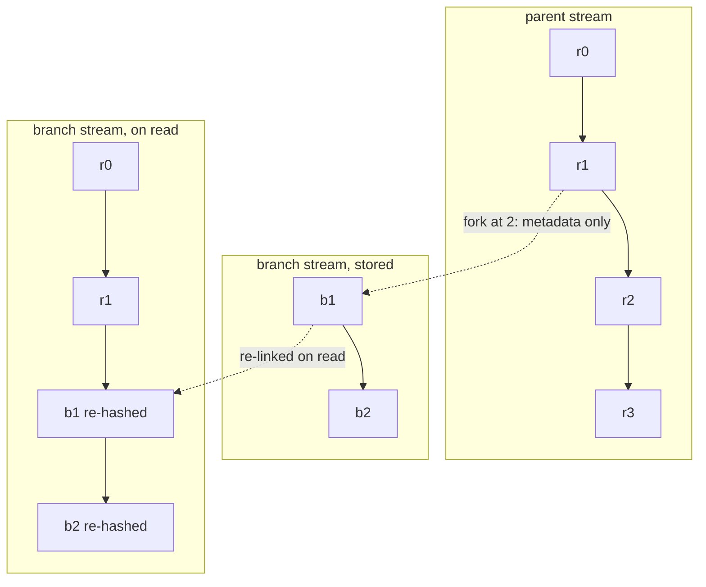

Every run Receipt performs leaves a trail you can read back afterwards: what happened, in what order, and under whose authority. That trail is the product — the [Replay view](/co-worker/replay) of a background run is one of these trails rendered. Because each entry is hash-linked to the one before it, the trail is tamper-evident: the runtime verifies it on every replay rather than trusting it.

Underneath, a receipt is an immutable record appended to a named stream. A stream is a hash-linked chain of receipts. Everything else in Receipt — job state, objective state, chat history — is a fold over one of those chains.

## The receipt shape

<ResponseField name="id" type="string" required>
  Receipt identifier. Format is `<ts in base36>-<8 random bytes as hex>`.
</ResponseField>

<ResponseField name="ts" type="number" required>
  Timestamp.
</ResponseField>

<ResponseField name="stream" type="string" required>
  The stream this receipt belongs to.
</ResponseField>

<ResponseField name="prev" type="string">
  Hash of the previous receipt in the chain. Absent on the first receipt of a stream.
</ResponseField>

<ResponseField name="body" type="Body" required>
  The event payload.
</ResponseField>

<ResponseField name="context" type="ReceiptExecutionContext">
  Authoritative receipt scope. Carries `actor`, `tenantId`, `organizationId`, `objectiveId`, `taskId`, `jobId`, `runId` and `branch`, plus open extra keys.
</ResponseField>

<ResponseField name="hash" type="string" required>
  The receipt's own hash. See below for exactly what it covers.
</ResponseField>

<ResponseField name="hints" type="Record<string, unknown>">
  Transport metadata for indexes, tracing and idempotency.
</ResponseField>

### `context` and `hints` are not the same thing

These two are routinely confused, and the difference is load-bearing:

- **`context` is authoritative and it is hashed.** Changing it changes the receipt's hash and breaks the chain.
- **`hints` are non-authoritative transport metadata and they are not hashed.** They exist to drive indexes, tracing and idempotency, not to record what happened.

## What the hash covers

`computeHash` is `sha256` over the canonical JSON of `id`, `ts`, `stream`, `prev` (written as `null` when absent), `body`, and `context` when it is present. `hints` are excluded. Normalizing `prev` to `null` means an absent and an explicitly null predecessor cannot produce two different hashes.

Canonicalization sorts object keys with `localeCompare` and honours `toJSON()`. It refuses to serialize `undefined`, `bigint`, `function`, `symbol`, non-finite numbers, circular structures and non-plain objects, raising errors prefixed `receipt canonicalization` — for example `receipt canonicalization cannot serialize undefined` and `receipt canonicalization requires finite numbers`.

### Identifiers and replayable simulation

Receipt ids combine a base36 timestamp with 8 random bytes. The random source is overridable through the global symbol `Symbol.for("receipt.core.randomBytesSource")`. That override is what makes deterministic simulation replayable: with entropy pinned, a replayed run produces the same receipt ids, and therefore the same hashes, as the original.

### Verifying a chain

`verify(chain)` walks the chain and returns either:

- `{ ok: true, count, head }`, or
- `{ ok: false, at, reason }`, where `reason` is `"broken prev"` or `"hash mismatch"`.

There are exactly those two failure reasons. `at` is the index where verification failed.

## How the runtime executes against a stream

- **Execution is serialized per stream.** `execute` takes an in-process lock on the stream.
- **Folds are incremental.** The runtime caches the chain and folded state per stream and folds only the suffix, for as long as the cached tail hash still matches. The cache is invalidated by the store's stream version, which Postgres computes as `<stream_seq>:<head hash>` of the tail receipt.
- **A corrupt chain is never replayed.** The runtime throws `Receipt runtime refused to replay invalid chain for stream '<s>': <reason> at index <n>` rather than folding over receipts that do not verify.
- **Commands are deduplicated whole.** When a command carries an `eventId`, the runtime writes the hint `eventId` — or `<eventId>#<i>` for a multi-event command — and skips the entire command if all of those hints already exist in the chain. Partial re-application is not possible.
- **Optimistic concurrency is explicit.** When a command carries `expectedPrev` and it does not equal the current head hash, the runtime throws `Expected prev hash <x> but head is <y>`.

Appends land in one Postgres transaction that takes an advisory lock on the stream, re-checks the predecessor hash against the physical tail of the receipt table, and inserts the receipt, the stream head, any branch metadata and a change-log row together. The next sequence number is derived from the receipt table, not from the stream head row, on the stated grounds that the head row is an append accelerator rather than the chain authority — a stale head must not be able to wedge a stream.

<Note>
The runtime is not the only writer. Nine chat mutators in the browser sync layer — rename, archive, pin, delete, branch selection, branch activation, mode, context-window mode and disabled tool keys — append their own hash-chained receipt on the authoritative server pass, idempotent on a receipt id derived from the client and mutation ids. Chat UI intents are receipts too.
</Note>

## Branching

A fork is metadata, not a copy.

`fork(stream, at, newName)` saves branch metadata only and **copies no receipts**. It refuses in three cases, with these messages:

- `Cannot fork <stream> at <n>; valid range is 0..<len>` — the fork point is past the end of the parent chain.
- `Branch '<name>' already exists`
- `Stream '<name>' already has receipts` — the target stream is not empty.

A branch materializes on read. `materializeChain` loads the parent prefix from index 0 up to (but not including) the fork point, then re-links and re-hashes the branch's own receipts on top of it. Because the branch's receipts are re-hashed against a new predecessor, their hashes differ from anything on the parent. A branch that points back at itself through its parent chain throws `Branch cycle detected for stream '<stream>'`.

Reading the branch above yields `r0`, `r1`, then `b1` and `b2` re-linked and re-hashed on top of `r1`. `r2` and `r3` stay on the parent and are never visible from the branch.

<Warning>
**A branch receipt's hash as read is not its hash as stored.** Re-linking recomputes it against the parent prefix, so a branch receipt must never be cited by hash across the fork boundary.
</Warning>

Branch metadata itself lives as receipts on the stream `__meta/branches` with the event type `branch.meta.upsert`, mirrored into the `receipt_branches` table.

## Verified stream families

| Family | Pattern |
| --- | --- |
| Queue index | `jobs` |
| Job lifecycle | `jobs/<jobId>` |
| Factory objective | `factory/objectives/<objectiveId>` |
| Factory objective step reference | `factory/objectives/<objectiveId>/steps/<taskId>` |
| Memory | `memory/<safe-scope>` |
| Eval run | `eval/runs/<runId>` |
| Computer-use session | `computer_use/sessions/<sessionId>` |
| Factory chat profile | `agents/factory/<repoKey>/receipt` |
| Factory chat session | `agents/factory/<repoKey>/receipt/sessions/<chatId>` |
| Factory chat objective | `agents/factory/<repoKey>/receipt/objectives/<objectiveId>` |
| App chat session | `apps/start/<repoKey>/app-chat/sessions/<threadId>` |
| Run stream (generic) | `<base>/runs/<runId>` |
| Branch metadata | `__meta/branches` |

A memory scope is normalized into its stream name by lowercasing and replacing every character outside `a-z0-9_.-/` with `_`. The `/` is inside that class, so nested scopes survive. The original scope string is preserved on each memory entry.

## Projections are disposable

Receipts are the truth. The Postgres tables are read models, rebuildable by replaying the chains, and are never the source of truth.

That is a typed contract rather than a convention. The runtime schema declares 37 tables, and each one carries a state role — `canonical` (the receipt log), `canonical-index` (stream heads and branch metadata), `operational`, `durable-execution` (the four durable-workflow tables) and `derived-read-model` (the remaining 27) — plus whether it may be replicated to browsers. Fifteen tables are published to browser clients by default; the raw receipt log is not one of them.

The core storage tables are:

- `receipt_streams` — `name` (primary key), `head_hash`, `receipt_count`, `updated_at`, `last_ts`.
- `receipt_receipts` — `global_seq` (bigserial primary key), `stream`, `stream_seq`, `receipt_id`, `ts`, `prev_hash`, `hash`, `event_type`, `body_json`, `hints_json`, with unique indexes on `(stream, stream_seq)`, `(stream, hash)` and `(stream, receipt_id)`, and a global unique index on `hash`.
- `receipt_branches` — `name` (primary key), `parent`, `fork_at`, `created_at`.
- `receipt_projection_offsets` — `projector` (primary key), `last_global_seq`, `updated_at`.
- `receipt_change_log` — `seq`, `global_seq`, `stream`, `event_type`, `changed_at`. Projectors tail this table.
- `receipt_projection_work` — `projector`, `stream`, `requested_seq`, `processed_seq`, `eligible_at`, keyed on `(projector, stream)`. The durable record of which projector still owes which stream work.
- `receipt_reducer_checkpoints` — `projector`, `stream`, `version`, `stream_seq`, `receipt_hash`, `state_json`, keyed on `(projector, stream)`. Folded state anchored to one specific receipt.

Everything derived from those — including `receipt_job_projection`, `receipt_objective_projection`, `receipt_task_projection`, `receipt_memory_entries` and the rest of the `receipt_`-prefixed projection tables — is regenerated from the same receipts.

<Note>
Every derived table carries the `receipt_` prefix. Memory tables, for instance, are `receipt_memory_entries`, `receipt_memory_accesses` and `receipt_memory_embeddings`. The two internal tables above are declared as "Internal, rebuildable state; never published to Zero clients."
</Note>

### How projections keep up

An `AFTER INSERT` trigger on the receipt table records pending work as each receipt lands, so scheduling survives a crash. Sequence values are compared only within a stream; nothing infers that separate transactions commit in global order. Seven projectors are named in that mapping — `job_projection`, `objective_projection`, `chat_context_projection`, `computer_inventory_projection`, `computer_lease_run_projection`, `eval_run_projection` and `computer_use_session_projection` — and the `api` role polls for due work and gives each of them one bounded batch per round, so a restart or migration backlog drains without waiting for a new append. A stream whose catch-up fails stays pending behind a backoff deadline and logs `projection.durable_catchup_failed`. A crash before acknowledgement causes replay, not lost work.

Hot reducers fold only the delta after their checkpointed sequence, and only while the receipt at that sequence still carries the checkpointed hash. On any mismatch, a reducer version change, or a stream that has a parent branch, the checkpoint is discarded and the chain is re-folded from the start under the usual verification. Derived state may be thrown away; the canonical chain is never rewritten to match it. Projection work also runs on its own reserved connection, so a long catch-up cannot starve request reads.

<Info>
Two boundaries survive that design. Structural chat changes, new runs and late historical events still take the full canonical replay path, and branch materialization is always a full replay. The older `receipt_projection_offsets` table is still written, but it is a diagnostic and compatibility value now, not delivery authority.
</Info>

## Tenancy

The resolved data directory is hashed into a Postgres schema name unless an explicit schema is configured, and every connection pool pins its `search_path` to that schema. Separate tenants are therefore separate schemas in the same database, not separate directories of receipts.

Next step: [see how jobs are enqueued and executed durably](/core/jobs-and-durable-execution).
