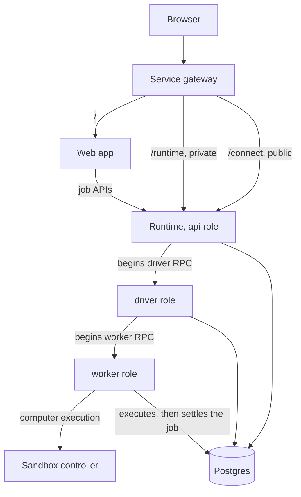

Receipt runs one runtime image. Which of five roles a given process takes is decided entirely by the `RECEIPT_PROCESS_ROLE` environment variable — the same build, started five different ways.

## The five roles

| Role | Binds an HTTP port | Runs heartbeats | Resonate function it registers | Default concurrency |
| --- | --- | --- | --- | --- |
| `api` | Yes — `PORT`, default `8787` | Yes | None. It is a Resonate client only, used to start driver RPCs. | 1 |
| `driver` | No | No | `receipt.job.driver` | 1 |
| `worker-chat` | No | No | `receipt.job.execute` and `receipt.agent.action.execute` | 4 (`CHAT_JOB_CONCURRENCY`) |
| `worker-control` | No | No | `receipt.job.execute`, plus the Factory objective watchdog worker | 1 (`ORCHESTRATION_JOB_CONCURRENCY`) |
| `worker-codex` | No | No | `receipt.job.execute` | 1 (`CODEX_JOB_CONCURRENCY`) |

`api` is the only role that binds an HTTP port, and the only role for which the runtime enables heartbeats. Every other role is a Resonate worker that opens no socket at all.

<Note>
When `RECEIPT_PROCESS_ROLE` is absent the runtime defaults to `api`. When it is set to a value that is not one of the five names, it resolves to `all`, which falls back to the `api` task group and registers no functions.
</Note>

A non-API role does not exit once it has registered its functions. It parks forever, waiting for Resonate to hand it work. A process that appears to be doing nothing and holding no port is the normal steady state for `driver`, `worker-chat`, `worker-control` and `worker-codex`.

Each role polls its own Resonate task group: `receipt-api`, `receipt-driver`, `receipt-chat`, `receipt-control` and `receipt-codex`, overridable with `RESONATE_GROUP_API`, `RESONATE_GROUP_DRIVER`, `RESONATE_GROUP_CHAT`, `RESONATE_GROUP_CONTROL` and `RESONATE_GROUP_CODEX`. A single `RECEIPT_RESONATE_EXECUTE_CONCURRENCY` overrides the per-role concurrency defaults.

## The service gateway

A single gateway sits in front of every service and routes by route prefix. Its table comes from a declarative service graph, not from per-deployment configuration:

| Prefix | Service | Default internal port | Exposure | Health check | Strips the prefix |
| --- | --- | --- | --- | --- | --- |
| `/` | Web app | 3001 | Public | `/health` | No |
| `/runtime` | Runtime | 8787 | Private | `/healthz` | Yes |
| `/connect` | Runtime | 8787 | Public | `/readyz` | **No** |
| `/zero` | zero-cache | 4848 | Public | `/` | Yes |
| `/integrations` | Integrations provider | 3003 | Public | `/health` | Yes |
| `/integrations-connect` | Integrations connect UI | 3009 | Public | `/` | Yes |
| `/slack` | Slack adapter | 3010 | Public | `/health` | Yes |
| `/teams` | Teams adapter | 3011 | Public | `/health` | Yes |
| `/resonate` | Resonate | 8001 | Private | `/health` | Yes |
| `/computer` | Sandbox controller | 8080 | Private | `/health` | Yes |

Longest prefix wins, and `/` is always evaluated last. Prefix stripping rewrites the upstream path, so `/runtime/healthz` reaches the runtime as `/healthz`. The `connect` service deliberately does **not** strip, so `/connect/...` arrives at the runtime with its path intact and lands on the runtime's own `/connect/...` routes.

A private service answers a bare `404 Not found` — plain text, `Cache-Control: no-store`, no body detail — unless the request came from localhost, or `RECEIPT_SERVICE_GATEWAY_EXPOSURE=private`, or `RECEIPT_SERVICE_GATEWAY_ALLOW_PRIVATE=1`. WebSocket upgrades are proxied for every service, which is what makes `/runtime/factory/live` work.

### Two consequences worth knowing

Matching is per-prefix, not per-path-segment-with-fallback:

- **An unmatched extension of a prefix falls through to the web app.** `/runtime-extra/health` does not match `/runtime`; it matches `/` and is served by the web application. The same applies to `/integrations-connectivity`, which does not match `/integrations`.
- **The runtime's own dashboard sits at a doubled path.** The runtime registers an HTML dashboard at `GET /runtime`. Because `/runtime` is the gateway prefix that gets stripped, that page is at `/runtime/runtime` through the gateway. A bare `GET <gateway>/runtime` maps to `GET <runtime>/`, which has no route, and returns the runtime's `404 Not found`.

## The call graph

The web application calls the runtime over HTTP for `POST /agents/factory/jobs`, `POST /jobs/:id/abort`, `GET /jobs?status=...` and `GET /receipt/stream`. From there the `api` role begins a driver RPC, the driver begins a worker RPC, and the worker executes and settles. Workers reach the sandbox controller for computer execution. Every role talks to Postgres.

## Storage

Storage is Postgres and nothing else. There is no SQLite receipt store and no local job backend in the server.

- The connection string comes from `ZERO_UPSTREAM_DB`. It is the only variable read for it; when it is unset the runtime throws `Receipt Postgres storage requires ZERO_UPSTREAM_DB.`
- `DATA_DIR` (or `RECEIPT_DATA_DIR`) is **not** a directory of receipts. It is a tenant key: the resolved path is hashed into the Postgres schema name `receipt_data_<sha256[0:24]>`, unless `RECEIPT_POSTGRES_SCHEMA` is set explicitly, in which case that schema is used and the derivation is skipped. The directory itself still holds worker packets, artifacts and logs.
- Every connection pool sets `search_path` explicitly, including `public`, so a role default cannot silently redirect an unqualified query. Pool size defaults to 2, overridable with `RECEIPT_POSTGRES_POOL_MAX`.

<Warning>
`JOB_BACKEND` is set in several deployment surfaces but is read nowhere in the application code. Setting `JOB_BACKEND=local` has no effect.
</Warning>

Next step: [read how receipts, chains and streams work](/develop/receipts-and-streams).
