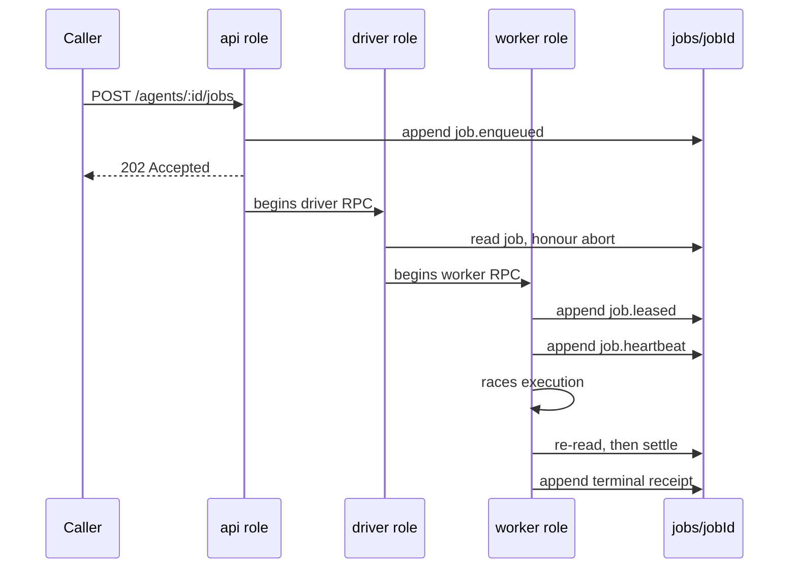

Work in Receipt is a job. A job is enqueued by appending a receipt, executed by a worker under a lease, and settled by appending a terminal receipt. Nothing about that path depends on a process staying alive.

## Lanes and statuses

There are **four** lanes:

`chat`, `collect`, `steer`, `follow_up`

<Warning>
`chat` is a real lane. Any document that lists three lanes is wrong. `POST /agents/:id/jobs` accepts all four, and the queue's own default is `collect`.
</Warning>

There are six job statuses:

`queued`, `leased`, `running`, `completed`, `failed`, `canceled`

Two narrower vocabularies sit alongside them: queue commands are typed `steer`, `follow_up` or `abort`, and the queue-command lanes are `steer` and `follow_up` only.

## Lifecycle receipts

A job's state is a fold over these ten event types on the stream `jobs/<jobId>`:

`job.enqueued`, `job.leased`, `job.heartbeat`, `job.progress`, `job.completed`, `job.failed`, `job.canceled`, `queue.command`, `queue.command.consumed`, `job.lease_expired`

The reducer enforces three invariants worth designing around:

- `job.leased` is **ignored** unless the job is currently `queued`. A second lease on an already-leased job changes nothing.
- `job.heartbeat` promotes `leased` to `running`, but only when the heartbeat's worker id and attempt match the active lease. A heartbeat from a superseded attempt is inert.
- Any event other than `job.enqueued` for a job that does not exist throws `Invariant: no job <jobId> for <type>`.

## Singleton semantics and enqueue idempotency

`singletonMode` defaults to `allow`. Its other two values act on a `sessionKey`:

- `cancel` — every *active* job on that session key receives an abort command, with the reason `singleton cancel`, before the new job is written.
- `steer` — the most recent active job on the session key receives a `queue.command` of type `steer` carrying the new payload plus `fromSessionKey` and `fromEnqueue: true`, and **that existing job is returned instead of a new one being created**.

Lease expiry is evaluated before the session scan, so a dead worker's `running` job cannot swallow a steer.

<Info>
**The idempotency contract.** An explicit `jobId` that already exists returns the existing job unchanged. Re-posting the same enqueue with the same `jobId` never creates a second job and never disturbs the first. This is the property callers rely on to make an enqueue safely retryable.
</Info>

`maxAttempts` is clamped to the range 1..8.

## Payload kinds

Nine payload kinds are accepted:

`factory.dispatch`, `factory.run`, `factory.integration.publish`, `factory.integration.validate`, `factory.objective.audit`, `factory.objective.control`, `factory.objective.watchdog`, `factory.task.monitor`, `factory.task.run`

Every one of these except `factory.objective.watchdog` requires an `authContext` carrying a `userId` and an `organizationId` (with optional `workspaceId`, `receiptConnectGatewayUrl`, `sessionId` and `source`).

Each kind also declares a contract: a `workerGroup` of `chat`, `codex` or `control`, an optional durable workflow, and flags for durable activity, objective scoping, objective reconciliation on a terminal or expired lease, live execution and terminal objective audit.

Actual Resonate routing, however, is decided agent-id first and kind second:

```
job.agentId === "codex"                              -> receipt-codex
job.payload.kind startsWith "factory.integration."   -> receipt-codex
job.agentId === "factory-control"                    -> receipt-control
otherwise                                            -> receipt-chat
```

<Note>
These two do not always agree. A `factory.dispatch` job posted to agent id `factory` lands on the **chat** group even though its kind contract names `control` as its worker group. Treat this as an ambiguity in the implementation rather than assuming either one is the contract.
</Note>

## The trap: only four agent ids have handlers

Exactly four agent ids have registered job handlers:

`factory`, `factory-control`, `factory-monitor`, `codex`

<Warning>
Posting to `/agents/<anything-else>/jobs` still returns **202**, still appends `job.enqueued`, and still hands you back a job object with a stream and event URLs. Nothing will ever execute it. There is no error, no rejection and no later failure receipt — the job simply sits in `queued` forever. Check the agent id against the four above before you conclude a job is slow.
</Warning>

## The durable execution path



Step by step:

1. **Enqueue.** `job.enqueued` is appended to `jobs/<jobId>` and to the `jobs` index stream. The caller gets back a **202** carrying the job object and its `async` block.
2. **Dispatch outbox.** The outbox wraps the queue and asks the driver starter to begin a driver RPC.
3. **Driver RPC.** The base dispatch key is the job id. If a previous driver or execute promise exists and is terminal, the key advances a *delivery generation*; that is bounded at 32, after which it errors with `resonate delivery recovery exceeded 32 generations for <jobId>`. If a promise is still pending, the starter returns `{ created: false, reason: "active_delivery" }` and does nothing.
4. **Driver executes.** The driver reads the job, fails stale active leases, honours `abortRequested`, and begins the worker RPC under a fresh attempt fence. The driver deliberately does **not** lease the job — leasing belongs to the worker.
5. **Worker executes and settles.** It leases if the job is `queued`, checks `abortRequested`, takes a start-fence heartbeat, races execution against the heartbeat loop and the execution timeout, re-reads the job, then completes, fails or cancels it under an attempt fence. Every settlement is wrapped in a storage retry: 5 attempts, 150 ms times attempt backoff, transient storage errors only.
6. **Callback.** The driver posts a JSON callback on each of `dispatched`, `completed`, `failed` and `canceled`, to `RECEIPT_RESONATE_CALLBACK_URL` / `RECEIPT_EVENT_CALLBACK_URL`, with a 5 s timeout and an optional `Authorization: Bearer` header from `RECEIPT_CALLBACK_TOKEN`.

### Failure statuses in a result

When a job settles unsuccessfully, `job.result` carries one of these statuses:

`settlement_conflict`, `stale_attempt`, `lease_lost`, `terminal_state`, `canceled`, `execution_timeout`, `failed`

## Leases, timeouts and heartbeats

| Job | Lease |
| --- | --- |
| Default | `JOB_LEASE_MS`, default **300 000 ms** |
| `factory-control` running `factory.objective.control` | the larger of the default and `FACTORY_CONTROL_JOB_LEASE_MS`, itself defaulting to 900 000 ms |
| `factory-monitor` running `factory.task.monitor` with `executionPath` of `computer` | the larger of the default and `CODEX_JOB_LEASE_MS`, itself defaulting to 900 000 ms |
| `codex` | the larger of `CODEX_JOB_LEASE_MS` (default 900 000 ms) and the payload timeout plus 300 000 ms, capped at 3 600 000 ms |

The **execution timeout** is the lease minus 1 000 ms, with a floor of 5 000 ms. `FACTORY_CONTROL_JOB_EXECUTION_TIMEOUT_MS` may lower it, for objective control only.

The **heartbeat cadence** is derived rather than configured outright: it is one third of the smaller of the lease and `RECEIPT_RESONATE_ACTIVE_STALE_MS` (default 600 000 ms), floored at 1 000 ms and capped by `RECEIPT_RESONATE_HEARTBEAT_INTERVAL_MS`. Dividing by three gives a worker two renewal opportunities before the fence fires.

The driver's own invocation timeout is the lease plus 60 000 ms, with a floor of 120 000 ms.

## Three independent recovery loops

| Loop | Where it runs | Interval |
| --- | --- | --- |
| Queued-job redrive | Every redrive-eligible role | `RECEIPT_RESONATE_QUEUED_REDRIVE_INTERVAL_MS`, default 15 000 ms, first pass after a 5 000 ms startup delay |
| Objective-control outbox redrive | `worker-control` and `all` | `RECEIPT_OBJECTIVE_CONTROL_OUTBOX_REDRIVE_INTERVAL_MS`, default 5 000 ms, with a 15 000 ms timeout |
| Factory objective watchdog | Whichever role holds a Resonate client | Cron-scheduled, `RECEIPT_FACTORY_OBJECTIVE_WATCHDOG_CRON`, default `* * * * *` |

The queued-job redrive is guarded by a minimum age (`RECEIPT_RESONATE_QUEUED_REDRIVE_MIN_AGE_MS`, 30 000 ms) and a cooldown (`RECEIPT_RESONATE_QUEUED_REDRIVE_COOLDOWN_MS`, 15 000 ms), and its dispatch key is `<jobId>:redrive:<attempt>:<updatedAt>` so a scanner pass is idempotent for one observed queue state. The watchdog can be turned off with `RECEIPT_FACTORY_OBJECTIVE_WATCHDOG_ENABLED=0`; its timeout defaults to 60 000 ms and its scan limit to 200, clamped to 1..2000.

## The durable ledger is beside receipts, not above them

A Postgres-backed workflow and activity ledger tracks durable execution alongside the receipt chains. Every durable side effect is best-effort: a durable write failure is logged and does **not** fail the receipt mutation that has already been appended. Queue commands are a deliberate straight pass-through, so steer and follow-up never depend on workflow signal delivery.

Next step: [call the runtime over HTTP](/develop/runtime-api).
