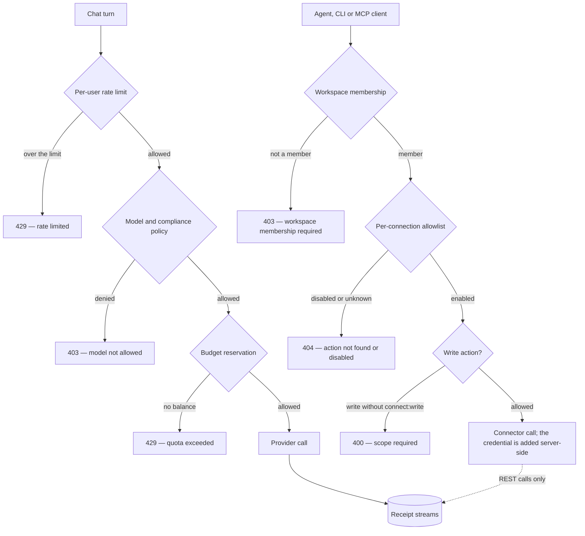

Guard is where you set the limits an agent works inside: which models it may call, which operations on a connected app it may run, who may change those settings, and what evidence is left behind. This page names every control, says where it acts, and marks the ones that are still configuration rather than enforcement.

<Warning>
**Several Guard screens store settings that nothing reads yet.** [Guardrail groups](/guard/guardrails) and four of the five modules on the [Policies](/guard/policies) page — rate limiting, budget limiting, logging config and tool approval — are authored, versioned and audited, but no runtime path evaluates them against live traffic. Only the controls marked **Enforced** below change what a request may do.
</Warning>

## What Guard covers

<CardGroup cols={2}>
  <Card title="Guardrails" icon="shield" href="/guard/guardrails">The nine kinds, and why nothing enforces them yet.</Card>
  <Card title="Policies" icon="sliders" href="/guard/policies">The five modules and the receipts behind each rule.</Card>
  <Card title="Access control" icon="user-lock" href="/guard/access-control">Roles, the settings rule, workspace authority.</Card>
  <Card title="Receipts and audit" icon="file-shield" href="/guard/receipts-and-audit">What writes a receipt, and what leaves no trace.</Card>
  <Card title="Data handling" icon="lock" href="/guard/data-handling-and-security">Where credentials live and what is encrypted.</Card>
</CardGroup>

## The gates a request passes

### Model and compliance policy

Every chat request resolves its model through one server-side checkpoint before a provider is contacted: disabled providers, disabled models and **Require ZDR (Zero Data Retention)** are decided there, and when an organization turns on **Enforce Study Mode** the same checkpoint pins the model whatever the request asked for. A denial is HTTP 403 with a machine reason — `policy_denied:provider`, `policy_denied:model` or `policy_denied:compliance`, joined by commas when more than one applies — and the person in chat sees **"The selected AI model is not allowed for your organization."** **Require ZDR** and **Enforce Study Mode** act on every request even though the settings screen that carries their toggles has no navigation entry and is opened by URL. [Model policy](/llm-gateway/model-policy) covers each flag, including how saving an organization OpenAI or Anthropic key turns ZDR enforcement off for models routed through it.

### Scopes and allowlists at the gateway

A tool call has to come from a workspace you belong to — anything else is HTTP 403, `workspace_membership_required` — and then clears two more checks: the action must be enabled in that connection's policy, and a write also needs `connect:write` on the calling token. A disabled action and one that does not exist return the same 404, `integration action not found or disabled`, so a tool you have not enabled cannot be probed; a write to an enabled action without the scope returns 400, `integration action '<tool>' requires connect:write`. GitHub connections add a further check when selected repositories are enforced. See [tools and permissions](/mcp-gateway/tools-and-permissions).

### Who may change a control

Organization settings are owner and admin only, checked in the browser and again on the server — a write from anyone else fails with, for example, **"Only organization owners or admins can manage guardrails."** The MCP Gateway and Workspaces pages are the deliberate exception: any member can open them, and workspace membership and authority decide what they change there. [Access control](/guard/access-control) has the full rule.

### Sandboxed execution and the receipt chain

Background work runs inside a disposable computer, and there is no host execution path to fall back to, so that container is the boundary for the agent's shell. Receipts are SHA-256 hash-chained: each append compares the expected previous hash against the stored head, and the runtime refuses to fold a chain that does not verify (`Receipt runtime refused to replay invalid chain for stream '<stream>': <reason> at index <index>`). See [receipts and audit](/guard/receipts-and-audit).

The dotted edge is the gap worth knowing: a REST gateway call writes `tool.called` and, when it succeeds, `tool.observed`. A tool call made over the MCP protocol passes the same membership, scope and allowlist checks, but is not recorded.

## The enforcement matrix

| Control | Where it acts | Status |
|---|---|---|
| Disabled providers and models | Every chat request | **Enforced** |
| Require ZDR (Zero Data Retention) | Every chat request | **Enforced**; an organization OpenAI or Anthropic key bypasses it for models routed through that provider |
| Enforce Study Mode | Every chat request | **Enforced**; pins one model |
| `CHAT_REQUIRE_BYOK` | Every chat request | **Enforced**; an operator setting, not a toggle |
| Per-user request limit | Every chat request | **Enforced**; 30 a minute by default, off when `VITE_DISABLE_REDIS=true` |
| Pre-authorized dollar budgets | Before each metered model call | **Enforced**; a call that runs on your own provider key is not reserved against |
| Per-connection action allowlist | Every gateway tool call | **Enforced** |
| `connect:write` for write actions | Every gateway tool call | **Enforced** |
| GitHub selected repositories | GitHub tool calls | **Enforced** |
| Workspace membership and authority | Gateway calls, connection and policy edits | **Enforced** |
| Owner and admin gating | Organization settings | **Enforced** in browser and server |
| Sandboxed execution | Background runs | **Enforced**; the only execution path |
| Receipt hash chain | Every append and replay | **Enforced** |
| Guardrail groups | — | Configured only: authoring and testing |
| Policies page modules | — | Configured only: stored, read by nothing |
| Require organization provider key | Chat model picker | Filters the picker; not checked on the server |
| Plan entitlements | — | Always allowed |
| Domains, Single Sign-On, Directory Provisioning | — | Placeholder screens |

## Saying it accurately

| A common phrasing | What is true here |
|---|---|
| Actions that change state wait for approval | Writes stay off until an owner or admin enables them for that connection. There is no per-action approval prompt; the Tool approval screen stores rules that are not applied. |
| Guardrails intercept risky content in real time | Guardrail rules are authored, versioned and tested against sample text. They are not applied to live traffic, and the detectors are fixed patterns — nothing learns. |
| Every action emits a receipt | Every REST `/connect/call` and every background run writes receipts. Calls made through the MCP bridge are not yet recorded. |
| Receipts carry cryptographic proof | They are tamper-evident: SHA-256 hash-chained, checked on append, verified on replay. There is no signature and no key material. |
| Token budgets and adaptive limits cap spend | One fixed per-user request limit and dollar-denominated budgets. There are no token budgets, and nothing adapts. |

Next step: [see how guardrail groups are built and tested](/guard/guardrails).
