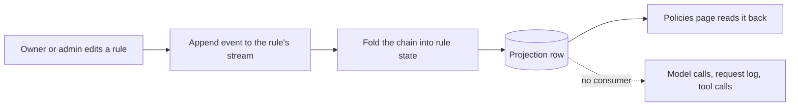

Policies is where an owner or admin writes down the organization-wide rules for the traffic Receipt handles — the model calls it makes and the tool calls its agents run: how often a caller may spend a request, how much a team may spend in dollars, what is kept in the request log, and which agent tools should pause for a person. Every change is attributable — a rule is a receipt stream, so "who removed the budget cap, and when" stays answerable after the rule is gone.

<Warning>
**Policy rules are stored and audited, not applied.** Every rule you create on this page is written to a receipt stream, folded into a projection row, and rendered back in the table. No runtime path reads those rows: the path that makes a model call does not consult your rate limits or budgets, the request log does not apply your redactions, and nothing pauses a tool call for a person to approve. Treat this page as a place to record intent, not as a control that fires.

Two real controls are easy to confuse with it. A built-in per-user chat request limit and dollar-denominated pre-authorized budgets **are** enforced. They are fixed platform behaviour, they are not configured here, and they are summarised at the end of this page.
</Warning>

## Where policies live

Policies is the **Policies** item in the organization settings sidebar, at `/organization/settings/policies`. The page header reads **"Policies"** — **"Configure organization-wide policies."**

Like the rest of organization settings, it is owner and admin only. A member who opens the URL is redirected to `/` with no access-denied screen, and the server repeats the check on every read and write, answering anyone else with **"Only organization owners or admins can manage policies."** [Access control](/guard/access-control) has the full rule and its one exception.

Five tabs run across the top: **Rate limiting** (the default), **Budget limiting**, **Logging config**, **Guardrails** and **Tool approval**. The active tab is a URL search parameter — `?tab=rate-limiting`, `budgets`, `logging`, `guardrails` or `tool-approval` — so a module can be linked directly and the back button moves between them.

Four of the five tabs own rules. The **Guardrails** tab owns nothing: it is a hand-off panel titled **"Guardrails live on their own page"** with an **Open Guardrails** button.

<Note>
The hand-off copy reads: "Guardrail groups inspect what your agents send and receive, and every change writes a receipt. They are configured on the Guardrails page, which is fully connected — unlike the modules alongside it here."

The first half is true, and the concession about the modules alongside it is true. **"Fully connected" is not.** Guardrail groups can be authored, versioned and tested against sample text, and nothing applies them to live traffic either; see [guardrail groups](/guard/guardrails).
</Note>

## Rate limiting

A rate limit rule holds a name, a whole number of requests, and a window drawn from **per minute**, **per hour**, **per day**, **per week** or **per month**. A new rule opens pre-filled at 1000 per day. The table columns are **Rule**, **Limit** (rendered as `1,000 requests per day`) and **Applies to**.

<Frame caption="The Rate limiting tab before any rule exists. The panel above the table is the module's own description of first-match ordering; the empty state offers a single Add rule action.">
  
</Frame>

The panel describes itself as: "Each request is checked against these rules in order, and only the first match applies. Keep specific rules above general ones — a catch-all at the top will shadow everything beneath it."

<Warning>
There is no way to act on that advice. Rules are returned in creation order and the table has no reorder control, so the order you created them in is the only order there is. Since nothing evaluates the rules, that ordering has no effect either way.
</Warning>

## Budget limiting

A budget rule holds a name, a cap in US dollars, and the same five windows. A new budget opens pre-filled at 100 per month. The table columns are **Budget**, **Cap** (rendered as `$100.00 per month`) and **Applies to**. Its description: "Budgets cap spend for the traffic they match over a rolling window. Like rate limits, the first matching rule wins, so order specific budgets above organization-wide ones."

<Frame caption="The Budget limiting tab with one saved rule capped at $100.00 per month. The rule survives a reload and its Enabled switch is on — but the cap is never checked against real spend.">
  
</Frame>

## Logging config

A logging rule holds a name, a **Log requests** switch ("Turn off to keep matching requests out of the log entirely"), and a comma-separated list of **Redacted fields** — field paths such as `authorization, user.email, metadata.ssn`. The field list is disabled when logging is off, and its helper line changes from "Comma-separated field paths. Each is masked in the logged copy only." to "Nothing is logged for this rule, so there is nothing to redact."

The module's boundary is stated in its own description, and it is the right mental model even though nothing applies it: "Control which gateway requests are recorded and which fields are masked in the stored copy. Redaction changes only the log — the model still receives the original request."

The table columns are **Config**, **Logging** (a `Logged` or `Not logged` badge), **Redactions** (one badge per field, or `None`) and **Applies to**.

## Tool approval

An approval policy holds a name, one or more comma-separated tool names, an approval lifetime, a notification channel and one or more approvers. Lifetime is **Every time**, **Once per session** or **After an interval** — the last adds an **Interval (hours)** field defaulting to 24. The channel is **Email**, **Slack**, **Webhook** or **PagerDuty**. Both the tools list and the approvers list are required; the form will not submit without at least one of each.

Unlike the other modules, approvals are not first-match: every policy covering a tool applies to it, so the table is unordered.

<Frame caption="The Tool approval tab. The description promises a human decision before a tool runs; no code in the product implements that gate.">
  
</Frame>

<Warning>
**Tool approval is the sharpest example of stored-not-applied.** Its description reads: "Require a human decision before sensitive agent tools run. Every policy covering a tool applies to it, and the agent waits until an approver responds on the channel you choose." There is no per-action approval prompt in this release: no code path pauses a tool call, and no approver is notified on any channel. The durable runtime does have a `human` step that an agent you write yourself can wait on — see [authoring agents](/core/authoring-agents) — but nothing in chat, background runs or the gateway calls it, and these rules are not what would drive it.

What limits tool access today is per-connection permission. Write operations are off until an owner or admin enables them for a connection, and a call to an action that is not on the allowlist is refused — see [tools and permissions](/mcp-gateway/tools-and-permissions).
</Warning>

## Who a rule applies to

Every module uses the same filter editor, labelled **Applies to** with the note "Leave empty to apply this rule to every request." A filter is a subject kind — **Users**, **Teams**, **Workspaces**, **Models** or **Metadata** — an operator (`in` or `not in`), and a comma-separated list of values.

With no filters the editor reads "No filters — this rule matches all requests.", and the table renders the scope as **All requests** rather than a blank cell, because blank would read as "not configured" when it actually means the broadest possible match.

## Working with a rule

Every module shares one table: a row number, the module's own columns, an **Enabled** switch and an **Actions** menu offering **Edit** and **Delete**. Above it sit an add button and a search box; below it, page-size and paging controls.

Every write confirms with a toast — `Rate limit rule created.`, `Budget rule updated.`, `Logging config deleted.`, `Approval policy created.` and their siblings. Deletion always asks first, and the confirmation names what stops: a rate limit or a logging config "will stop applying immediately", a budget "will stop capping spend immediately", an approval policy "will be removed and its tools will run without approval". Each ends "This cannot be undone."

If a read or write fails, the page shows the server's message in an error banner above the table rather than a toast; `Unable to load policies.` and `Unable to save the policy.` are the fallbacks when the server gives no message of its own. A failed save leaves the dialog open instead of implying a save that did not happen.

<Info>
Policy rules do not reach the browser through the sync layer the way chat and receipts do. The page calls server functions directly and re-reads the whole list after every write, so a change another admin made appears on your next write or reload, not live.
</Info>

## Receipts behind every rule

A rule is a receipt stream, not a row you edit in place. The stream is `organizations/{organizationId}/policy-rules/{ruleId}`, and four event types append to it.

| Event | Written when |
|---|---|
| `organization.policy_rule.created` | A rule is added, carrying its module, name and configuration |
| `organization.policy_rule.updated` | Its name or configuration changes |
| `organization.policy_rule.enabled_changed` | The **Enabled** switch is toggled |
| `organization.policy_rule.deleted` | The rule is deleted |

Three consequences are worth knowing:

- **Deletion removes the projection row and keeps the chain.** The rule leaves the settings page, and the receipts still answer who removed it and when.
- **The chain, not the projection, decides what is legal.** A stale client cannot resurrect a deleted rule or edit one that was never created; those transitions are rejected while the chain is folded.
- **A rule id from another organization fails with `Policy rule not found.`** rather than starting a fresh stream, so a guessed id is not a way across the tenant boundary.

Rule ids are `pol_{module}_{hash}`, and the hash is seeded with the clock and a random value rather than derived from the name — deliberately, so two rules that share a name (a "Default cap" in more than one module, say) stay on separate streams instead of merging.

## Limits

| Limit | Value |
|---|---|
| Policy name length | 120 characters |
| Rules per organization | 200 |
| Filters per rule | 20 |
| Values per filter | 100 |
| Redacted fields per rule | 50 |
| Approvers per rule | 50 |
| Tools per rule | 100 |

Only the name length is checked today. The server function's input schema rejects a name longer than 120 characters before the write starts, and the receipt layer repeats the check with `Policy name must be 120 characters or fewer.` The rest are declared constants that no validator reads, which matters mainly because exceeding one will not warn you.

## What is enforced instead

While this page waits for a consumer, three controls that do run cover some of the same ground.

- **A built-in per-user chat request limit.** A fixed window counted in Postgres, 30 requests per 60 seconds by default, per user rather than per organization, adjustable with `PAID_CHAT_RATE_LIMIT_MAX_REQUESTS` and `PAID_CHAT_RATE_LIMIT_WINDOW_MS`. It is switched off entirely when `VITE_DISABLE_REDIS=true`, which the cloud example environment file sets and the self-hosted one does not — despite the limiter itself not using Redis.
- **Dollar-denominated pre-authorized budgets.** Signup credit, per-seat cycle budgets and an admin-set organization cap are reserved before a turn and settled after it, and a request beyond them is refused rather than billed. Your own provider key bypasses the reservation, and there is no token budget anywhere in the product. See [usage and spend](/llm-gateway/usage-and-spend).
- **Per-connection permissions.** Every gateway tool call is checked against the connection's action allowlist, and write actions additionally need the `connect:write` scope. See [tools and permissions](/mcp-gateway/tools-and-permissions).

Next step: [see who can change any of this](/guard/access-control).
