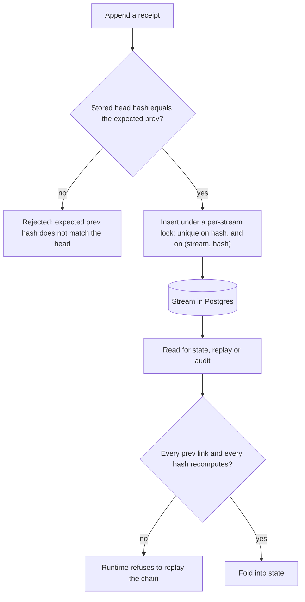

Receipt keeps an append-only record of the work it does, and gives you three ways to read it: the **Agent replay** dialog for one chat thread or background run, **Gateway activity** for a workspace's tool calls, and `receipt dst`, a chain audit you can run on a schedule from a source checkout. What makes that record worth showing an auditor is not that a service promises it did not edit the log. It is that every receipt carries the hash of the one before it, so an edit, an insertion or a deletion changes a hash — and the next read refuses to fold the chain.

<Warning>
**Receipts are tamper-evident, not signed.** There is no key material, no signature field on a receipt, and no timestamping authority anywhere in the product. A hash chain detects modification; it does not authenticate origin. Two coverage gaps matter as much: tool calls that arrive over the MCP protocol write no receipt, and guardrail and model-policy decisions are not receipts at all. Both are listed below.
</Warning>

## Where you read the trail

- **Agent replay** renders a thread's or a run's receipts as a session summary, a chronological transcript and a work log, with a per-receipt detail panel that has **Overview** and **Raw receipt** views and a **Replay to this step** control. Open it from a chat thread, or from the **Receipts** row action on the **Beetle Tasks** page — Beetle is the assistant's name in the interface. [Replay](/co-worker/replay) walks through the dialog.
- **Gateway activity**, inside an MCP Gateway workspace, describes itself as a "Live view of this workspace’s MCP tool activity, derived from execution receipts." See [Gateway activity](/mcp-gateway/gateway-activity).
- **`receipt dst`** audits the chains themselves. It ships with the developer CLI you run from a source checkout, and is covered at the end of this page.

## What writes a receipt

In the stream names below, `<repoKey>` is a per-deployment constant and the other angle-bracket segments are ids filled in when the receipt is written.

| Surface | Stream | What is appended |
|---|---|---|
| A chat turn | `apps/start/<repoKey>/app-chat/sessions/<threadId>`, plus `.../runs/<runId>` | `problem.set` with the message you sent, `run.configured`, a `run.status` for every progress note and status change, and `response.finalized` with the answer |
| Thread settings — rename, archive, pin, delete, branch selection, mode, context window, disabled tools | The thread's own chat stream | `thread.settings.updated` or `thread.branch.updated`, one per change, written on the authoritative server pass of the sync mutation |
| A background run | `factory/objectives/<objectiveId>`, plus `jobs/<jobId>` for each job it dispatches | Objective, task and job lifecycle: planning, dispatch, computer leases, commands and their output, candidates, integration and completion |
| A REST gateway tool call (`POST /connect/call`) | `receipt-connect/gateway/<orgId>/<workspaceId>` | `tool.called`, and on success `tool.observed`, both with `agentId: "mcp-gateway"` and a fresh run id per call; a failed call leaves only `tool.called`, carrying its error |
| Guardrail groups | `organizations/<orgId>/guardrail-groups/<groupId>` | `organization.guardrail_group.created`, `.updated`, `.enabled_changed`, `organization.guardrail.added`, `.updated`, `.removed`, `organization.guardrail_group.archived`, `.deleted` |
| Policy rules | `organizations/<orgId>/policy-rules/<ruleId>` | `organization.policy_rule.created`, `.updated`, `.enabled_changed`, `.deleted` |
| Organization skills | `organizations/<orgId>/skills/<skillId>` | `organization.skill.created`, `.version_added`, `.save_acknowledged`, `.enabled_changed`, `.archived`, `.deleted` |
| Agent Registry scans | `organizations/<orgId>/agent-inventory` | `organization.agent_inventory.scan_requested`, then `.scan_completed` with the discovered agents or `.scan_failed` with a one-line error |
| Agent memory | `memory/<scope>` | `memory.committed`, `memory.accessed`, `memory.forgotten` |

Two things follow from that list. The [Guardrails](/guard/guardrails) and [Policies](/guard/policies) modules are configured but never applied to live traffic — yet their *configuration* is fully audited, so you can always show when a rule was written, changed, switched off or deleted, and by whom. And a gateway receipt carries a bounded preview rather than the payload: the tool output is truncated to 2,000 characters and flagged as truncated, so a full response body is never copied into the chain.

## What leaves no receipt

| Not recorded | Detail |
|---|---|
| MCP-protocol tool calls | A call arriving on the gateway's MCP endpoint (`POST /connect/mcp`) — the one an MCP client is pointed at — passes the same scope and allowlist checks but writes no `tool.called` or `tool.observed` receipt, and so never appears in Gateway activity. Calls over the REST route do. |
| Model-policy denials | A blocked model is an HTTP 403 carrying a machine reason. It lands in the request's telemetry event, not in a receipt. See [Model policy](/llm-gateway/model-policy). |
| Guardrail evaluations | No guardrail evaluation is recorded anywhere, including the admin test dialog, which states that "Nothing is saved and no live traffic is affected." The **Monitor only** strategy has no store behind it in this release. |
| Gateway administration | Enabling a tool, connecting an app or inviting a member goes to the gateway's own **Activity log** panel, backed by the `org_activity_log` table, not to a receipt stream. That is deliberate: these are decisions *about* the gateway rather than traffic through it, so the receipt log keeps one meaning — runtime execution. |
| A call with no workspace | A gateway call that resolves no workspace id is not recorded at all. |

<Note>
Writing a gateway receipt is deliberately best-effort: recording must never turn a working tool call into a failed request, so a write failure is logged and the call still succeeds. Treat Gateway activity as a near-complete record of REST tool calls, not a guaranteed-complete one.
</Note>

## What the hash covers

A receipt is `id`, `ts`, `stream`, `prev`, `body` and `hash`, plus an optional `context` and `hints`. The hash is SHA-256 over the canonical JSON of `id`, `ts`, `stream`, `prev` (written as `null` when absent), `body`, and `context` when it is present. `hints` are excluded.

That split is load-bearing for an audit:

- **`context` is authoritative and it is hashed.** When a writer sets it, it carries the actor, tenant, organization, objective, task, job, run and branch the receipt belongs to. Changing any of it changes the hash and breaks the chain.
- **`hints` are non-authoritative transport metadata and they are not hashed.** They drive indexes, tracing and idempotency, not the record of what happened.

Canonicalization sorts object keys with `localeCompare` and honours `toJSON()`. It refuses to serialize `undefined`, `bigint`, `function`, `symbol`, non-finite numbers, circular structures and non-plain objects, raising errors prefixed `receipt canonicalization`.

## The three checks that run



**On append.** Each write takes a per-stream lock, reads the physical tail of the chain, and compares it to the previous hash the writer expected. A mismatch throws `Expected prev hash <x> but head is <y>` and nothing is inserted. Unique indexes on the hash — globally, and per stream — mean the same receipt cannot be stored twice.

**On replay.** Before folding a chain into state, the runtime verifies it. A chain that does not verify is refused with `Receipt runtime refused to replay invalid chain for stream '<stream>': <reason> at index <n>` rather than being folded over. A corrupt chain fails loudly instead of quietly producing a wrong answer.

**On demand.** Verification walks a chain and returns either success with the receipt count and head, or a failure with the index at which it broke and one of exactly two reasons: `broken prev` or `hash mismatch`.

## What the chain proves, and what it does not

It proves that the receipts in a stream stand in the order they were appended and that none of them has been edited, inserted or removed since — any of those changes a hash, and the next verification names the index where the chain breaks.

It does not cryptographically prove *who* wrote a receipt. Many events name their actor in the body — a guardrail rule records its `createdBy`, `updatedBy` or `deletedBy`, and that field is hashed like everything else — but nothing signs the record, so treat a hash as tamper detection and never as origin authentication. It also does not prove that a projection table agrees with the receipts, or that an artifact a receipt refers to still exists.

<Note>
One subtlety if you ever cite a receipt by hash: a branch is metadata, not a copy. Its receipts are re-linked and re-hashed onto the parent's prefix when the branch is read, so a branch receipt's hash as read differs from its hash as stored. Hashes are stable to quote within one unbranched stream. [Receipts, chains, and streams](/core/receipts-and-streams) has the full model.
</Note>

## Auditing the chains with receipt dst

`receipt dst` is the built-in audit pass over receipt streams. It ships with the developer CLI you run from a source checkout, not with the released binary — see [receipts and jobs from source](/cli/from-source/receipts-and-jobs) for the full reference.

```bash
# Audit every stream
receipt dst

# Audit one prefix, as JSON, failing the process on any problem
receipt dst factory/objectives/ --json --strict
```

For each stream it loads the chain, verifies it, replays it into a summary, then loads it a second time and compares the two passes — so it reports three independent dimensions: integrity (did the chain verify), replay (could the stream be summarized at all) and determinism (did two fresh passes agree).

```text
Receipt DST Audit
Data dir: <resolved data directory>
Scanned: <n> streams
Integrity failures: <n>
Replay failures: <n>
Deterministic failures: <n>

Kinds:
- <kind>: <n>
```

Anything that failed is then listed under `Issues:` as `- <stream> [<kind>] integrity=<reason> at receipt <n>`, followed by a `Streams:` listing. Both text listings stop at 20 entries unless you raise `--limit`; the `--json` report always contains every stream. `--strict` turns any failure into a non-zero exit, which is what makes it usable as a scheduled check.

Read the determinism column with care: a stream that is still being written can legitimately differ between the two passes without anything being wrong. And note the audit's own boundary — it proves a chain is append-valid and still replayable; it does not prove that every projection matches the receipts, or that every referenced artifact still exists.

## Receipts are the record; the tables are not

The receipt log is the one canonical table. The stream and branch tables are indexes over it, the durable-execution tables are a recoverable ledger for in-flight work, and the rest — job, objective, task, chat, memory, skill, guardrail-group and policy-rule projections included — is a derived read model, rebuildable by replaying the chains, apart from a few bookkeeping tables marked operational. Each table declares which of those roles it has, so "this is disposable" is a contract rather than a convention.

That is why deleting a guardrail group or an organization skill removes its projection row and frees the name while the receipt history survives: the delete is itself an event on the chain. When someone asks what a control looked like on a particular day, the answer comes from replaying the stream, not from the current state of a table.

Next step: [see where credentials live and what is encrypted](/guard/data-handling-and-security).
