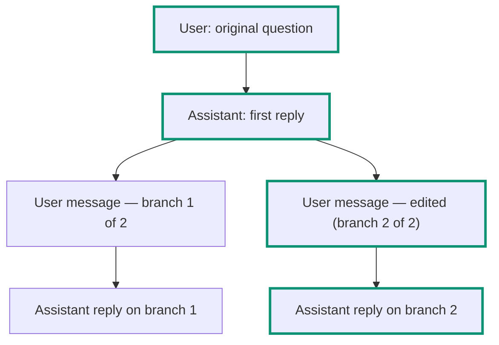

A Receipt thread isn't a flat list of messages — it's an immutable tree. Every message points at its parent, and whenever more than one message shares the same parent, the thread has more than one branch. Receipt always resolves a single, deterministic path through that tree, root to leaf. It is never "whichever branch was touched most recently."

## The message tree and the canonical path

Editing a user message, or regenerating a response, doesn't change the message that already exists — it creates a new sibling message under the same parent. The tree keeps every version; only one path through it is "active" at a time, and that active path is what you see rendered as the conversation.

In this example, editing the second user message created a second branch under the first assistant reply. Both versions of that message still exist in the tree, but the canonical path (outlined above) follows the edited version and its reply — the version you'd see by default when you open the thread.

## Editing and regenerating

- Only **user** messages that sit on the current canonical path can be edited. A message on a branch you're not currently viewing can't be edited directly.
- **Regenerate** always anchors to a user message, even if you trigger it from an assistant reply — Receipt walks up to that reply's parent user message and branches from there.
- There is **no per-message delete** and **no explicit "fork" action**. Branching is simply what editing and regenerating do implicitly, every time. Deleting a message on its own isn't possible; deletion exists only at the thread level, from the sidebar.
- When more than one version of a message exists, a pager appears on it: **Previous branch version** / `n/m` / **Next branch version**, so you can step between siblings.

## When two tabs disagree

Every edit or regenerate carries the branch version it expects to be working from. If that version is out of date but still lower than the thread's current version, Receipt rebases it onto the current tail and retries automatically — so an older tab, or one that's been open a while, keeps working without you noticing. If the conflict can't be resolved that way, you'll see:

`This chat changed in another tab or session. Refresh and try again.`

If you try to edit a message that's no longer on the canonical path, or that's stale for some other reason, you'll instead see:

`This message can no longer be edited. Refresh and try again.`

Editing or regenerating while a response is still streaming is refused by the server — finish or stop the current response first.

## The sidebar

The chat sidebar gives you **New Chat**, **Chat History**, **Projects**, and **Search chats**. Threads are grouped by date: **Pinned**, **Today**, **Yesterday**, **Last 7 Days**, **Last 30 Days**, and **Older**.

Each thread has a menu with **Rename**, **Copy link**, **Pin** / **Unpin**, and **Delete**. These produce toasts as you'd expect — `Thread renamed`, `Thread title cannot be empty`, `Failed to delete thread`, `Failed to rename thread`, `Failed to update pinned state` — with one naming quirk worth knowing: the toast that confirms a successful thread deletion reads `Objective deleted`, not "Thread deleted."

While a thread is in flight, its row in the sidebar carries a status pill: **Pending** while it's queued, **Generating** while a response is being produced, or **Error** if something went wrong.

## Searching your chats

`Cmd/Ctrl+K` opens the search palette from anywhere in the product. The sidebar's **Search chats** entry opens the same palette, but in search-only mode.

Search runs after a 120 ms debounce, returns 20 results by default (30 at most), and a query longer than 200 characters is rejected as too long. Searching message bodies (as opposed to just thread titles) requires at least 2 characters.

<Tip>
Content search scans every message in the thread's history, including messages on branches that aren't part of the current canonical path — so a message you'd otherwise have to page through several `n/m` versions to find is still searchable directly. Selecting a hidden-branch result activates that message's whole root-to-leaf branch path in one step, scrolls it into view, and highlights the match.
</Tip>

Next step: [look up the exact wording of an error you've hit](/guides/errors-and-limits).
