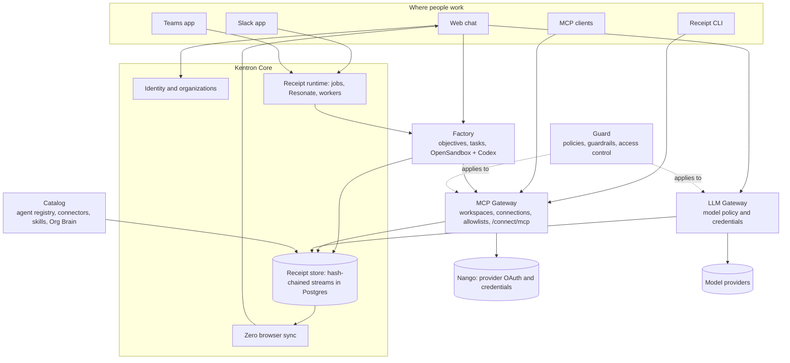

Kentron is an AI-agent platform. Its product is **Receipt**: a co-worker you hand a goal to in plain language, which either answers you directly or plans, executes and reports back, with every step recorded as a receipt you can replay. The hosted application is `app.kentron.ai`; if you are not signed in, opening it takes you straight to the sign-up page.

## A co-worker you give goals to

You talk to Receipt in the web app, in Slack, or in Microsoft Teams. Every message first goes through a router that does nothing but classify the turn. It returns one of three decisions:

- **Answer directly.** A second pass writes the response you see in the thread.
- **Author an organization skill.** Receipt drafts or saves a reusable set of instructions for your organization. This route runs in the web app only.
- **Run a durable background objective.** Receipt queues the work and posts the result when the run settles; the web app and Slack also stream progress into the thread.

Background work runs in Factory: the objective is planned into tasks, each task runs in a disposable sandboxed computer, and the outcome comes back to the thread with a **Replay** you can open. In the web app and in Slack, if the router cannot tell what access a request needs it stops rather than guessing: `Receipt couldn't determine the access needed for this request. Please retry; no task was started.`

<Frame caption="The chat home page as an owner or admin sees it: a greeting, the composer with its + menu, Skills chip and a rotating example prompt, a Replay button top right, and the Docs link and Beetle runners count in the sidebar footer. Members see a shorter sidebar.">
  
</Frame>

In the interface the assistant is called **Beetle**: chat status lines read `Sending your message to Beetle...`, the tasks page is titled **Beetle Tasks**, and the sidebar footer widget that counts sandbox capacity is **Beetle runners**. This documentation says Receipt, and quotes Beetle only where the screen shows it.

## The gateways that govern models and tools

Two gateways sit between an agent and everything outside Receipt.

The **MCP Gateway** holds your app connections. You connect an app once through Receipt Connect, an owner or admin decides per connection which operations agents may call, and Codex or any other MCP client uses those operations without ever holding a provider credential. Write operations are off until an owner or admin enables them; there is no per-action approval prompt in this release. Provider credentials stay in Nango, so MCP client configs and sandboxes never contain them.

The **LLM Gateway** is the checkpoint every model call Receipt itself makes passes through: which providers and models the organization allows, whose key pays for the call, and how much spend is pre-authorized. It is not a proxy; there is no external endpoint for other applications to send model traffic through.

## Receipts as proof

Receipt records its work in receipt streams: tamper-evident, SHA-256 hash-chained records in Postgres. Every background run and every action called through the gateway's `/connect/call` route writes receipts; the pages that show tasks, runs and sessions are built from those streams; the runtime verifies the hash chain whenever it replays a stream and refuses one that does not check out. Calls made through the MCP bridge are not yet recorded.

## The seven components

<CardGroup cols={2}>
  <Card title="Receipt AI Co-Worker" icon="comments" href="/co-worker/overview">
    Give Receipt a goal in chat, Slack or Teams; it answers or runs a background objective, and every step is a receipt you can replay.
  </Card>
  <Card title="MCP Gateway" icon="plug" href="/mcp-gateway/overview">
    Connect your apps once, decide which operations agents may call, and let any MCP client use them without holding a credential.
  </Card>
  <Card title="LLM Gateway" icon="microchip" href="/llm-gateway/overview">
    One policy and credential checkpoint for every model call Receipt makes: providers, models, your own keys, and spend.
  </Card>
  <Card title="Kentron Catalog" icon="book-open" href="/catalog/overview">
    What your organization has: the AI agents found in your clouds, 63 connectable connectors inside a directory of about 900, your skills, and how all of it is used.
  </Card>
  <Card title="Kentron Guard" icon="shield-halved" href="/guard/overview">
    The controls between an agent and your systems, stating plainly which are enforced today and which are stored but not yet applied.
  </Card>
  <Card title="Kentron Core" icon="layer-group" href="/core/overview">
    The platform everything else runs on: accounts, organizations, billing, the receipt runtime, the API and SDK, configuration and self-hosting.
  </Card>
  <Card title="Receipt CLI" icon="terminal" href="/cli/overview">
    Sign in once with `receipt setup`, pick a workspace, and use your connections from the terminal, from Codex, or from any MCP client.
  </Card>
</CardGroup>

## Which component do I need?

| I want to… | Go to |
|---|---|
| Ask a question, or hand Receipt a multi-step task and get a report back | [Receipt AI Co-Worker](/co-worker/overview) |
| Use Receipt from a Slack channel or a Teams chat | [Slack](/co-worker/slack) and [Teams](/co-worker/teams) |
| Connect GitHub, Jira, AWS or another app and decide which operations agents may call | [MCP Gateway](/mcp-gateway/overview) |
| Point Codex or another MCP client at those connections | [Tools and MCP](/cli/tools-and-mcp) |
| Choose which model providers and models the organization may use, bring my own key, or see spend | [LLM Gateway](/llm-gateway/overview) |
| Find the AI agents running in my AWS, Azure or Google Cloud accounts | [Agent Registry](/catalog/agent-registry) |
| Give agents shared, versioned instructions | [Skills](/catalog/skills) |
| Know exactly which controls are enforced between an agent and my systems | [Kentron Guard](/guard/overview) |
| Read or verify the receipts behind a run | [Replay](/co-worker/replay) and [Receipts and audit](/guard/receipts-and-audit) |
| Invite teammates, set roles, or manage billing | [Members and roles](/core/members-and-roles) |
| Run Receipt myself, or build against the runtime | [Self-hosting](/core/self-hosting) and [Runtime API](/core/runtime-api) |
| Use my connections from the terminal | [Receipt CLI](/cli/overview) |

## How it fits together

Every edge is backed by code: web chat goes through the LLM Gateway for direct answers and hands background work to Factory; Slack and Teams reach the same runtime through its channel-neutral routes; the CLI and MCP clients talk to the MCP Gateway, which Factory workers also call for credentials at run time; Nango holds the provider credentials; Zero syncs the receipt projections back to your browser. Guard's enforced controls sit on the model and gateway paths.

## Get started

<CardGroup cols={3}>
  <Card title="Create an account" icon="user-plus" href="/core/your-account">
    Sign up on the hosted app; an organization is created for you.
  </Card>
  <Card title="Send your first chat" icon="paper-plane" href="/co-worker/your-first-chat">
    Ask a question, then hand over a task and watch it run.
  </Card>
  <Card title="Install the CLI" icon="download" href="/cli/install">
    Put `receipt` on your machine and sign in with `receipt setup`.
  </Card>
</CardGroup>

Next step: [see what the co-worker can do](/co-worker/overview).
