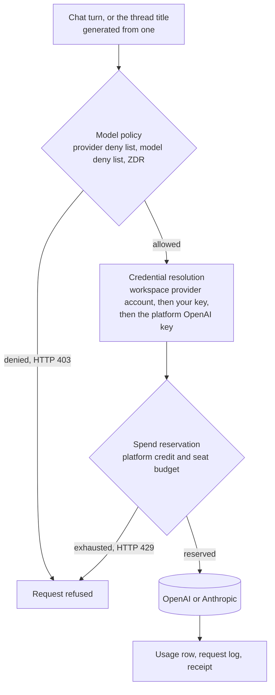

The LLM Gateway is where your organization decides which model providers it uses, which credential pays for each call, and which models are off limits. Every model call Receipt itself makes — a chat answer, a generated thread title, an attachment embedding, a background run — resolves its model and its credential on the server before a provider is contacted. There is no external endpoint for other applications to route their own traffic through.

<Warning>
**Two of the 32 provider tiles execute, and the Playground is an empty heading.** OpenAI and Anthropic are the only providers with a runtime adapter in this release. The other 30 tiles open, collect their fields, and are then refused with **"This provider is a catalog preview and cannot be configured yet."** The **Playground** item in the Model Gateway rail renders a page containing the heading **"Playground"** and nothing else — no model selector, no request, no usage, no receipt.
</Warning>

<CardGroup cols={2}>
  <Card title="Models and providers" href="/llm-gateway/models-and-providers">
    The provider gallery, the setup wizard, workspace provider accounts, and the model catalogue.
  </Card>
  <Card title="Bring your own key" href="/llm-gateway/bring-your-own-key">
    Organization and workspace provider keys, how they are stored, and which requests they cover.
  </Card>
  <Card title="Model policy" href="/llm-gateway/model-policy">
    Provider and model deny lists, the three compliance flags, and what a denial returns.
  </Card>
  <Card title="Usage and spend" href="/llm-gateway/usage-and-spend">
    Platform credit, pre-authorized budgets, the per-user request limit, and the Usage page.
  </Card>
  <Card title="Gateway configuration" href="/llm-gateway/configuration">
    The variables on the model path, the error envelope, and self-hosted differences.
  </Card>
</CardGroup>

## What runs today

| Provider | Credential it accepts | Where it works |
|---|---|---|
| **OpenAI** | The platform-funded server key, or your organization's or workspace's own key | Chat answers, thread titles, embeddings, and background runs |
| **Anthropic** | Your own key only — there is no platform-funded Anthropic route | Chat answers, and the thread title generated from one; embeddings and background runs are OpenAI-only |

The model catalogue holds 75 rows from eleven manufacturers — `openai`, `anthropic`, `google`, `alibaba`, `deepseek`, `meta`, `mistral`, `minimax`, `moonshotai`, `xai` and `zai` — and it is append-only in practice, so that policy can keep referring to stable model ids. Read the app rather than this page for the current list. Only the 25 rows that can route through OpenAI or Anthropic execute. The rest still appear in the policy screens, but a turn that selects one cannot be routed and fails with **"The AI provider is currently unavailable. Please retry."** (HTTP 502).

<Note>
The chat composer has no model picker in this release. Which model a turn uses is resolved on the server from the thread's model and your organization's policy, not chosen per message.
</Note>

<Frame caption="The Models page on its Models tab before any provider account exists. All 32 tiles sit under the 'Start adding your Models here' empty state; Filter narrows the grid to the tiles that can actually be saved, and Custom Endpoints sits beside it.">
  
</Frame>

## How a request flows

Three gates, one provider call, one ledger:

1. **Policy.** Your organization's disabled providers, disabled models and Zero Data Retention requirement are evaluated first. A denial is HTTP 403, and it happens before any spend is reserved and before a provider is contacted.
2. **Credential.** A workspace provider account wins when one covers the model and you are allowed to use it; otherwise your organization's or workspace's own provider key; otherwise the platform-funded OpenAI key. A request that runs on your own key skips the reservation step entirely.
3. **Spend.** Platform-funded and paid-seat turns reserve an estimate against the balance *before* the model runs, then settle to the real cost once the answer finishes. An exhausted balance is HTTP 429.
4. **Provider.** The answer streams back through the same layer, which sets the output cap and the provider options.
5. **Records.** Every turn that reaches the provider writes a usage row (tokens, model, cost, and whether your own key paid) and one structured request log line carrying the model, the policy outcome, tokens and cost — never the prompt or the completion. A direct chat answer also writes a `response.finalized` receipt carrying the same analytics, and [Replay](/co-worker/replay) reads that stream back.

Two other model calls take a shorter version of that path. Attachment embeddings always run `openai/text-embedding-3-small`, on your organization's OpenAI key or on the platform key when there is none; they reserve and settle spend and write a usage row like any other call, but the provider and model deny lists are not evaluated for them. Background runs are OpenAI-only because Factory ships only an OpenAI adapter, and a platform-funded run has to present the credit reservation its chat turn already made before Receipt hands it the server key.

For the exact message a user sees at each gate, see [Errors and limits](/co-worker/errors-and-limits).

## A checkpoint, not a proxy

Every model call Receipt itself makes is resolved and funded on the server. Nothing else can reach that path: there is no OpenAI-compatible endpoint, no `/v1/*` route and no proxy anywhere in the product, so you cannot point another application's SDK at Receipt and have it inherit your policy.

The **Custom Endpoints** tab on the Models page points the other way. It offers to "Add an OpenAI-compatible or self-hosted inference endpoint and then select the models it exposes" — that is Receipt calling your endpoint as a provider, not your application calling Receipt. Its **Add custom endpoint** button opens the Self-Hosted Model tile, which is one of the 30 catalog previews and cannot be saved yet.

## Where it lives in the app

The sidebar area is titled **Model Gateway**, described as "Manage models and try them in the playground", and holds two items: **Models** and **Playground**. **Models** has no page of its own — it opens `/organization/settings/models`, the provider gallery in organization settings, which is owner and admin only. A member who reaches that URL is returned to the app root with no access-denied screen. `/model-gateway` itself has no index page and renders an empty column.

Next step: [connect a provider and choose its models](/llm-gateway/models-and-providers).
