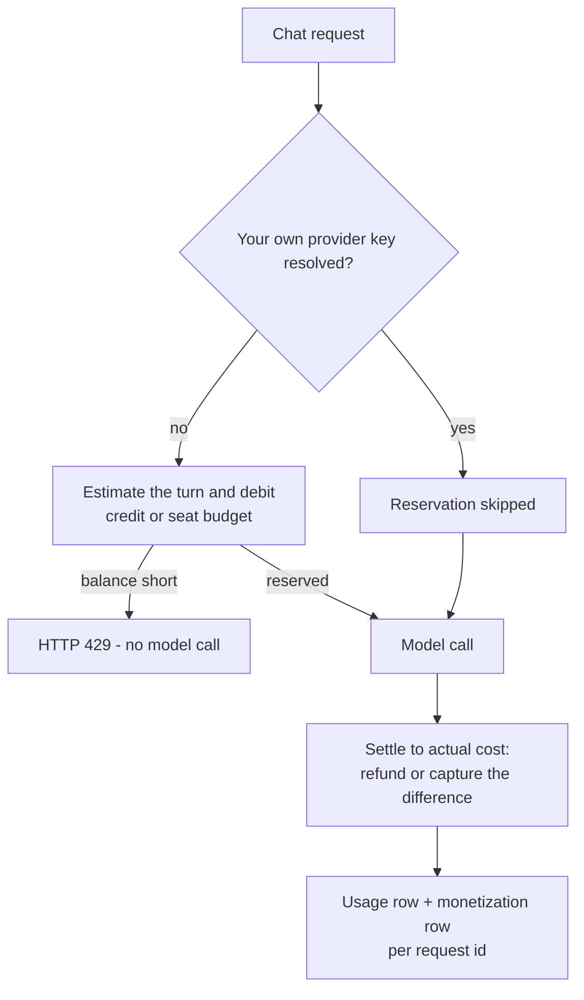

Every model call Receipt funds is paid for before it runs. A new hosted organization starts with a one-time $5 platform credit, each paid seat carries a dollar budget for the billing cycle, and every turn reserves an estimate against one of those balances *before* the provider is contacted — then settles to the real cost once the answer is finished. The **Usage** page is where you read the result.

<Warning>
**The Rate limiting and Budget limiting modules on the Policies page are not applied to traffic.** Those rules are stored as receipts, and no runtime path reads them. The controls described on this page — the reservation engine, seat budgets, and the per-user request limit — are the ones that actually run. See [Policies](/guard/policies).
</Warning>

## The Usage page

Usage lives in organization settings at `/organization/settings/usage`, titled **Usage** and described as "Track your plan usage and model requests." Only owners and admins can open it; a member who reaches the URL is redirected to the app root rather than shown an access-denied screen. It carries no icon in the sidebar rail and no entry in the workspace menu, so you reach it by typing the URL.

<Frame caption="The Usage page. Only the Members tile carries a denominator, and Recorded spend need not match Credit used: spend sums the cost recorded on every request, including turns that used your own provider key, while Credit used is only what the platform credit balance has given up.">
  
</Frame>

At the top, a **Current plan** card shows the plan name — or "Loading…" — with an **Active** pill. Below it sits a resource grid headed `{plan name} plan · {workspace name}` (or "no workspace"), with an **Upgrade** button that links to Billing.

### The three resource tiles

| Tile | What it counts |
|---|---|
| **Workspaces** | A plain count. Uncapped. |
| **Integrations** | A plain count of valid connections. Uncapped, and counted **inside the active workspace only**, because every Receipt Connect connection is scoped to one workspace. |
| **Members** | Capped. Rendered as `{count} / {limit}` against your seat count, with a progress ring and an at-limit state once the count reaches the limit. |

Members is the only tile with a real cap, because seats are the only per-plan limit enforced today. On the Free plan that ceiling is five seats by default; a deployment can change it with `RECEIPT_DEFAULT_FREE_SEAT_COUNT`. Inviting past it is refused, not just flagged on this page.

### The headline cards and the detail rows

Three headline cards:

- **Requests this period** — captioned "total model requests".
- **Total tokens** — captioned "input, output, and reasoning combined".
- **Credit used** — the granted credit minus what remains, captioned "platform credit consumed".

Then two sections of stat rows. **Credits and spend** shows **Credit remaining**, **Recorded spend** and **Top model** — the model you used most often, ties broken by whichever you used most recently. **Token breakdown** shows **Input tokens**, **Output tokens**, **Reasoning tokens** and **Cache-read tokens**.

<Warning>
**These numbers are yours, not your organization's.** The page sits in organization settings, but the query behind it filters to the signed-in user, over a rolling **31-day** window. Two admins looking at the same organization's Usage page see two different sets of numbers.
</Warning>

<Note>
The two number formats behave differently when a value is missing. A missing value renders as **`Not recorded`** in the stat rows, but as **`0`** in the three headline cards. A headline `0` therefore does not distinguish "nothing happened" from "nothing was recorded".
</Note>

Money is stored in nano-USD and formatted as USD, with up to four decimal places for amounts under a cent.

## How a turn is paid for

**The signup credit.** Each new hosted organization is granted a one-time $5 platform credit, written to its billing account as a `signup_grant` ledger entry attributed to the organization owner. Self-hosted organizations are granted nothing, and the whole usage policy is disabled on self-hosted deployments.

**The reservation.** Unless the turn resolves one of your own provider keys, the request reserves an estimate before the model runs. The estimate prices your prompt tokens at the model's input rate, adds an output allowance of at least 96 tokens (12% of the prompt, capped by the model's default maximum output) at the output rate, adds 10% headroom, and never reserves less than $0.005. A model with no pricing in the catalog reserves that floor. Stale reservations expire after **15 minutes**. The whole check runs in one transaction with a row lock, so two concurrent turns cannot spend the same balance twice.

**Settlement.** When the stream finishes, Receipt settles the reservation to the real number: a provider-reported cost if one came back, otherwise the catalog rate card applied to the recorded tokens, otherwise the estimate, otherwise zero — deliberately, so a missing provider cost never turns a completed platform-funded request into a free one. The difference is refunded or captured, and any overage the balance cannot cover is forgiven. A monetization row moves from `pending` to `settled`, or is recorded as `bypassed` when the turn used your own key or reserved nothing.

If the turn never completes, the reservation is released with a reason — `request_failed`, `title_generation_failed` or `reservation_expired`.

<Info>
Turns that use your own provider key bypass the reservation entirely: you are paying the provider directly, so Receipt has no balance to hold. That also means this traffic is not constrained by your credit or your seat budget. See [Bring your own key](/llm-gateway/bring-your-own-key).
</Info>

## Seat budgets and organization caps

A Free organization has no plan budget; its turns run against the platform credit balance instead. Paid organizations get a per-seat bucket for the billing cycle, prorated by the time left in that cycle. The seat's monthly budget is the plan's seat price reduced by a target margin, which the deployment sets with `WORKSPACE_USAGE_TARGET_MARGIN_PERCENT` (with optional per-plan overrides such as `WORKSPACE_USAGE_PRO_TARGET_MARGIN_PERCENT`). The variable is required on a hosted deployment for paid plans: the resolver throws `Missing {NAME}` when it is absent, and `Expected {NAME} to be between 0 and 100` when the value is out of range.

A hosted organization may also carry an organization-wide monthly cap. Only Kentron can set it — organization settings has no control for it — and when one is present it replaces the derived figure and is divided evenly across the seat count.

Seats themselves are picked per member per cycle, preferring genuinely unused seats over ones a previous member has already spent from, so inviting and removing members cannot manufacture extra budget.

<Note>
There is no token budget anywhere in the product. The only token ceilings on a request are the per-call output cap and the context-window check; spend limits are all denominated in dollars.
</Note>

## What a refusal looks like

Spend refusals are returned before the model call, as HTTP 429 with a retryable error envelope.

| Situation | What you see |
|---|---|
| Platform credit spent, Free organization | "Your $5 platform credit has been used. Add an optional provider key in Billing & Credits to continue without platform credit." |
| Seat budget exhausted | "This seat has exhausted its current AI usage allowance. Please wait until the monthly reset and try again." |
| Too many requests | "Too many requests. Please wait about `{retryAfterSeconds}` seconds and retry." |

<Note>
The credit message points at a page called "Billing & Credits". No page ships under that name — the destination is **Billing**, described on [Billing and plans](/core/billing-and-plans). The full envelope shape and the rest of the chat error table are on [Errors and limits](/co-worker/errors-and-limits).
</Note>

## The request rate limit

Chat is limited to **30 requests per 60-second window, per user**. It is a fixed-window counter in Postgres, keyed on the user and the window start; there is no per-organization limit, no per-key limit, and no `Retry-After` header — the wait hint travels inside the error envelope as `retryAfterSeconds`. The window and the maximum can be changed with `PAID_CHAT_RATE_LIMIT_WINDOW_MS` and `PAID_CHAT_RATE_LIMIT_MAX_REQUESTS`, which must be positive integers or the resolver throws `Expected {NAME} to be a positive integer`.

<Warning>
**Setting `VITE_DISABLE_REDIS=true` turns the rate limiter off completely.** The chat runtime swaps in an adapter that always answers "allowed", even though the live limiter is backed by Postgres and does not use Redis at all. The example environment file ships that value, so a deployment copied from it starts with no request limit. The same flag also disables stream resume.
</Warning>

## What is recorded for each request

<AccordionGroup>

<Accordion title="A usage row and a monetization row">
One of each per request id, carrying the user, the organization, the seat, the model id, whether your own key was used, the estimated and actual nano-USD, and a token-metadata payload. These rows are what the Usage page reads.
</Accordion>

<Accordion title="One structured request log line">
A single wide event per request with the actor, the thread, the requested and resolved model, reasoning effort, the policy that applied (including the zero-data-retention requirement and any denied tool keys), stream details, prompt and total tokens, estimated and actual cost, and the outcome. It contains **no prompt or completion text**.
</Accordion>

<Accordion title="Receipts, for direct answers">
A direct answer appends a `response.finalized` receipt carrying the same analytics, followed by a `run.status` receipt of `completed` with the note `chat turn completed from /api/chat`. Background work in Factory writes its own objective receipts. Router sub-calls are folded into the turn rather than itemized. See [Receipts and streams](/core/receipts-and-streams).
</Accordion>

</AccordionGroup>

Token and cost figures for a turn are summed across every model call it made — routing, skill authoring, and the final answer — not just the visible response.

## Who can see a cost figure

Per-turn cost is exposed to the person who ran it when either the turn used your own provider key, or the deployment sets `ALLOW_USER_COST_DISPLAY=true` (the example environment file ships `false`). Otherwise the figure is kept internal, and only the aggregate on the Usage page is visible.

Where cost is exposed, the composer's context hover card shows a **Total cost** footer, and the replay dialog labels the row **Estimated provider cost**, showing **Not recorded** when no figure was captured — a missing cost is deliberately kept distinct from a zero cost.

Next step: [set the gateway's configuration variables](/llm-gateway/configuration).
