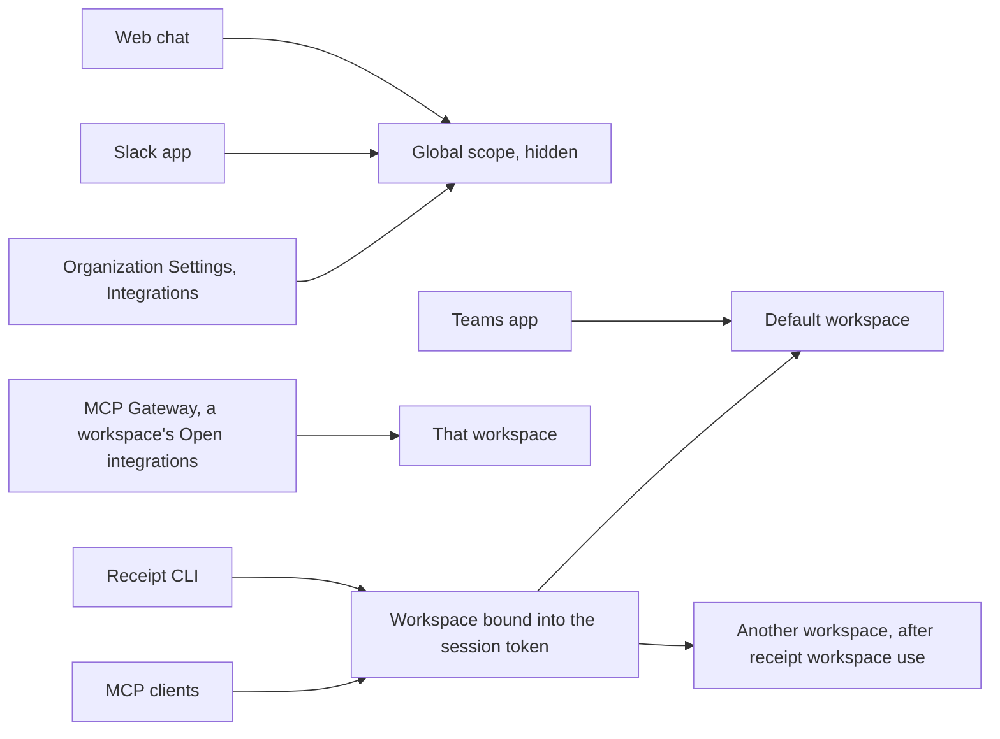

This is the single most misunderstood behaviour in Receipt. You connect GitHub, chat starts using it, and then `receipt tools list` shows nothing. Nothing is broken. The two surfaces are reading different scopes.

## Connections are stored per workspace

Every connection row is filtered on **organization and workspace together**. There is no organization-wide connection store. When a caller supplies no workspace at all, the lookup falls back to the organization's Default workspace — which is a workspace, not an organization-wide scope.

Three workspace-shaped scopes exist.

<AccordionGroup>
<Accordion title="The Default workspace">
Not created at signup. Its row is created lazily, the first time any workspace-scoped code path runs for that organization. It has the name `Default` and the slug `default`, and its id is `ws_<md5 of the organization id>`, so it is deterministic — the same workspace every time. It cannot be deleted.
</Accordion>

<Accordion title="Named workspaces">
Created by users. Each one is an isolated authorization boundary with its own connections, provider keys, members and activity. Creating and managing them is [Workspaces](/mcp-gateway/workspaces).
</Accordion>

<Accordion title="The Global scope">
A hidden scope, id `ws_global_<md5 of the organization id>`, with a reserved slug. It is stored as a workspace row, but it is excluded from every workspace list and is never selectable in the interface. You cannot open it, switch to it, or point a CLI session at it. It is created on demand, the first time someone opens organization-wide integrations.
</Accordion>
</AccordionGroup>

## Which surface reads which scope

| Surface | Scope it uses |
| --- | --- |
| Organization Settings > Integrations ("Global Integrations") | Writes into the **Global scope** |
| MCP Gateway > a workspace > Open integrations | Writes into **that workspace** |
| Web chat | Reads capabilities from the **Global scope** only |
| The Slack app | Reads capabilities from the **Global scope** |
| The Teams app | Reads capabilities from the **Default workspace** |
| Receipt CLI and MCP clients | The **workspace bound into the session token** |
| A Factory background run | The scope carried in the job's auth context — the **Global scope** when the run starts in web chat or Slack |

So, plainly:

- An app connected on **Organization Settings > Integrations** does **not** appear in `receipt tools list`, because that page writes to the Global scope and the CLI reads the workspace in its token.
- An app connected inside an **MCP Gateway workspace** does **not** help web chat, because chat reads the Global scope only.
- An app connected for chat does **not** reach the Teams app either, because Teams passes no workspace and so lands on Default.

Connect the app in both places if you need it in both places.

<Warning>
**The Teams app reads a different scope than web chat and Slack.** Web chat and the Slack app probe the hidden Global scope; the Teams app sends no workspace with its probe, so it resolves to the organization's `Default` workspace. An app connected under Global Integrations is therefore invisible to Teams until it is also connected in Default. Treat this as current behaviour rather than a documented guarantee.
</Warning>

## Why it works this way

The reason is recorded in the code, and it is a deliberate choice rather than an oversight. Global integrations are what Receipt chat uses, and chat runs with no workspace selected. They previously resolved to the organization's Default workspace — which meant that connecting an app for chat also connected it for whoever was using Default with an MCP client, and the reverse. Those are different audiences, so the global scope became its own row: the same shape as a workspace, so every connection path keeps working unchanged, but never the Default one and never listed among the workspaces people pick between.

<Note>
Older connections that carry only an organization tag and no workspace are read-repaired into the **Global** scope, not into Default. They powered organization-wide chat, so Global is where they belong.
</Note>

## Who can read and who can change

Reading and changing a scope's connections are two different levels of authority, deliberately.

| Action | Required authority |
| --- | --- |
| Read a workspace's connections | Membership of that workspace, in that organization |
| Connection lifecycle and permission changes | Workspace mutation authority: workspace owner or admin, falling back to organization owner or admin |
| Create a workspace | Organization owner or admin |

Connection lifecycle and permission changes sit at the higher level on purpose. They are workspace administration, not ordinary runtime operations — and because web tokens intentionally carry broad runtime scopes, the workspace role has to be checked at that boundary rather than inferred from the token.

**Effective role**: an organization owner or admin is treated as an owner or admin in every workspace, regardless of the workspace member row. The rest of the workspace administration rules are on [Workspaces](/mcp-gateway/workspaces).

## What binds a surface to a scope

The token a surface holds is what pins it to one scope, and the two shapes differ in both lifetime and reach. The web app's token lives 10 minutes and carries `connect:read` and `connect:write`; a CLI session token lives 12 hours and adds `connect:credential`, which is what makes tool execution possible at all. The full table is in the [gateway security model](/mcp-gateway/security-model).

What matters here is how each one acquires its workspace:

- The web app mints its short-lived token and immediately exchanges it at `/connect/workspaces/:id/token` for a workspace-bound token. For **Organization Settings > Integrations** the browser never sees or picks the Global-scope id at all — a server function resolves it.
- A CLI session token is bound to the **Default** workspace by device login, every time. `receipt workspace use <id|slug|name>` is the only operation that replaces it with a token bound to a different workspace, and MCP clients that read the session at start-up need a restart afterwards.

<Tip>
If a tool you expect is missing, check the scope before checking anything else. `receipt workspace current` prints the name and id of the workspace your session is bound to; the connection has to exist in that workspace, not in Global Integrations.
</Tip>

Next step: [understand what a connection actually stores](/mcp-gateway/receipt-connect).
