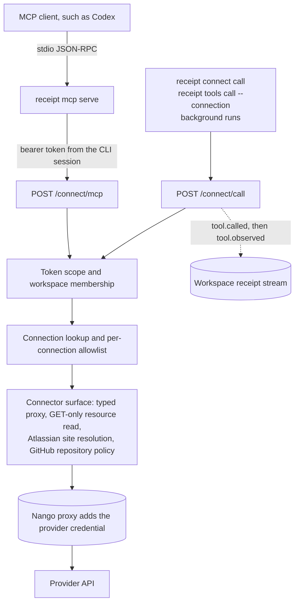

The MCP Gateway holds the apps your organization has connected — GitHub, Jira, Gmail, AWS and the rest — and hands them to agents as tools. **MCP** is the Model Context Protocol, the open standard an AI agent uses to discover and call tools, and any program that speaks it is an **MCP client**; Codex, OpenAI's coding agent, is the one Receipt can configure for you.

You connect an app once through **Receipt Connect**, the part of Receipt that owns connections — 63 connectable apps sit inside a browsable directory of about 900 — an owner or admin decides which operations that connection may perform, and an MCP client calls them through a single server. The provider credential stays in Nango, the integration provider Receipt runs beside itself, and is attached to the request on the server, so no MCP client config ever holds it.

## What you can do

<CardGroup cols={2}>
<Card title="Connect an app" href="/mcp-gateway/connect-an-app">
Authorize a provider account for chat and Slack, or inside one workspace for the CLI and MCP clients.
</Card>
<Card title="Set up an MCP client" href="/mcp-gateway/quickstart">
Sign in with the CLI, install the Codex bridge, confirm the workspace, list the tools.
</Card>
<Card title="Isolate work in workspaces" href="/mcp-gateway/workspaces">
Create, share, rename and delete the boundaries that hold connections, permissions and CLI sessions.
</Card>
<Card title="See where a connection lives" href="/mcp-gateway/connection-scopes">
Which surface reads which scope, and why an app connected for chat is invisible to the CLI.
</Card>
<Card title="Understand a connection" href="/mcp-gateway/receipt-connect">
What Receipt stores and does not store, how a connection is addressed, what each connector publishes.
</Card>
<Card title="Decide what agents may call" href="/mcp-gateway/tools-and-permissions">
Every published operation sits on a per-connection allowlist, and writes stay off until an owner or admin enables them.
</Card>
<Card title="Read the server reference" href="/mcp-gateway/aggregate-server">
Protocol versions, opaque tool aliases, publication rules, error shapes and the route table.
</Card>
<Card title="Watch gateway activity" href="/mcp-gateway/gateway-activity">
One workspace's tool traffic, and which calls reach the dashboard and which never will.
</Card>
<Card title="Understand the security model" href="/mcp-gateway/security-model">
Token shapes, what a stolen session file can do, what never leaves the server.
</Card>
<Card title="Fix a failing call" href="/mcp-gateway/troubleshooting">
The gateway, connection and CLI error strings, each with its cause and its fix.
</Card>
</CardGroup>

## Two scopes, one gateway

Every connection belongs to exactly one scope, and the scope decides which agents can reach it.

**Global Integrations** is the organization-wide scope: an app connected there is available to Receipt chat for the whole organization. Web chat and the Slack app read it; the Teams app reads the **Default** workspace instead. [Connect an app](/mcp-gateway/connect-an-app) walks through that page.

**Workspaces** are what the CLI and MCP clients read. Every organization has a Default workspace that cannot be deleted, and owners and admins create named ones beside it. Signing the CLI in binds your session to Default; `receipt workspace use <name>` moves it.

So connecting GitHub under Global Integrations makes it available to chat and Slack, but `receipt tools list` will not show it until GitHub is also connected inside the workspace your session is bound to. The full rules are in [where a connection lives](/mcp-gateway/connection-scopes).

<Frame caption="The Workspaces page under MCP Gateway. Each row is an authorization boundary with its own connections; the green dot marks the active workspace — Default here — and a wrench under Sharing and tools marks a workspace that has at least one connected app.">

</Frame>

## How a tool call travels

The bridge relays each JSON-RPC line to the gateway with your bearer token. On every call the gateway re-checks the token's scope and your membership of its workspace, looks up the connection and its allowlist, validates the arguments, and forwards the request through the Nango proxy, which adds the provider credential server-side. A write runs only when the token carries `connect:write` **and** an owner or admin has enabled that operation for that connection; there is no per-action approval prompt in this release. Unknown and disabled tools share one answer, `integration action not found or disabled`, so a client cannot probe for what it is not allowed to see.

Tool names are opaque aliases of the form `receipt_<provider>_<connection>_<tool>_<20 hex characters>` — copy them from the listing, never construct one. Connectors that expose the provider's own MCP server publish nothing through the aggregate endpoint, so an upstream tool added later cannot silently become callable across your organization.

## Which clients can attach

| Client | How it attaches |
| --- | --- |
| Codex | `receipt mcp install codex` adds a `receipt` server entry through `codex mcp add`, backing the config up first and rolling back on failure. `status` and `remove` manage it afterwards. |
| Any other stdio client | `receipt mcp config generic` prints a config to paste into that client's own settings. `install`, `status` and `remove` answer `receipt mcp install/status/remove currently supports codex; use 'receipt mcp config --client generic' for other clients`. |
| ChatGPT and other remote-only clients | Cannot attach. The gateway accepts a bearer token only; there is no OAuth authorization server, no protected-resource metadata and no dynamic client registration. |

Every config the CLI writes is checked before it is saved: one containing the session token, or anything that looks like credential material, is refused.

## What is stored, and what is recorded

- **Connections.** For an app connected through the browser, Receipt stores an encrypted reference — organization, workspace, provider and name mapped to the provider connection — not the credential. The two exceptions are explicit imports: an AWS `credential_process` bundle or a GitHub token you import through the CLI, encrypted in the same table. Browsers receive only a connection's id, organization, workspace, provider, name, kind, status, expiry and timestamps.
- **Permissions.** The per-connection allowlist and the GitHub repository selection live on the connection's metadata in Nango, never in a client config.
- **Your CLI session.** A 12-hour bearer token, bound to one workspace, stored in plaintext on your machine and readable only by you. It cannot be revoked before it expires, so treat it like a password — see the [security model](/mcp-gateway/security-model).
- **Receipts.** Each `POST /connect/call` writes a `tool.called` event and, on success, a `tool.observed` event into that workspace's receipt stream, with the recorded output truncated to 2,000 characters.

<Warning>
**Tool calls made through the MCP bridge are not yet recorded as receipts.** Calls through `receipt connect call`, `receipt tools call --connection` and background runs are. [The aggregate MCP server](/mcp-gateway/aggregate-server) sets out which route each command takes, and [Gateway activity](/mcp-gateway/gateway-activity) shows what reaches the dashboard.
</Warning>

Next step: [connect an app](/mcp-gateway/connect-an-app).
