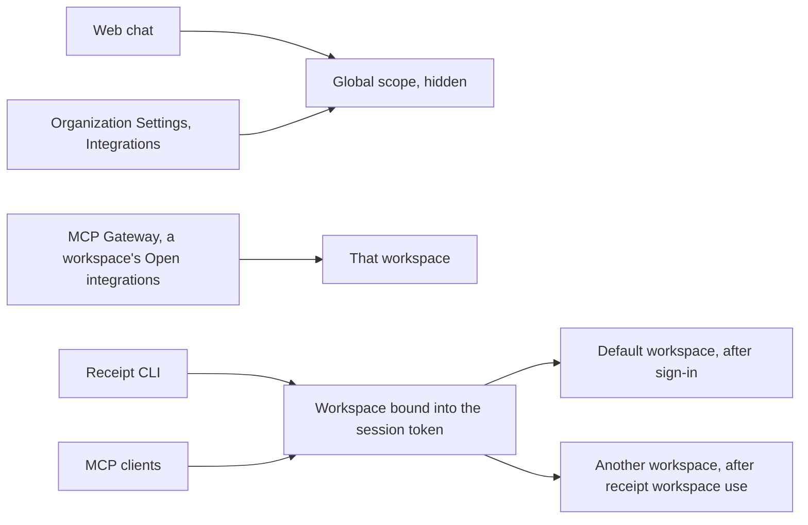

This is the single most misunderstood behaviour in Receipt. You connect GitHub, chat starts using it, and then `receipt tools list` shows nothing. Nothing is broken. The two surfaces are reading different scopes.

## Connections are stored per workspace

Every connection row is filtered on **organization and workspace together**. There is no organization-wide connection store. When a caller supplies no workspace at all, the lookup falls back to the organization's Default workspace — which is a workspace, not an organization-wide scope.

Three workspace-shaped scopes exist.

<AccordionGroup>
<Accordion title="The Default workspace">
Not created at signup. Its row is created lazily, the first time any workspace-scoped code path runs for that organization. It has the name `Default` and the slug `default`, and its id is `ws_<md5 of the organization id>`, so it is deterministic — the same workspace every time.
</Accordion>

<Accordion title="Named workspaces">
Created by users. Each one is an isolated authorization boundary with its own connections, provider keys, members and activity.
</Accordion>

<Accordion title="The Global scope">
A hidden scope, id `ws_global_<md5 of the organization id>`, with a reserved slug. It is stored as a workspace row, but it is excluded from every workspace list and is never selectable in the interface. You cannot open it, switch to it, or point a CLI session at it.
</Accordion>
</AccordionGroup>

## Which surface reads which scope

| Surface | Scope it uses |
| --- | --- |
| Organization Settings > Integrations ("Global Integrations") | Writes into the **Global scope** |
| MCP Gateway > a workspace > Open integrations | Writes into **that workspace** |
| Web chat | Reads capabilities from the **Global scope** only |
| Receipt CLI and MCP clients | The **workspace bound into the session token** |

So, plainly:

- An app connected on **Organization Settings > Integrations** does **not** appear in `receipt tools list`, because that page writes to the Global scope and the CLI reads the workspace in its token.
- An app connected inside an **MCP Gateway workspace** does **not** help web chat, because chat reads the Global scope only.

Connect the app in both places if you need it in both places.

## Why it works this way

The reason is recorded in the code, and it is a deliberate choice rather than an oversight. Global integrations are what Receipt chat uses, and chat runs with no workspace selected. They previously resolved to the organization's Default workspace — which meant that connecting an app for chat also connected it for whoever was using Default with an MCP client, and the reverse. Those are different audiences, so the global scope became its own row.

<Note>
Older connections that carry only an organization tag and no workspace are read-repaired into the **Global** scope, not into Default.
</Note>

## Who can do what

Three levels of authority apply, and they are deliberately not the same.

| Action | Required authority |
| --- | --- |
| Read a workspace's connections | Membership of that workspace, in that organization |
| Connection lifecycle and permission changes | Workspace mutation authority: workspace owner or admin, falling back to organization owner or admin |
| Create a workspace | Organization owner or admin |

Connection lifecycle and permission changes sit at the higher level on purpose. They are workspace administration, not ordinary runtime operations — and because web tokens intentionally carry broad runtime scopes, the workspace role has to be checked at that boundary rather than inferred from the token.

**Effective role**: an organization owner or admin is treated as an owner or admin in every workspace, regardless of the workspace member row.

## The two token shapes

The token a surface holds is what binds it to a scope, and the two shapes differ in both lifetime and scopes.

| Token | Lifetime | Scopes |
| --- | --- | --- |
| Web app token | 10 minutes | `connect:read`, `connect:write` |
| CLI session token | 12 hours | `connect:read`, `connect:write`, `connect:credential` |

The web app mints its short-lived token and immediately exchanges it at `/connect/workspaces/:id/token` for a workspace-bound token. For **Organization Settings > Integrations** the browser never sees or picks the Global-scope id at all — a server function resolves it.

A CLI session token is bound to the **Default** workspace by device login, every time. `receipt workspace use <id|slug|name>` is the only operation that replaces it with a token bound to a different workspace.

Next step: [start using the Receipt CLI](/cli/overview), which is where the workspace binding stops being theoretical.
