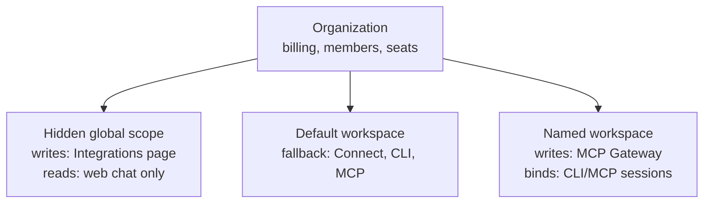

Receipt has two separate tenancy concepts, and in-product copy calls both of them a "workspace". They are not the same thing, and most of the rest of this site depends on telling them apart.

- An **organization** is the billing and membership tenant. It is what the sidebar switcher switches between, what holds your members and invitations, and what a plan and its seats attach to.
- A **Receipt workspace** is the credential and authorization boundary. It is what holds connected accounts, action permissions, CLI sessions and MCP tools, and it is what the MCP Gateway, Receipt Connect and the CLI bind to.

The confusion is baked into the copy: the organization Receipt creates for you at signup is literally named `<Your Name>'s Workspace`, and the billing page describes itself as managing "your workspace subscription" while operating on an organization. A practical rule when you read the word in the app: if the sentence is about billing, seats or members, it means the organization; if it is about connections, credentials or tokens, it means a Receipt workspace.

## How the two nest

One organization contains a `Default` workspace, any named workspaces you create, and a hidden global scope you never see in a list. Different surfaces read different scopes:

Concretely: Receipt Connect, the CLI and MCP clients land on `Default` when no workspace is named. A named workspace is written to from its **Open integrations tab**, and it's what a CLI or MCP client session binds to once its token names that workspace.

Connecting an app for chat therefore does not connect it for an MCP client on `Default`, and connecting one inside a named workspace does not make it available to chat. [Where a connection lives](/platform/connection-scopes) covers the consequences in detail.

## Organizations

### You get one automatically

When you sign up, Receipt creates an organization for you. Its name is `<display name>'s Workspace`, or is derived from the local part of your email address when your name is empty — `ari.say@example.com` becomes `Ari Say's Workspace`. Anonymous users get no organization.

Your active organization is stored on your session, and the sidebar switcher is what changes it.

### Creating more

Open the organization switcher in the sidebar and choose **Create organization**. The dialog reads `Enter a name.`, the field is labelled **Organization name** with the placeholder `Acme`, and the button is **Create**.

Creation is capped at ten organizations per user, enforced on the server and mirrored in the dialog. Past that, creating fails with:

> `You can create up to {max} organizations.`

Anonymous users cannot create an organization at all.

### Switching

The switcher lists your organizations under the heading **Organizations**, with a member count on each row — `1 member` or `{count} members`. While it works it shows `Loading organizations...`, `Switching...`, or `No organizations found` when there is nothing to list.

### Naming and logo

Organization settings → **General** carries the two identity fields. The organization name is capped at 64 characters, with the help text `Use 64 characters or fewer.` and the placeholder `e.g. Acme Inc.`. The logo accepts JPG, PNG, WEBP and SVG up to 10 MB; a wrong file type gives `Please upload a JPG, PNG, WEBP, or SVG image.` and an oversized one gives `File exceeds limit of {n}MB.`

This page is owner and admin only — see [Members, roles, and invitations](/platform/members-roles-and-invitations) for the exact access rule.

## Receipt workspaces

### The Default workspace

Every organization has a workspace named `Default`, with the slug `default`. Its id is derived deterministically from the organization id, so the same organization always resolves to the same Default workspace. It is not created at signup: the row appears the first time any workspace-scoped code path runs for that organization.

You cannot delete it. The server answers with HTTP 409 and:

> `the Default workspace cannot be deleted`

Any workspace, Default or not, must be emptied of connections before it can be deleted:

> `workspace connections must be removed before deleting the workspace`

### The hidden global scope

Alongside `Default`, each organization has a global scope. It is stored as a workspace row with a reserved slug, but it is excluded from every workspace list and is never selectable in the interface — you cannot pick it, rename it or delete it.

It exists because Receipt chat runs with no workspace selected. Global connections used to resolve to the organization's `Default` workspace, which meant connecting an app for chat also connected it for whoever used `Default` with an MCP client, and the reverse. Those are different audiences, so the global scope became its own row.

In practice: Organization settings → **Integrations** ("Global Integrations") writes into the global scope, and web chat reads its capabilities from there and nowhere else.

### Named workspaces

Everything else is a workspace you create. Each is an isolated authorization boundary with its own connections, LLM keys, members and activity.

## The Workspaces page

Organization settings → **Workspaces** is the management surface. Its description states the purpose plainly:

> `Isolate connected accounts, action permissions, CLI sessions, and MCP tools inside your organization.`

The table is the MCP Gateway's own workspace table, with columns `#`, **Workspace**, **Sharing and tools**, **Created**, **Updated** and **Actions**, sorted default-first then alphabetically, ten rows to a page. There is a search box placeholder `Search workspaces`. Clicking a row opens that workspace's MCP Gateway overview — this page is the entry point into [the MCP gateway](/platform/mcp-gateway).

### New workspace

**New workspace** opens a **Create workspace** dialog described as `Workspace names help people choose the correct authorization boundary.` The **Workspace name** field takes up to 80 characters, the submit button reads **Save workspace**, an empty field gives `Enter a workspace name.`, and success toasts `{name} workspace created.`

<Note>
Creating a workspace from the Workspaces page deliberately does not switch you into it — you stay where you are and the new row appears in the list. The MCP Gateway landing page has its own **New workspace** button, and creating one there does navigate straight into it.
</Note>

### Rename and share

**Rename** opens a **Rename workspace** dialog and toasts `Workspace renamed.` on success. **Share** opens a share dialog that fetches the organization's member list on demand; sharing a workspace with someone is a separate invitation mechanism, covered under [Members, roles, and invitations](/platform/members-roles-and-invitations).

### Delete is two steps

Deleting a workspace revokes the credentials every agent using it depends on, so it takes two confirmations.

<Steps>
<Step title="Delete workspace">
The first dialog reads `Delete {name}? This cannot be undone. Agents using this workspace will no longer be able to use its credentials. Connections in other workspaces are not affected.` The button is **Continue to delete**.
</Step>
<Step title="Confirm the workspace name">
The second is titled `Confirm you are deleting {name}` and reads `This is permanent. Type the workspace name below to delete {name} and revoke its credentials for every agent using it.` The field is labelled `Type {name} to confirm` and the button **Delete workspace permanently** stays disabled until what you type matches the name exactly — the comparison is case-sensitive after trimming. A **Back** button returns you to step one.
</Step>
</Steps>

Success toasts `{name} workspace deleted.`

## Who can do what

Access to workspaces does not follow the same rule as the rest of organization settings:

- **Any organization member can open the Workspaces page.** The path matches the same rule that opens the MCP Gateway to every member. The list itself only returns workspaces you are a member of.
- **Creating, renaming and deleting a workspace from the web app requires an organization owner or admin.** Anyone else gets `Only organization owners and admins can manage workspaces.`
- **An organization owner or admin is treated as an owner or admin in every workspace**, regardless of what that workspace's own member row says. The role the interface shows you is your organization role when that is owner or admin, and your workspace role otherwise.

Next step: [see exactly what each role can do and how people join](/platform/members-roles-and-invitations)
