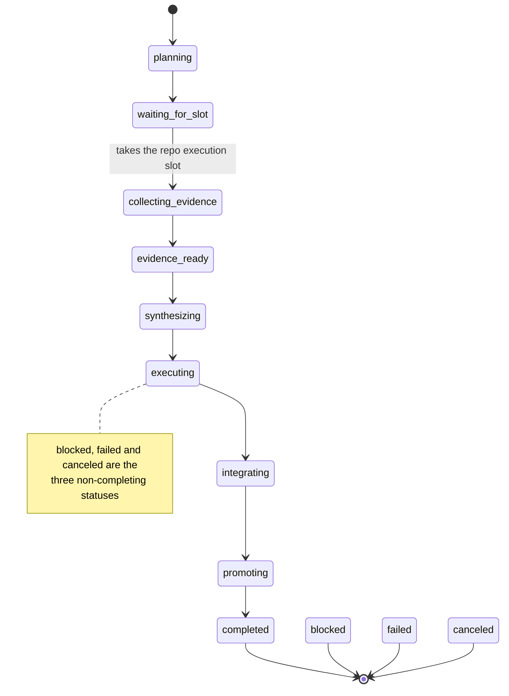

Factory is the part of Receipt that takes a written goal, breaks it into tasks, runs them, integrates the result into the repository, and records every step as receipts you can replay afterwards. This page defines the vocabulary and the configuration file. [The command reference](/repo/factory-cli-reference) covers how to drive it.

<Warning>
Factory is reachable only from the in-repo developer CLI. `receipt factory` requires a Receipt checkout, Bun and Postgres, and is absent from the released `receipt` binary. See [The in-repo developer CLI](/repo/in-repo-cli) for the difference between the two programs named `receipt`.
</Warning>

## Objective

An objective is the top unit of Factory work: a durable, receipt-backed goal. Its receipts live on the stream `factory/objectives/<objectiveId>`, and ids look like `objective_moc07bs6_ovbmts`.

An objective carries twelve statuses:

`planning`, `waiting_for_slot`, `collecting_evidence`, `evidence_ready`, `synthesizing`, `executing`, `integrating`, `promoting`, `completed`, `blocked`, `failed`, `canceled`



<Note>
The diagram follows the order in which the code declares the statuses. Read the arrows as the ordinary forward path, not as the only legal moves.
</Note>

Alongside the status the CLI surfaces two further vocabularies.

**Display state**, the coarse label:

`Draft`, `Queued`, `Running`, `Awaiting Review`, `Stalled`, `Blocked`, `Completed`, `Archived`, `Failed`, `Canceled`

**Phase detail**, the finer one:

`draft`, `waiting_for_slot`, `waiting_for_computer_lease`, `waiting_for_control`, `waiting_for_synthesis`, `waiting_for_promotion`, `collecting_evidence`, `evidence_ready`, `synthesizing`, `integrating`, `promoting`, `cleaning_up`, `awaiting_review`, `stalled`, `completed`, `blocked`, `failed`, `canceled`, `archived`

The display state and the phase detail appear together in the header the CLI prints for an objective, alongside the status authority and the slot state:

```
state=<displayState> · <phaseDetail> · authority:<statusAuthority> slot=<slotState>[ q=<n>]
```

The human-readable lines that go with a phase are fixed strings. Six of them:

- `Queued — Waiting for the repo execution slot.`
- `Waiting for computer — Waiting for computer capacity before the agent starts.`
- `Collecting evidence — Gathering evidence for the active task.`
- `Synthesizing — Turning evidence into a final answer.`
- `Blocked — Waiting for operator guidance before continuing.`
- `Stalled — Execution stopped making visible progress.`

### Mode and severity

An objective has a **mode**, either `delivery` or `investigation`, and a **severity**, an integer from 1 to 5. Both default from the profile; the checked-in profile sets mode `investigation` and severity `1`. Mode is not cosmetic — it changes whether checks run, whether the promotion gate runs at all, and whether auto-promotion is allowed.

### The repository execution slot

Only one objective holds the repository execution slot at a time. Everything else queues. That single constraint is why the board has the five sections it has: **Needs Attention**, **Active**, **Queued**, **Completed** and **Archived**.

Two of those sections carry a description that says exactly what the slot means:

- Active — `Objectives currently holding the repo execution slot.`
- Queued — `Objectives waiting for the repo execution slot.`

## Task and the task DAG

A task is a focused piece of an objective and a node in a directed graph: it has a `nodeId` and a `dependsOn` list of other node ids.

Task statuses are:

`pending`, `ready`, `running`, `reviewing`, `approved`, `integrated`, `blocked`, `superseded`

Those statuses are bucketed for display and for scheduling:

```
planned  : pending
ready    : ready
active   : running, reviewing
completed: approved, integrated, superseded
blocked  : blocked
terminal : approved, integrated, blocked, superseded
```

A task also carries an **execution phase** — `collecting_evidence`, `evidence_ready`, `synthesizing` — and an **evidence status** — `empty`, `partial`, `sufficient`, `final`.

### Seeding the graph

You seed the graph when you create the objective, with either form:

```bash
receipt factory create --prompt "Tighten the retry policy" \
  --initial-task 'Audit the current policy::List every retry site and its backoff' \
  --initial-task 'Propose the change::Write the diff and the test plan'
```

`--initial-task` is repeatable, takes `title::prompt`, and has the alias `--parallel-task`. The JSON form takes the whole graph at once:

```bash
receipt factory create --prompt "Tighten the retry policy" \
  --initial-tasks-json '[{"title":"Audit","prompt":"List every retry site"},{"title":"Propose","task":"Write the diff"}]'
```

Each entry accepts `title`, `prompt` (or `task`), and `dependsOn`, which is an array of strings.

## Candidate

A candidate is one sequential attempt at a task. Candidate ids contain `_candidate_`, which is how the CLI recognises one when you pass it as a target. Candidate statuses are:

`planned`, `running`, `awaiting_review`, `changes_requested`, `approved`, `integrated`, `rejected`, `conflicted`

## Job

A job is the queued unit of work behind a task or a control action. Job ids start with `job_`, and job statuses are `queued`, `leased`, `running`, `completed`, `failed` and `canceled`. The Factory config accepts four lanes — `chat`, `collect`, `steer` and `follow_up`. See [Jobs, lanes, and durable execution](/develop/jobs-and-durable-execution) for how the queue itself behaves.

A **run** is an agent-loop run inside a stream whose name ends `/runs/<runId>`.

## Check

A check is a shell validation command run against the integration worktree before promotion. `--check` accepts comma- or newline-separated values and is repeatable.

The runtime resolves the check list in this order:

1. If `checks` was supplied at all — including as an empty array — that is an explicit contract and is used as given.
2. Investigation objectives get `[]`.
3. Connected-system objectives, matched on their required capabilities, get `[]`.
4. A profile whose `defaultValidationMode` is `none` gets `[]`.
5. Otherwise the default list, which is `["bun run build"]`.

<Warning>
Two objective kinds run **no checks at all**: investigation objectives and connected-system objectives. If you create an objective in the default mode and expect a build to gate it, you will not get one — the shipped profile defaults new objectives to `investigation`.
</Warning>

The CLI applies a shorter version of the same rule before it sends the objective: explicit `--check` values win; `--objective-mode investigation` sends no checks; a profile with `defaultValidationMode: none` sends no checks; otherwise it sends `defaultChecks` from `.receipt/config.json`.

## Promotion

Promotion merges the approved integration branch into the source branch. The integration status moves through:

`idle`, `queued`, `merging`, `validating`, `validated`, `ready_to_promote`, `promoting`, `promoted`, `conflicted`

`receipt factory promote` asserts that the profile allows the `promote` action, runs the promotion gate, and then requires **both** `integration.status = ready_to_promote` **and** an active candidate. Without both it fails with a 409 and the message `objective is not ready to promote`.

The gate itself is skipped entirely for investigation objectives. When it does run, it refuses with one of exactly six messages:

- `Promotion gate blocked: planning receipt is missing.`
- `Promotion gate blocked: <taskId> is still blocked.`
- `Promotion gate blocked: no integrated task satisfied the objective.`
- `Promotion gate blocked: <taskId> is missing its completion contract.`
- `Promotion gate blocked: <taskId> did not record proof for the completed work.`
- `Promotion gate blocked: <taskId> still reports remaining work.`

### Auto-promotion is on by default and off in practice

`promotion.autoPromote` defaults to `true`. The runtime then forces it to `false` for every investigation objective, and the checked-in profile defaults new objectives to investigation.

<Info>
In a stock checkout the practical default is **manual promotion**: you create an objective, it runs, and you call `receipt factory promote` yourself. Do not plan around auto-promotion unless you are explicitly creating `delivery` objectives.
</Info>

## The profile

A profile lives at `<profileRoot>/profiles/<id>/PROFILE.md`, optionally with a `SOUL.md` beside it. The repository ships **exactly one**: `profiles/receipt/`, whose canonical id is `receipt`.

Its frontmatter declares:

- `actionPolicy.allowedDispatchActions`: `create`, `react`, `promote`, `cancel`, `cleanup`, `archive`
- `actionPolicy.allowedCreateModes`: `delivery`, `investigation`
- `defaultObjectiveMode: investigation`, `defaultValidationMode: repo_profile`, `defaultTaskExecutionMode: worktree`, `maxParallelChildren: 5`, `allowObjectiveCreation: true`
- an orchestration block: `executionMode: supervisor`, `discoveryBudget: 2`, `finalWhileChildRunning: reject`, `childDedupe: by_run_and_prompt`
- thirteen checked-in `skills/*/SKILL.md` paths

Every objective mutation asserts the action against `allowedDispatchActions`, so a profile that omits an action rejects it.

When a manifest omits a field, the resolved defaults are `allowedWorkerTypes: ["codex","infra","agent"]`, `defaultWorkerType: "codex"`, `defaultTaskExecutionMode: "worktree"`, `defaultValidationMode: "repo_profile"`, `defaultObjectiveMode: "investigation"`, `defaultSeverity: 1`, `maxParallelChildren: 5`, `allowObjectiveCreation: true`.

Profile-root resolution walks candidates until one contains a `profiles/` directory: the requested root, then `repoRoot`, then `RECEIPT_REPO_ROOT`, then the installed package root. The errors are `no factory profiles found under <root>/profiles`, `factory profile '<id>' is not installed under <root>/profiles`, and — as a 403 — `profile '<id>' is not allowed to create Factory objectives`.

## Execution: one path, one target

The execution path has exactly one legal value, `computer`, and the only computer execution target is `opensandbox`. Neither is a choice you make per objective; the flags exist to name the one value each accepts.

Three environment variables control the lane:

| Variable | Default |
| --- | --- |
| `RECEIPT_FACTORY_EXECUTION_PATH` | `computer` |
| `RECEIPT_FACTORY_COMPUTER_PROVIDER` | `opensandbox` |
| `RECEIPT_FACTORY_COMPUTER_ENABLED` | unset; `true`/`1` or `false`/`0` forces support on or off |

Sandbox configuration defaults:

| Setting | Default | Environment override |
| --- | --- | --- |
| Domain | `localhost:8080` | `OPEN_SANDBOX_DOMAIN` |
| Protocol | `http` | `OPEN_SANDBOX_PROTOCOL` |
| Worker image | `receiptfactory/opensandbox-worker:local` | `OPEN_SANDBOX_IMAGE` |
| Template version | `receipt-factory-opensandbox-v1` | `OPEN_SANDBOX_TEMPLATE_VERSION` |
| Remote workspace root | `/workspace/receipt-workspaces` | `OPEN_SANDBOX_REMOTE_WORKSPACE_ROOT` |
| Ready timeout | 120 s | `OPEN_SANDBOX_READY_TIMEOUT_SECONDS` |
| Request timeout | 120 s | `OPEN_SANDBOX_REQUEST_TIMEOUT_SECONDS` |
| Sandbox timeout | 3600 s | `OPEN_SANDBOX_TIMEOUT_SECONDS` |
| CPU / memory | `2` / `4Gi` | `OPEN_SANDBOX_CPU`, `OPEN_SANDBOX_MEMORY` |
| Host ready timeout | 180000 ms | `OPEN_SANDBOX_HOST_READY_TIMEOUT_MS` |
| Host idle stop | 1200000 ms (20 minutes) | `OPEN_SANDBOX_HOST_IDLE_STOP_MS` |

<Warning>
The default worker image is local-only, and two guards refuse to use it remotely:

`OPEN_SANDBOX_IMAGE is required for cloud OpenSandbox execution; refusing to use the local-only default image.`

`OPEN_SANDBOX_IMAGE must reference a published image when Receipt workers use a public gateway. Refusing local-only image receiptfactory/opensandbox-worker:local. Set OPEN_SANDBOX_IMAGE to the published ECR/OpenSandbox worker image before running remote computer objectives.`

Set `OPEN_SANDBOX_IMAGE` to a published image before running anything remotely.
</Warning>

Starting the host runs a readiness health check. When it fails the error is `OpenSandbox host is not healthy after readiness check for <protocol>://<domain>`.

## The task packet

Everything a worker reads and writes for one task lives under `receipt/current/` in the task workspace:

```
receipt/current/objective.json
receipt/current/task.json
receipt/current/manifest.json
receipt/current/context.md
receipt/current/context-pack.json
receipt/current/prompt.md
receipt/current/output/result.json
receipt/current/output/stdout.log
receipt/current/output/stderr.log
receipt/current/output/last-message.md
receipt/current/evidence/evidence.json
receipt/current/skills/skill-bundle.json
receipt/current/memory.cjs
receipt/current/memory-scopes.json
receipt/current/receipt-cli.md
```

Integration packets add `receipt/current/output/<candidateId>.integration.json`, `.integration.stdout.log` and `.integration.stderr.log`. The whole `receipt/current/` directory is git-ignored, as is `.receipt/data/`.

The checked-in helper `receipt/bin/receipt-workbench` exposes three commands:

- `path` prints the absolute `receipt/current` path.
- `show` materializes a repository projection into `receipt/current/` when none is mounted, then prints `Receipt workbench: <path>`, the objective and task titles when it has them, and `Read receipt/current/context.md and receipt/current/receipt-cli.md.`
- `finalize` prints `{"resultPath": "…/receipt/current/output/result.json", "summaryPath": "…/receipt/current/output/summary.md"}`.

Anything else exits 2 with `Unknown receipt-workbench command: <cmd>` on stderr.

## Prerequisites

| Requirement | Why |
| --- | --- |
| Postgres via `ZERO_UPSTREAM_DB` | The Factory runtime always uses the Postgres receipt and branch stores. Without it: `Receipt Postgres storage requires ZERO_UPSTREAM_DB.` |
| A git repository | `receipt factory init` fails with `Factory init requires a git repository. No repo found from <path>` |
| `.receipt/config.json` | A missing config fails non-interactively with the message below. Interactively the CLI runs `init` inline instead. |
| A `codex` binary | Detected on `PATH` at init; override with `--codex-bin` or `RECEIPT_CODEX_BIN`. Task readiness reports `codex_missing` and `codex_auth_missing`. |
| A running Receipt runtime | The CLI only enqueues jobs; it never executes them. Without a runtime draining the queue, attached commands poll forever. |
| A saved login or an explicit organization id | Otherwise: `factory commands require --organization-id, RECEIPT_CONNECT_ORGANIZATION_ID, or a saved receipt login session` |
| `python3` | Only for `receipt factory helper run` |

The message a missing config produces is:

```
Factory is not initialized in this repo. Run `receipt factory init` first.
```

Environment files are loaded before any command dispatches, later files overriding earlier ones but never overriding a value already exported in your shell: `<repo>/.env`, `<repo>/.env.local`, `<repo>/apps/start/.env`, `<repo>/apps/start/.env.local`, then `<repo>/.deploy-artifacts/local-up/latest.env` and the files named by `START_ALL_ENV_FILE`, `RECEIPT_LOCAL_ENV_FILE`, `VALIDATE_STACK_ENV_FILE`, `START_ALL_ENV_FILES` and `VALIDATE_STACK_ENV_FILES`. Set `RECEIPT_CLI_LOAD_LOCAL_ENV=0` to skip the generated local-up file.

## `.receipt/config.json`

`receipt factory init` writes this file; every command that touches an objective loads it. Discovery walks up from the current directory looking for `<dir>/.receipt/config.json`, and `--repo-root` or `RECEIPT_REPO_ROOT` pins it.

```json
{
  "repoRoot": ".",
  "dataDir": ".receipt/data",
  "codexBin": "codex",
  "repoSlotConcurrency": 20,
  "defaultChecks": ["bun run build"],
  "defaultPolicy": {},
  "schedules": []
}
```

How each top-level field resolves:

<ParamField path="repoRoot" type="string" default=".">
`--repo-root` or `RECEIPT_REPO_ROOT`, then the stored value, then `"."` — resolved against the directory that contains `.receipt/`.
</ParamField>

<ParamField path="dataDir" type="string" default=".receipt/data">
`RECEIPT_DATA_DIR`, then `DATA_DIR`, then the stored value, then `.receipt/data`. Note that this is relative to the directory containing `.receipt/`, not to your current directory.
</ParamField>

<ParamField path="codexBin" type="string" default="codex">
`RECEIPT_CODEX_BIN`, then the stored value, then `codex`.
</ParamField>

<ParamField path="repoSlotConcurrency" type="number" default="20">
`RECEIPT_FACTORY_REPO_SLOT_CONCURRENCY`, then the stored value, then 20. Coerced to at least 1.
</ParamField>

<ParamField path="defaultChecks" type="string[]">
Trimmed and de-duplicated.
</ParamField>

<ParamField path="schedules" type="object[]">
Normalized into heartbeat specs. Entries with `enabled: false` are skipped. `agentId` is required, `intervalMs` must be at least 1000, and `payload` must be an object. `lane` defaults to `collect` and accepts `chat`, `collect`, `steer` or `follow_up`; `sessionKey` defaults to `schedule:<id>`; `singletonMode` defaults to `cancel` and accepts `allow`, `cancel` or `steer`; `maxAttempts` defaults to 1 and is clamped to 1–8; `id` defaults to `schedule:<agentId>:<index+1>`.
</ParamField>

### `defaultPolicy` — the four groups that exist

The policy decoder reads **exactly four groups**, containing six keys in total. Values are clamped after decoding, and a numeric string such as `"3"` is coerced to the number `3`.

| Key | Default | Clamp | Meaning |
| --- | --- | --- | --- |
| `concurrency.maxActiveTasks` | 5 | 1–50 | Tasks running concurrently for one objective |
| `budgets.maxTaskRuns` | 50 | 1–200 | Total task dispatch budget for the objective |
| `budgets.maxCandidatePassesPerTask` | 4 | 1–12 | Attempts allowed per task |
| `budgets.maxObjectiveMinutes` | 1440 | 1–10080 | Wall-clock budget: 24 hours by default, 7 days maximum |
| `throttles.maxDispatchesPerReact` | 10 | 1–30 | Dispatches allowed per reconcile pass |
| `promotion.autoPromote` | `true` | — | Promote automatically once ready; forced `false` for investigation objectives |

<Warning>
**Every other key is read and silently discarded.** There is no `mutation` group, no `budgets.maxReconciliationTasks` and no `throttles.mutationCooldownMs` — the policy type has exactly the four groups above.

The repository's own checked-in `.receipt/config.json` still contains `budgets.maxReconciliationTasks: 8`, `throttles.mutationCooldownMs: 15000` and a `mutation: { aggressiveness: "balanced" }` block. All three are parsed and thrown away. Copying that file verbatim into your own repository teaches you three settings that do nothing.
</Warning>

### `--policy-file`

`--policy-file <path>` reads a JSON file through the same decoder, so its errors are worded `policy file must be an object`, `policy file.budgets must be an object`, and so on. The parsed result is shallow-merged over `defaultPolicy` one group at a time, and any group that is not `concurrency`, `budgets`, `throttles` or `promotion` is dropped in the merge as well.

### Parse errors

The loader throws on a malformed file rather than falling back to defaults:

- `Factory config must be a JSON object`
- `Factory config defaultChecks must be an array`
- `Factory config defaultChecks at index <i> must be a string`
- `Factory config defaultPolicy must be an object`, and the same wording for `defaultPolicy.concurrency`, `defaultPolicy.budgets`, `defaultPolicy.throttles` and `defaultPolicy.promotion`
- `Factory config schedules must be an array`
- `Factory config schedule at index <i> must be an object`
- `Factory config schedule at index <i> requires agentId`
- `Factory config schedule '<agentId>' must set intervalMs >= 1000`
- `Factory config schedule '<agentId>' requires payload to be an object`
- `Factory config has duplicate schedule id '<id>'`
- `Factory config already exists at <path>` — from `init` without `--force`

Next step: [the receipt factory command reference](/repo/factory-cli-reference) gives every command, flag and error message in the subtree.
