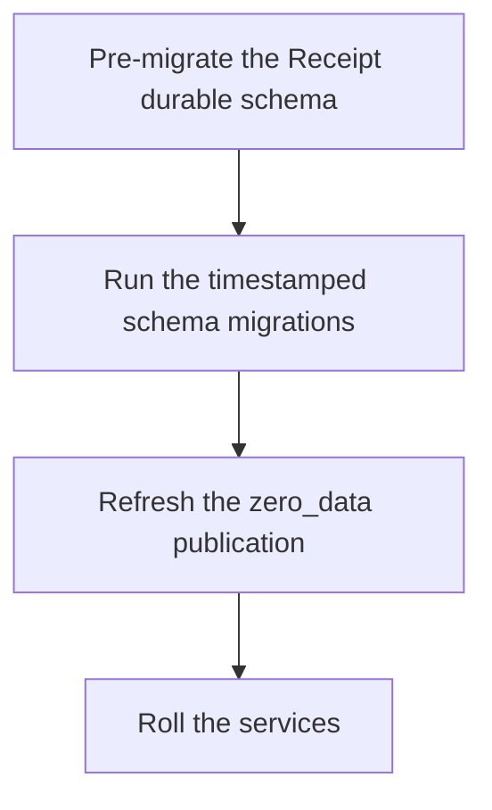

Receipt stores everything in Postgres. The client sync layer — Zero — does not read your tables over HTTP; it **replicates them out of Postgres over logical replication** and serves the replica to browsers. That single fact drives every requirement on this page.

## What Postgres has to be

<Warning>
**Logical replication must be on.** Postgres must run with `wal_level=logical`. The default, `wal_level=replica`, does not work — the sync layer cannot replicate from it.

The bundled compose file starts Postgres with `command: postgres -c wal_level=logical`. A Postgres you bring yourself almost certainly does not have it set.
</Warning>

### Pick a major version deliberately

The repository does not agree with itself, so you have to choose:

| Where | Version |
|---|---|
| `docker-compose.postgres.yml`, used by local development | `postgres:16-alpine` |
| The CI workflow's service container | `postgres:17` |
| The managed database in the reference deploy configuration | Postgres 17 |

The repository's database-migration note sets the floor at Postgres 15 or newer. Pin one version across your environments rather than letting each one pick its own.

### Other upstream requirements

These come from the repository's own database-migration note, so they describe what that migration was written against:

- Enough `max_replication_slots` and `max_wal_senders` for the sync layer's slot.
- On managed Postgres, logical replication is a parameter-group setting applied on reboot — the first deploy or a parameter change may need a database restart before replication works.
- `ZERO_UPSTREAM_DB` must be a **direct writer** connection: no connection pooler, no read replica, no reader endpoint. The sync layer's CVR and change databases may be pooled.
- Inactive logical slots retain WAL. Watch replication-slot lag and slot disk usage, or a forgotten slot will fill the volume.
- A Postgres you run natively rather than from the bundled compose file needs `wal_level=logical` and the `pg_trgm` extension.

<Note>
`ZERO_UPSTREAM_DB` is the only connection variable the application, the Receipt runtime, the sync layer and every script read. See [Configuration, secrets, and keys](/self-hosting/configuration) for why it accepts no aliases.
</Note>

## Migrations

A migration is a single timestamped, forward-only, idempotent SQL file in `apps/start/zero/migrations/`, named `YYYYMMDD_snake_case_description.sql`. Files are matched by `^\d+_.+\.sql$` and applied in lexical order. `schema.sql` sits alongside them and bootstraps a fresh database.

The conventions visible in the checked-in migrations: a leading comment block explaining why the table exists, `CREATE TABLE IF NOT EXISTS` and `CREATE INDEX IF NOT EXISTS` throughout, inline column comments, `metadata_json JSONB NOT NULL DEFAULT '{}'::jsonb` for open-ended data, `created_at BIGINT` epoch millis, and indexes that match the exact read paths.

### One runner, nine steps

`apps/start/scripts/zero-migrate.ts` is the single production migration runner. It:

<Steps>
<Step title="Resolves the connection string">
From `ZERO_UPSTREAM_DB`, falling back to `DATABASE_URL` and `DATABASE_PUBLIC_URL`. With none of them set it fails with `No Postgres connection string found. Set ZERO_UPSTREAM_DB, DATABASE_URL, or DATABASE_PUBLIC_URL in deployment variables.`
</Step>
<Step title="Takes an advisory lock">
It connects with `search_path=public` and takes a Postgres advisory lock, so two concurrent deploys cannot race each other through the migration set. The lock is released in a `finally` block.
</Step>
<Step title="Normalises legacy per-user-schema tables back into public">
`moveUserSchemaObjectsToPublic` moves tables left over from an earlier Neon per-user-schema architecture back into `public`, so every later step operates against one consistent schema.
</Step>
<Step title="Runs the Better Auth migrations">
So the auth-owned tables — `user`, `session`, `account`, `verification`, `organization`, `member`, `invitation`, `twoFactor` — exist before anything references them.
</Step>
<Step title="Creates the ledger">
`zero_schema_migrations (filename PK, checksum, applied_at)`.
</Step>
<Step title="Bootstraps schema.sql on a fresh database">
Detected by the absence of baseline tables.
</Step>
<Step title="Applies every timestamped migration in lexical order">
Every file matching `^\d+_.+\.sql$` in `apps/start/zero/migrations/` — currently 49 timestamped migrations, plus `schema.sql`.
</Step>
<Step title="Refreshes the zero_data publication">
Covered below. This is the step that decides what reaches a browser.
</Step>
<Step title="Records filename and SHA-256 checksum">
And fails when an already-applied file has changed.
</Step>
</Steps>

### Never edit an applied migration

<Warning>
Editing a migration that has already run fails the next deploy:

```
Migration <file> was already applied with a different checksum. Create a new migration file instead of editing old ones.
```

Add a new timestamped file instead. A small allow-list inside the runner lets specific historical files be re-applied idempotently and advances the ledger, without weakening the check for anything else.
</Warning>

### Which commands are safe against a live stack

| Command | Safe on a live stack? | What it does |
|---|---|---|
| `./bunw run --cwd apps/start zero:migrate` | **Yes** — forward-only, advisory-locked | The nine steps above |
| `./bunw run --cwd apps/start db:reset` | **No — destructive** | Drops the `zero_data` publication and every base table in `public` with `CASCADE`, re-runs the Better Auth migrations, then runs the sync reset |
| `./bunw run --cwd apps/start zero:reset` | **No — destructive** | Drops the sync layer's event triggers and internal schemas, drops its tables, re-applies `schema.sql` and every timestamped migration, recreates the publication, and deletes the local replica files `zero.db`, `zero.db-wal`, `zero.db-wal2`, `zero.db-shm` |
| `./bunw run --cwd apps/start postgres:drop-all-tables` | **No — destructive** | Drops every table |

`zero:reset` finishes by printing what you still have to do yourself:

```
Done. Next steps:
  - Restart zero-cache: bun run zero-cache
  - Restart the app dev server.
  - For a clean browser client, clear site data for localhost (DevTools → Application → Clear site data).
```

## The publication trap

This is the one thing to take away from this page.

The sync layer replicates a **curated** publication called `zero_data`, not `FOR ALL TABLES`. A table reaches a browser client only when it is a member of that publication. A table that exists, has rows, is in the client schema and is queried correctly will still return nothing if it is not published.

<Warning>
A table missing from the `zero_data` publication does not break only that table. It **silently breaks all client sync**. The repository records this as its first root-cause finding, and its own contributor instructions lead with it.
</Warning>

### Membership is computed, not declared once

`apps/start/scripts/zero-publication.ts` builds the member list from:

- A fixed list of UI tables: `user`, `organization`, `member`, `invitation`, `org_ai_policy`, `org_connection_secret`, `receipt_workspace`, `receipt_workspace_member`, `attachments`, `org_billing_account`, `org_subscription`, `org_entitlement_snapshot`, `org_member_access`, `org_user_usage_summary`.
- The default Receipt projection tables from the runtime contracts.
- `ZERO_PUBLICATION_EXTRA_TABLES`, a comma-separated list appended to the rest. This is the supported opt-in for a new UI surface without editing the fixed list.

Each table is schema-qualified: Receipt runtime projections get `RECEIPT_POSTGRES_SCHEMA` (default `public`), everything else gets `public`. Four `receipt_`-prefixed tables are explicit exceptions treated as app-owned public tables: `receipt_workspace`, `receipt_workspace_member`, `receipt_org_guardrail_group_projection` and `receipt_org_policy_rule_projection`.

Raw receipt logs, memory embeddings, durable scheduler tables and the eval and computer projections stay server-side on purpose.

The refresh is `ALTER PUBLICATION zero_data SET TABLE …` when the publication already exists, otherwise `CREATE PUBLICATION zero_data FOR TABLE …`, with per-table column lists where declared. It logs one of:

```
Refreshing zero_data publication with <n> tables...
Creating zero_data publication with <n> tables...
```

### Adding a table is two changes, not one

<Info>
Change the schema **and** the publication membership in the same migration. A schema change without a membership change ships a table nobody can read; a membership change without the table breaks the refresh.
</Info>

If the new table is a Receipt runtime projection, its entry in `RECEIPT_RUNTIME_TABLE_CONTRACTS` must also declare `zeroPublication: "default"` when it is added or changed in `apps/start/src/integrations/zero/schema.ts`.

And when a replicated table is added to the client schema, bump the versioned browser-storage namespace so existing browser replicas rebuild instead of resuming against a schema that no longer matches.

### Ordering on deploy

The publication references Receipt projection tables, so those tables must exist before the refresh runs.



The supervised local stack does exactly this: it pre-migrates the Receipt durable schema, then runs `zero:migrate`, then explicitly re-runs the publication refresh afterwards. If you drive migrations by hand, keep the same order.

### Logical replication does not backfill

Adding a table to the publication does not populate the existing replica with the rows already in it. Forcing a full initial sync means starting from a fresh replica file — which is what deleting `zero.db*` (and what `zero:reset`) does.

The browser also keeps its own store, and a hard refresh does not rebuild it. If one client looks stuck while others are fine, clear site data for the origin.

<Note>
The reference deployment carries a replica-generation marker in its configuration, used for both the replica file name and its backup location. Bumping that marker is the documented recovery when a bad publication or schema change leaves the durable replica unable to apply the change log: Postgres stays authoritative and a new generation forces a fresh initial sync instead of restoring a poisoned backup.

Changing the upstream database has the same consequence — delete the replica file and its siblings before starting against a new upstream.
</Note>

## Symptoms and their causes

| What you see | Cause | Fix |
|---|---|---|
| The UI loads but nothing ever syncs | A table missing from the `zero_data` publication breaks all client sync | Run `zero:migrate` against the live stack (or `zero:reset` locally), and confirm Postgres runs with `wal_level=logical` |
| A newly published table shows no rows | Logical replication does not backfill | Force a full initial sync from a fresh replica file; clear browser site data too |
| `zero-cache` exits shortly after start, following a schema reset | A retained replica file still holds table DDL and replication watermarks from the earlier schema lifecycle; the replayed `CREATE TABLE` hits a table the replica already has | Delete `zero.db*`, or let `zero:reset` do it. The stack validator isolates its replica file per run for exactly this reason |
| `relation "<schema>.receipt_job_projection" does not exist` during `zero:migrate` | The migration refreshed the publication before Receipt's durable projection tables existed in the configured schema | Pre-migrate the Receipt schema first, as above |
| `Could not locate the bindings file.` from `zero-cache` | The sync layer's native SQLite binding was not built | Rebuild the `@rocicorp/zero-sqlite3` native binding; `start:all` and `local:up` rebuild it automatically, `dev` does not |

## What the publication does not carry

The publication declares an **explicit column list** for `org_connection_secret`, the table that holds Receipt Connect connection references:

```
id, organization_id, workspace_id, provider, name, kind, status,
expires_at, last_validated_at, created_at, updated_at
```

The ciphertext, the key version and the internal ownership metadata are in that table but are **not** in the column list, so they are never replicated to a browser — even though `status`, which the UI needs, shares the same row. Copy this pattern if you add a table that mixes client-visible state with secret material.

## Tenancy: a directory name becomes a schema name

The Receipt runtime's Postgres store is keyed by data directory, not by a schema you name:

- `DATA_DIR` (or `RECEIPT_DATA_DIR`) is resolved to an absolute path, hashed with SHA-256, and the first 24 hex characters become the schema name `receipt_data_<24 hex>`.
- Setting `RECEIPT_POSTGRES_SCHEMA` explicitly skips the derivation entirely and uses that schema.
- Every connection pool sets `-c search_path="<schema>"` explicitly, including when the schema is `public`, so a role's default `search_path` cannot silently redirect unqualified queries somewhere else.
- The default pool size is **2**, overridable with `RECEIPT_POSTGRES_POOL_MAX`.

Two deployments pointed at the same database with different data directories therefore land in different schemas and cannot see each other's runtime data. Two deployments with the same resolved data directory share one.

Next step: [Running the integration provider](/self-hosting/integrations-provider) covers the service Receipt Connect cannot work without, and the key that only exists after you have already deployed once.
